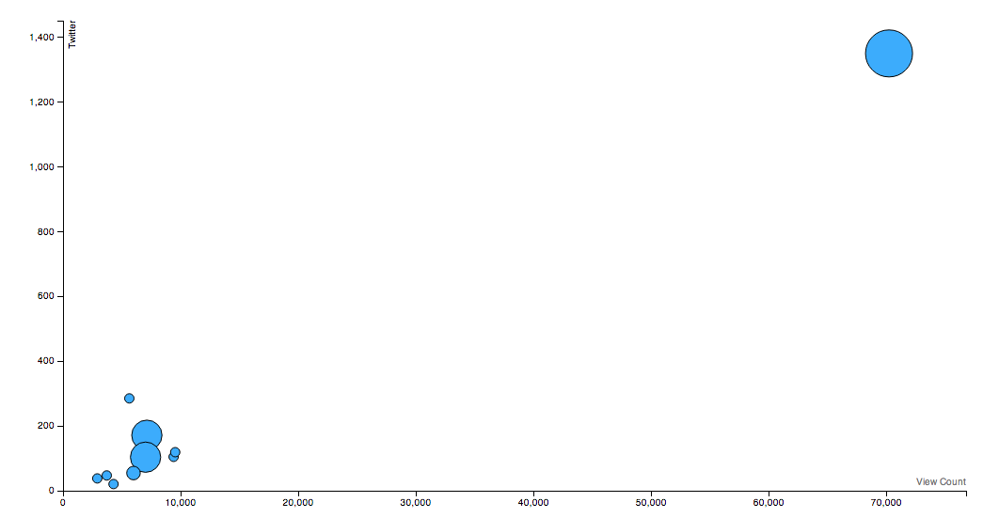
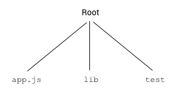
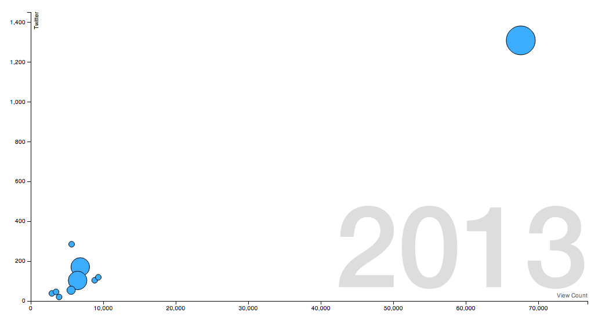
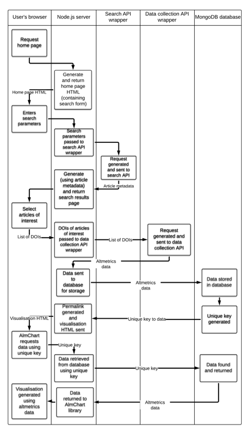

<div class="title-page">
# On the Temporal Aspect Of Altmetrics

## by Alasdair Smith

<div id="title-text">
Submitted in partial fulfilment of the requirements for the award of degree of BSc Web Technologies of the University of Portsmouth

</div>

<div id="date">
April 2014

</div>

<div class="copyright">
### Copyright

Copyright &copy; Alasdair Smith. All rights reserved.
The copyright of this thesis rests with the Author. Copies (by any means) either in full, or of extracts, may not be made without prior written consent from the Author.
</div>
</div>

### Acknowledgements

The author would like to thank Rich Boakes, Cameron Neylon, Jenny Smith and Dan Harper for their advice and comments at various stages of this work.

<br>
### Table of contents

<div id="toc-top">

| Copyright	        | 1 |
| ----------------- | - |
| Acknowledgements  | 2 |
| Table of Contents | 2 |
| List of Tables    | 3 |
| List of Figures   | 3 |
| Abstract          | 4 |

</div>

__Chaper 1 Introduction to Altmetrics..................................................................................................5__

1.1 Introduction to Altmetrics...............................................................................................................5
1.2 Project Goals..............................................................................................................................6
1.3 Overview of Report.......................................................................................................................7

__Chapter 2 A Review of Altmetrics Literature.......................................................................................8__

2.1 Introduction...............................................................................................................................8
2.2 History of Bibliometrics................................................................................................................8
2.3 What is Altmetrics?....................................................................................................................12
2.4 The Case for Altmetrics...............................................................................................................19
2.5 Criticism of Altmetrics................................................................................................................22
2.6 Literature Review Conclusion........................................................................................................25
2.6 Chapter Summary.......................................................................................................................28

__Chapter 3 Artefact Design..............................................................................................................29__

3.1 Introduction..............................................................................................................................29
3.2 Design Methodology...................................................................................................................29
3.3 Requirements............................................................................................................................30
3.4 Proposed Solution.......................................................................................................................33
3.5 Summary.................................................................................................................................45

__Chapter 4 System Implementation...................................................................................................46__

4.1 Introduction..............................................................................................................................46
4.2 Altmetrics Data Collection Implementation.........................................................................................46
4.3 Search Implementation................................................................................................................50
4.4 Visualisation Implementation.........................................................................................................52
4.5 Storage Implementation...............................................................................................................57
4.6 Web Application Implementation.....................................................................................................59
4.7 Summary.................................................................................................................................64

__Chapter 5 Testing and Evaluation....................................................................................................65__

5.1 Introduction..............................................................................................................................65
5.2 Testing Summary........................................................................................................................65
5.3 Evaluation................................................................................................................................69
5.3.1 Requirements Review................................................................................................................69
5.3.2 Artefact Review.......................................................................................................................73
5.4 Testing and Evaluation Summary.....................................................................................................79

__Chapter 6 Conclusion....................................................................................................................80__

6.1 Introduction..............................................................................................................................80
6.2 Report Summary........................................................................................................................80
6.3 Conclusions..............................................................................................................................80
6.3.1 Key Points..............................................................................................................................81

__Chapter 7 References.....................................................................................................................87__

__Chapter 8 Appendices....................................................................................................................92__

<br>
### List of Tables

Table 1: A comparison of potential altmetrics data providers.........................................................................36
Table 2: Input fields used for the scholarly article search form.......................................................................39
Table 3: Testing coverage report, for the data collection and search modules......................................................67

### List of Figures

Figure 2.1: The algorithm used to calculate the impact factor..........................................................................8
Figure 2.2: Categorisation of altmetric sources by the altmetrics provider, ImpactStory.........................................18
Figure 3.1: A screenshot of a button created using Bootstrap Bootstrap stylesheets..............................................36
Figure 3.2: An example of a bubble chart...............................................................................................41
Figure 3.3: A series of images showing the progression of an animated bubble chart............................................42
Figure 4.1: Diagram showing basic file structure of a Node.js application.........................................................48
Figure 4.2: A screenshot of the final visualisation......................................................................................55
Figure 4.3: Flow diagram showing the flow of data between the various parts of the application and the user...............60

<div class="page-break-avoid">

### Abstract

Altmetrics are a faster, more diverse and transparent form of bibliometrics. Altmetrics use web-based sources of information, such as social networks, to find citations of academic work which are used capture a novel perspective on the "story" of impact. One aspect of this story that has not been studied in detail is how altmetrics change over a period of time, so this project aims to provide tools for researchers investigating this area. A visualisation is created showing altmetrics data and its change over time. This visualisation is developed as part of a web application that uses several new technologies, including Node.js, D3.js and MongoDB. These technologies were experimented with throughout the project, and assessed for their suitability. The design and implementation of the application is described in this report, discussing the problems encountered and solutions given. A description of the methods used to test the application are given, and these are used to evaluate the artefact. Finally, conclusions about the project are drawn, finding that the application mostly meets the project goals and discusses the areas where more work is necessary.

</div>

<br>
<div class="page-break-avoid page-break-before">

### Chapter 1 Introduction

In this chapter, the overarching themes of the report and motivation behind the project are discussed. The goals for the work are then introduced and the rationale described. Section 1.3 gives a summary of the overall project. Finally an overview of this report is given on a per-chapter basis.

</div>

<br>
<div class="page-break-avoid">

#### 1.1 Introduction to Altmetrics

This project will focus on the field of altmetrics, a relatively new area of study within bibliometrics. As discussed in more depth in section 2.2, bibliometrics is the study of scientific literature itself, analysing it quantitatively to find so-called "impact". Impact is generated when a person gives credit, formally or informally, to others for their work. Some refer to this credit as "reuse", as one can be considered to be reusing the ideas of others in novel work.

</div>

In the past, this credit has been identified solely through a formal citation on a piece of scholarly literature. This method has been used for many years, mostly commonly in the form of the "impact factor", which is calculated by Thomson Reuters' Journal Citation Reports. This factor has been used for many purposes, most commonly to judge the value of a scholar's work.

Researchers have identified several problems with this approach, and this literature is discussed in detail in section 2.2.2. Some of the criticisms levelled at the impact factor include its simplistic "single number" approach and some of the underlying mathematics used in its calculation. Some find that the impact factor is too slow for modern communication methods and other criticise its inappropriate usage as a proxy for assessment outside of journal assessment. Other claim that it is biased towards existing highly respected journals producing a "rich get richer" phenomenon. The impact factor's singular focus on academia has been criticised, with claims that it does not represent real world impact. There are problems with so-called "gaming", where impact is artificially boosted through manipulation of journal publications. This problem arises with Thomson Reuters, who calculate the impact factor, who have been criticised for not publishing the methods by which citations are counted, leading to calls for a more scientific approach. Some point out that traditional scholarly processes are becoming overwhelmed by a growing flood of newly published work. The impact factor has also been found to ignore important areas such as other forms of scholarly output, therefore not providing incentives for good scholarly practice. Also ignored is the effect of an academic network. Finally, the impact factor does not account for retracted papers during its calculation, which has received criticism as unscientific.

Altmetrics has been proposed as an alternative to the impact factor, answering some of the criticism described above. Section 2.3 describes what altmetrics is, and details the individual data sources that make up altmetrics. In general, altmetrics is an attempt to discover scholarly impact from web-based sources. Commonly this involves measuring the number of citations, usually informal, that occur on social networks, such as Twitter and Facebook. Altmetrics is an umbrella term for all of these data sources, which can be combined to perform complex analysis of impact.

Section 2.4 describes the case for altmetrics, discussing the benefits of using such a system. Several studies have found that altmetrics correlate with traditional citation counts, suggesting that they do point to valuable articles. Altmetrics have the ability to discover impact in places previously unmonitored by the impact factor, the "scientific street cred" that occurs in the less formal settings of social networks. Studies have found that altmetrics has a much greater diversity of people, including the general public, than traditional citation count metrics. Altmetrics also allows for a more qualitative perspective on impact through categorisation and through study of network effects, telling the "story" of how impact was generated. Several studies found that altmetrics were able to find useful impact much faster than the impact factor. Altmetrics are also more transparent than traditional metrics, allowing researchers to examine methods of calculation, a more scientific approach. Altmetrics can measure impact from more of an author's work, including data and code. Altmetrics operates at a huge scale, allowing researchers to rely more on the "wisdom of the crowds", potentially providing an answer for questions about gaming. Finally, several pieces of literature found that altmetrics can work alongside traditional metrics to provide a multi-dimensional view of impact.

There is, however, criticism of altmetrics in the literature, discussed in detail in section 2.5. Some studies have found that specific data sources were poor indicators of impact. Correlation with citation is disputed, with some researchers finding only weak correlation, although some state that altmetrics may be "orthogonal to citation". In addition, altmetrics coverage is low, with much data found to be sparse. Altmetrics can also be vulnerable to bias, skewing towards a younger, more technical population of authors. It was also suggested that altmetrics is vulnerable to the "rich get richer" phenomenon observed in traditional metrics. Many have accused altmetrics of being open to gaming, claiming that it is too easy to create fake accounts to unfairly skew altmetric data. Another common criticism is that altmetrics relies too heavily on the general public, who cannot be trusted with correctly attributing impact. Some within the altmetrics community have argued against standardisation, stating that it will become "calcified". Finally, there are significant technical hurdles for the altmetrics community to cross before all forms of impact can be correctly identified. For example, it is notoriously difficult to track historical data within Twitter's API.

Section 2.6 draws conclusions from the literature review, finding that altmetrics is a powerful new tool for discovering impact using the web. The section also describes potential future work that can be developed by the altmetrics community. This includes further exploration of categorisation of altmetric data sources, the effects of considering the network on impact and investigating other forms of academic output. However, the area with most exciting potential is the study of how altmetrics changes over time. Many studies have looked at altmetrics within a few hours or days after an article has been published, and further studies have looked at altmetrics aggregated over several years after publication. However, little or no study has been done on how altmetrics changes between these two timescales. This could have very interesting results, as this is an area of the "story" of how impact is generated that has not been looked at in detail.

<br>
<div class="page-break-avoid">

#### 1.2 Project Goals

In the previous section, an introduction to altmetrics was given, and it was found that altmetrics is a powerful new tool for measuring impact. An area of future work was highlighted that is of interest to the project, as it has the potential to add greatly to the field of altmetrics. This area is the study of how altmetrics changes over a period of time. For this research to begin, tools for the analysis of complex and voluminous data that altmetrics produces must be created. This is the main goal of the project; to create a tool, or set of tools, that will assist altmetrics researchers in studying how altmetrics changes over time. It is believed that if these tools are provided, researchers will be encouraged to start studying this area, potentially using these tools in their work. 

</div>

A secondary goal of the project is to make the tools produced by the project usable by a wider group of users. Traditionally, scientific software does not have a reputation for good usability and striking design aesthetic. This turns users away, especially those outside of the altmetrics research community. As described in the previous section, altmetrics is aimed at a wider section of society, meaning that more casual users may encounter the application. For this reason, the project will aim to make the artefact as usable as possible to these casual users. By improving accessibility of altmetrics tools, it is believed that more people will use altmetrics to gain insight into their own impact.

Finally, this project aims to experiment with new technologies to investigate the best choices for the application. The software world is constantly evolving and changing to produce new concepts or improvements on older ideas. Sometimes these succeed, and become widely adopted, however this is not always the case. Some technologies are particularly well suited to given circumstances. Assessments on the technologies used must be made to evaluate whether they are the right choice for the current situation.

<br>
<div class="page-break-avoid">

### 1.3 Overview of Report

This section will give a chapter-by-chapter overview of what is contained in this report. Summaries of the content of the chapter will be given for each.

</div>

Chapter 2 reviews the published literature on altmetrics, giving details on the history of bibliometrics, criticism of traditional metrics, including the impact factor, a breakdown of what altmetrics are, and evidence to support the usage of altmetrics. Criticism of altmetrics is then discussed and counter-arguments made. Finally, conclusions of the review are drawn and potential future work is detailed.

In Chapter 3 the design of the artefact is discussed. The methodology that is used throughout the project is described, followed by the list of requirements needed to achieve the goals stated in section 1.2. Finally, a proposed solution to the problem described by the requirements is detailed in section 3.4.

Chapter 4 describes the implementation of the application. Key aspects of the five major parts that make up the application are discussed in more detail. Problems that were encountered during this phase of the project are described and the solutions and work-arounds to these issues are discussed.

Chapter 5 discusses the tests that were performed on the final application and gives an overview of their results. These results are then used in section 5.3 to evaluate the artefact. As part of this the requirements given in section 3.3 are assessed and the artefact evaluated against them. Finally for this chapter, the implementation details described in chapter 4 are evaluated.

Finally, chapter 6 draws conclusions on the project. A brief summary of the report is given, before a synopsis of the final artefact. Finally, key points of the conclusion are described, along with possible future work.

<br>
<div class="page-break-avoid page-break-before">

### Chapter 2 A Review of Altmetrics Literature

#### 2.1 Introduction

This chapter gives a more in depth introduction to altmetrics, discussing the origins, definitions, supporting evidence and criticism. Section 2.1 gives a brief description of the wider field of bibliometrics, and the impact factor, before discussing the problems with this approach.

Section 2.2 defines altmetrics and breaks down the online data sources that are commonly used when collecting altmetrics data. Section 2.3 gives the evidence that establishes altmetrics as a useful technique, and section 2.4 gives criticism. Finally, section 2.5 draws conclusions of the review and discusses potential future work.

</div>

<br>
#### 2.2 History of Bibliometrics

<div class="page-break-avoid">

##### 2.2.1 Introduction to Bibliometrics

The field of bibliometrics, sometimes scientometrics, has existed for many years and has created a set of methods to quantitatively analyse scientific and technological literature (De Bellis, 2009). These metrics are most commonly used to measure the impact, or value, of the research in question. Fenner (2013) defines impact as follows: "The scientific impact of a particular piece of research is reflected in how this work is taken up by the scientific community", although others look outside the academic community for impact. This impact ranking has a diverse set of applications, including assessment of an author's work. Godin & Dore (2004) find that there is "huge demand for quantitative studies and indicators on the impact of science", with most aimed at the economic impact of research. They state that research has, and continues to be, funded on the basis that it has outcomes in society. One of the most widely used methods is the Impact Factor, sometimes known as the Journal Impact Factor. It was first proposed by Eugene Garfield in 1972, in his paper, Citation Analysis As A Tool in Journal Evaluation. The impact factor is calculated using the following algorithm:

</div>


The Journal Citation Reports is published annually by Thomson Reuters, listing all known journals and giving their impact factor, and other metrics for the current year. Neylon and Wu (2009) state that "most scientists ... will point to the Thomson ISI Journal Impact Factor as an external and 'objective' measure for ranking the impact of specific journals and the individual articles within them".

Usage of the impact factor in ranking research other than journals has become more widespread. Increasingly, impact factor has become a proxy for measuring many diverse research outputs. These range from comparisons of international impact to individual article value (Fuyuno & Cyranoski, 2006) (Arnold & Fowler, 2010) (Garfield, 2006). Article value is calculated by proxy, by simply taking the impact factor from the journal it was published in. This has led to ranking author impact, by totalling the impact factor of each paper published.

Because of its wide-ranging use, the impact factor has a strong influence on the scientific community. This has affected decisions on where to publish, whom to promote or hire, the success of grant applications, library decisions to purchase and renew journal subscriptions, researchers deciding where to publish, researchers choice on what to read and even salary bonuses (Van Epps & Hill, 2007) (Arnold & Fowler, 2010). The Public Library of Science (PLOS) Medicine editors (2006) report that "in some countries, government funding of entire institutions is dependent on the number of publications in journals with high impact factors".

In the UK, governmental assessment of Higher Education institutions have been conducted by the Research Assessment Exercise (RAE) since 1986. The exercise relied on the "subjective assessment of scientific publications by a panel of experts". Because of this, the RAE was time-consuming and expensive, costing the UK Government £12 million and universities an additional £47 million (Eyre-Walker & Stoletzki, 2013). In 2014, the RAE will be replaced by the Research Excellence Framework (REF). The REF will controversially provide more focus on research impact, with 25% of the final grading going towards measurement of value (Shepherd, 2009). Allen, Jones and Dolby (2009) believe that it is the impact factor's place as the key indicator of research progression that provides much of the rationale for the move to a more metrics-based successor.

##### 2.2.2 Failings of Traditional Metrics

The impact factor has been the subject of much criticism, with many papers reporting on its faults. Increasingly, scientists have been calling for an end to the wide-ranging use of the impact factor. In December 2012, researchers at the annual meeting of the American Society for Cell Biology signed the Declaration on Research Assessment, calling for the end of the use of journal metrics to assess individual articles or authors.

<div class="page-break-avoid">

__Impact Cannot Be Represented By a Single Value__

Arnold & Fowler (2010) report that "the allure of the impact factor as a single, readily available number - not requiring complex judgments or expert input, but purporting to represent journal quality - has proven irresistible to many". It is this inherent simplicity that led to the rise of the impact factor. As is shown in this chapter, this simplicity fails to interpret the scope and complexity of scientific impact.

</div>

<div class="page-break-avoid">

__Network Effects Are Disregarded__

Authors have criticised the impact factor's simplicity, in that it is merely a straight count of citations, and does not take the effect of a network of researchers into account. Bollen, Rodriquez & Van de Sompel (2006) write that it "only represents the popularity factor of status, not its prestige factor", where popularity is defined as the total number of endorsements, and prestige is the relative "trustworthy-ness" of endorsing actors. In their proposed system, a citation from a paper with higher prestige would be weighted more than a citation from a paper with lower prestige. This system is similar to Google's very successful PageRank algorithm, which allowed large scale ranking of web pages to produce accurate and relevant search results. Bollen, Rodriquez & Van de Sompel (2006) find that their PageRank-like algorithm "strongly-overlapped" with the impact factor, but it "revealed significant and meaningful discrepancies". The simplicity of the impact factor does not allow for the concept of network effects, reducing its usefulness as a tool for filtering.

</div>

<div class="page-break-avoid">

__Usage As a Proxy for Other Forms of Impact__

As discussed above, the impact factor has been used as a proxy for other forms of impact - primarily article or author impact. This is problematic, as the impact factor was simply not designed to measure anything other than journal impact (Neylon & Wu, 2009). King & Tenopir (2004) find that only about 15 - 20% of scientists in the United States have authored a refereed article, further supporting the view that journal impact is not representative of author impact. Even Garfield, who proposed the original impact factor, has criticised this usage. In his paper, How to Use Citation Analysis for Faculty Evaluations, and When Is It Relevant? (1983), he states that citation analysis can augment author assessment, but finds that it is easily misinterpreted or inadvertently manipulated. Additionally, the current publishers of the impact factor, Thomson Reuters have admitted that it is being used in "many inappropriate ways" (The PLOS Medicine editors, 2006).

</div>

<div class="page-break-avoid">

__Overwhelmed By Scale of Scholarly Publishing__

Scientific publishing has grown to an incredible rate, with over 800 000 papers published in 2008 in the popular academic article search engine, PubMed, alone (Neylon & Wu, 2009). This has grown to nearly 950 000 papers in 2013 ("2013 PubMed Search Results", n.d.). Neylon and Wu (2009) claim this growth is overwhelming for researchers - "It [is] impossible for any scientist to read every paper relevant to their research, and a difficult choice has to be made about which papers to read". Renear and Palmer (2009) find that scientists read 50% more papers than they did in the 1970s, spending less time on average with each one. Mendeley, a social referencing manager, found that researchers spent an average of 1:12 hours per day studying literature ("Global Research Report", 2009). Choices about where researcher's time reading papers now must be made, leading to a greater need for filtering the mass of papers. Traditional forms of filtering, namely, peer review and the impact factor, are overwhelmed by the scale of modern research (Priem, Taraborelli, Groth & Neylon; 2010).

</div>

<div class="page-break-avoid">

__Citations Take Time to Accumulate__

The impact factor relies on citations as its base measurement, which take time to accumulate. The average paper is not cited for months, at the earliest, but more often 1 - 2 years after publication (Neylon & Wu, 2009) (Priem, Piwowar, Hemminger, 2012). Potential impact, therefore, takes a long time to accumulate, especially relative to the rapid pace of development. This means that decisions using citation analysis data made soon after publication may be incomplete, affecting career decisions, decisions on where to publish, funding decisions, and many other decisions. Additionally, real-time ranking of output becomes very difficult, preventing possible filtering applications.

</div>

<div class="page-break-avoid">

__Underlying Issues with Impact Factor Calculation__

Researchers have also pointed out underlying mathematical issues with the impact factors. In a Journal of Cell Biology editorial, Rossner, Van Epps and Hill (2007) report that 89% of Nature's citations are attributable to only 25% of papers. Fundamentally, the impact factor is a mean, so it can be "badly skewed by a 'blockbuster' paper".

</div>

<div class="page-break-avoid">

__Bias Towards Existing High Impact Journals__

Allen, Jones & Dolby (2009) compared expert reviews of research articles to the impact factor, and other citation-based metrics. They found that the expert's score was more strongly correlated to the impact factor than to the number of citations the paper had received. They believe this was a consequence of experts rating papers in high profile (and high impact) journals more highly, rather than an ability of experts to judge the intrinsic merit or likely impact of a paper. This presents the current metric system with a "rich get richer" problem - papers published in journals with existing high impact factors are perceived to be "better", leading to further high impact factors. This means it is difficult for papers in new journals to break into the system. A metric that considers more diverse communication methods might address this issue.

</div>

<div class="page-break-avoid">

__The Impact Factor's Journal-Based Approach Produces a Bias Towards STEM Disciplines__

Roemer & Borchardt (2013) note that "it has frequently been noted by both librarians and information scientists that researchers in Science, Technology, Engineering and Maths (STEM) disciplines tend to emphasize the production and consumption of journal articles more heavily than scholars in the humanities or social sciences". This has a huge effect on the less article-heavy disciplines, like the humanities, as the impact factor only measures article citations. By de-emphasising this aspect of scholarly communication, the impact factor will be subsequently lower, which is potentially damaging especially in the current climate of measuring all academics using the impact factor. For example, in the UK, the upcoming REF (see above) will take impact measurement into account and these disciplines may lose out.

</div>

<div class="page-break-avoid">

__Citation Counts Ignore Academic Outreach__

The impact factor only measures impact within the scientific community, through its sole use of citations. Citation is evolving, and the published scientific article is not always the primary method of communicating scientific thinking (Anderson, 2009). Any attempt by researchers to provide outreach to the public is ignored by the impact factor (The PLOS Medicine editors, 2006). In the current research climate, where the impact factor has power over career paths, outreach is discouraged. The PLOS Medicine editors (2006) write that "[For a journal] which strives to make ... open-access content reach the widest possible audience ... impact factor is a poor measure of overall impact". They believe that by reaching a wider audience, they can help to set agendas - by publishing policy papers or highlighting neglected issues.

</div>

Additionally, some forms of scholarly communication that were rarely recorded before are now becoming commonplace in digital formats (Groth & Gurney, 2010) (Priem & Costello, 2010) (Zhao and Rosson, 2009) (Letierce, Passant, Decker et al., 2009) (Shema, Bar-Ilan & Thelwall; 2012). Researchers who collaborate well, or can explain concepts well have unpublished, but still valuable impact. Priem, Piwowar & Hemminger (2012) call this "scientific street cred", the informal and sometimes unintentional credit that scholars receive from peers that is moving online, where it can be tracked and quantified. Again, the impact factor does not take this hidden impact into consideration, by its citation-based nature.

<div class="page-break-avoid">

__Citation Counts Ignore Alternative Forms of Academic Publishing__

Other areas of scholarly work are also overlooked by the impact factor. The published paper is not necessarily the total output of a researcher, although it is often used to summarise. The Altmetrics manifesto authors (2010) report that there are "new forms [of communication that] reflect and transmit scholarly impact". Additional work might include data sets, or code, that may go on to be reused by further research, increasing its impact (Piwowar & Vision, 2013). Priem & Costello (2011) believe that sharing information (in all forms) is a "central component of [researchers] work". However this potential impact will be not be captured by the impact factor.

</div>

<div class="page-break-avoid">

__Thomson-Reuter's Unscientific Approach__

The Institute of Scientific Information, founded by Garfield in 1960, was acquired by Thomson Reuters in 1992 ("Thomson Corporation acquired ISI", 1992), handing over control of the impact factor. At no point have the key details of the impact factor calculation been made public, as they remain proprietary to Thomson Reuters. Some have accused the corporation of misidentifying article types, something that significantly affect the impact factor. The calculation is dependent on which article types are deemed as "citable" - the fewer citable types, the higher the impact factor. Thomson Reuters has not published its process of choosing "citable" article types, and the PLOS Medicine editors (2006) report that "it became clear that the process of determining a journal's impact factor is unscientific and arbitrary". Rossner, Van Epps & Hill (2007) in a separate report found "numerous incorrect article-type designations" in Thomson Reuters' data. They also found that the number of citations used in the impact factor was "substantially fewer" than the number published on the Journal Citation Reports website. They attempted to buy data that is used to calculate the impact factor and were refused by Thomson Reuters. They concluded that just as scientists would reject an article without primary data, so the impact factor should be rejected (Galligan & Dyas-Correia, 2013). The impact factor is not reproducible, a damning report of a metric that is supposed to measure scientific information, and that may affect potential career decisions.

</div>

<div class="page-break-avoid">

__The Impact Factor is Vulnerable To Gaming by Journal Editors__

The impact factor suffers from problems with gaming - where publishers or authors attempt to artificially raise their impact factor. The main approach to this is to garner as many citations as possible, even if this does not accurately reflect on the true number of citations a journal may have received. Certain types of article are used to achieve this, in particular, review articles. These articles that review a journal's output, by their very nature tend to cite the journal many times (Rossner, Van Epps & Hill, 2007). When indexed by the Journal Citation Reports, journal editors will negotiate with Thomson Reuters to have whole article types removed, thereby potentially increasing their impact factor. One strategy for achieving this is reducing the publication of articles of a certain type, an approach that cannot be be viewed as good for a healthy science community (The PLOS Medicine Editors, 2006). Arnold & Fowler (2010) also report on another worrying trend from authors of manuscripts under review, who were asked or required by editors to cite other papers from the journal. They describe this practice as "bordering on extortion".

</div>

<div class="page-break-avoid">

__Retracted Papers Are Included in Impact Factor Calculations__

Research papers are sometimes retracted because of errors, however these are still counted towards the impact factor. Liu (2007) points to the infamous Hwang stem cell papers that were retracted after it was discovered that they were fabricated. The retracted papers were cited 377 times, and accounted for 39% of the journal Science's impact factor in 2004 and 2005. Liu also reports that high impact factor journals are based on "useless or misleading citations". Impact gained from retracted papers does not reflect accurately on the true value, and should not be included in the impact factor.

</div>

<div class="page-break-avoid">

__Citation Counts Offer No Incentive For Certain Good Scientific Practices__

A core aim of bibliometrics is to find the best scientific articles, however, the impact factor can encourage poor scientific practices. The impact factor provides no incentive to publish negative results, considered a good practice for advancing science. Buschman & Michalek (2013) comment that the impact factor "discourages publishing research with negative results", as these papers receive fewer citations, and therefore lower impact factor. They also find that blogs are increasingly being used to document negative results, however this valuable work is not captured by the impact factor.

</div>

<div class="page-break-avoid">

__Journal's Restrictive Terms of Use Limit Innovation__

Some newer approaches to assessing impact, such as the webometric movement are fundamentally limited by terms of use restrictions. Text mining or scraping web sites to count citations to scholarly work is a potentially useful method for measuring impact, however these approaches are prevented by academic publisher's terms of use. These terms prevent automated text mining, so instead indexes must be build manually, which is not a scalable approach (Priem, Piwowar & Hemminger, 2012).

</div>

<br>
<div class="page-break-avoid">

#### 2.3 What is Altmetrics?

As alternative to traditional bibliometrics, the concept of altmetrics was developed in the late 2000s. Although there are many different definitions, altmetrics as a term has evolved over the years to an umbrella term for metrics that measure impact of web-based scholarly communications both qualitatively and quantitatively (Priem, Taraborelli, Groth & Neylon, 2010) (Liu, 2003) (Howard, 2012). Altmetrics, in contrast to the impact factor, are primarily measured at the article level, although it has been suggested by some that altmetrics should also measure impact outside of the traditional article (Neylon & Wu, 2009) (Adie, 2013). Article level metrics was a term favoured initially by those looking for an alternative to the impact factor. However article level metrics have started to be incorporated under the banner of altmetrics (Priem, 2010). These metrics attempt to find the "real world impact" of research, measuring sources outside of traditional science, giving a more encompassing view of impact.

</div>

Kaitlin Thaney, Director of the Mozilla Science Lab, likened altmetrics to tracking "a researcher's footprints in the community" (Liu, 2003). This is a good metaphor for describing how altmetrics attempts to capture impact from a wide range of sources. It is this wide range of sources, and their relative ease of access that allows not only the measurement of scholarly communications, but also communications of the wider general public (Priem & Hemminger, 2010). Although the webometric movement has mined the web for impact data before, this approach has not been updated for the rise of the social web, or Web 2.0. This new form of interaction on the web, enables a much larger audience to access publishing tools on the web. Users are using these tools to chat, discuss and share interesting links, activities that could potentially generate impact for researchers by measuring how far their research is spread (Galligan, 2012). Priem & Hemminger (2010) state that "[the] emergence of 'Web 2.0' presents a new window through which to view the impact of scholarship".

Metrics that have been included in altmetrics in the past include article views and downloads, scholarly tweets and Facebook messages (Zhao and Rosson, 2009), bookmarks on bookmarking services like Delicious (Priem, Piwowar & Hemminger, 2012), saves on social referencing services like Mendeley (Yan & Gerstein, 2011), blogs (Groth & Gurney, 2010) and even traditional citations (Priem, Piwowar & Hemminger, 2012). There is a consensus that altmetrics centre around mining web-based resources (Howard, 2012). There exists no definitive list of data sources, and some disagree on the validity of specifics, but there is some movement towards standardising metrics and how they are measured (Thelwall, Haustein, Lariviere et al, 2013) (Lin & Fenner, 2013).

The web's usage by scholars to communicate has been growing, and looks to continue into the future (Priem, Taraborelli, Groth & Neylon, 2010). Fenner (2013) found that 93% of PLOS Biology research articles published since June 2012 have been discussed on Twitter, and 63% mentioned on Facebook. Procter, Williams, Stewart et al. (2010) find that usage of "Web 2.0" tools such as blogs, comments and wikis are used for scholarly purposes "frequently" by 13% of their sample and "occasionally" by 45% (Procter, Williams, Stewart et al, 2010).

A key feature of altmetrics is the diversity of data sources; as discussed, the impact factor's simplistic model does not adequately measure the complex system that is scientific impact (Fenner, 2013). There is no definitive list of data sources that altmetrics practitioners have standardised around, and studies have used different data sources and implementations of retrieving the sources (Mulvany, 2013). The following sections list altmetric data sources that have been used in previous studes.

<div class="page-break-avoid">

##### 2.3.1 Twitter

Twitter as a service has grown rapidly in recent years (Priem & Hemminger, 2010). Several studies have looked at the scholarly usage of Twitter, finding that it has been used for a variety of academic purposes (Zhao & Rosson, 2009) (Letierce, 2009) (Shuai, Pepe & Bollen, 2012) (Eysenbach, 2011). Zhao & Rosson (2009) found that 6% of sampled tweets contained a link to a paper, of which, 52% directly linked to a paper and 48% linked to a third-party which then linked to a paper. This is considered a form of impact within altmetrics.

</div>

Shuai, Pepe & Bollen (2012) studied the usage of Twitter by scholars over time after a new paper has been released. They found that most Twitter mentions of a paper occur one day after publication, and that is the only day the article is mentioned on Twitter. Articles are quickly passed around with little in-depth discussion. They conclude that either early Twitter mentions drive greater download numbers, or alternatively, inherently higher quality articles generate high early Twitter mentions. Eysenbach (2011) found similar usage - a majority of tweets related to a paper were sent on the day of article publication, and after 30 days, tweets would move into "sporadic tweetation phase".

Zhao and Rosson (2009) interviewed scholarly Twitter users and found that they "typically follow people both in and out of their particular subfields", which gives conversations a "more interdisciplinary perspective". This broad scope of conversations is interesting to altmetric practitioners, as it affords an opportunity to measure impact that is more wide ranging. They additionally found that participants "emphasized that they saw citing on Twitter as part of a dynamic, ongoing conversation".

Access to Twitter data primarily comes from the Twitter API, which enables programmatic access to tweets. However, historically Twitter has struggled to provide complete access to all tweets, or tweets older than a few days. Twitter now says that it filters search results for "quality Tweets and accounts" ("Twitter search rules and restrictions", n.d.). In addition, Twitter has begun rate limiting API requests to 450 per app per hour ("GET search/tweets", n.d.).

Several applications have developed approaches to solve this. The third-party altmetrics service, Altmetric.com, creates its own database of tweets by polling the Search API regularly ("Sources of Attention - Twitter", n.d.), and saving tweets with links to scholarly papers. Another altmetrics service, ImpactStory, uses a third-party Twitter search analysis API called Topsy to retrieve tweets. Topsy enables not just a search for the number of times a link has been tweeted but a search for the number of times "influential" users have tweeted a link ("Twitter Search, Monitoring, & Analytics", n.d.). In addition, ImpactStory uses the regular Twitter API to retrieve statistics on the number of followers of a particular account ("ImpactStory: FAQ", n.d.).

<div class="page-break-avoid">

##### 2.3.2 Other Social Networks

Twitter is by far the most studied social network as a data source for altmetrics. However, other social networks have been included in altmetric studies, with Facebook, Reddit, Digg, StumbleUpon and Slashdot being examples (Priem & Hemminger, 2010). Interaction with science in these online arenas is similar to that of Twitter - discussion around a link to a primary or secondary source. These take many forms; Facebook data consists of counts of clicks, likes, shares and comments of a link (Priem, Piwowar & Hemminger, 2012). Reddit shows some criteria that make it potentially valuable as a data source, with Sanderson & Rigby (2013) reporting that Reddit's code of behaviour, or "reddiquette", enforces linking to primary sources.

</div>

Impact from social networks is likely to be similar to that of Twitter's, with lower relative usage from scholars. This reflects the wider usage of social networks, and represents the diverse impact potential of an article (Sanderson & Rigby, 2013) (Zhao & Rosson, 2009).

Less emphasis has been placed on study of these networks, with only a few articles including them. No articles focus entirely on studying the impact of a particular social network other than Twitter. This may be for a few reasons; as discussed, Twitter's usage among scholars is growing, so focus on that particular social network has been strong. Some of the social networks have seen declining usage recently, Digg, reportedly dropping in visitors since 2010 (Metz, 2010). Additionally, gaining access to other social network's data is somewhat difficult, as sites like Slashdot do not offer programmatic access to data. RSS feeds or web pages would have to be scraped by a crawler.

<div class="page-break-avoid">

##### 2.3.3 Blogs

Blogging as a medium started in the late 1990s, but grew more popular in the mid-2000s, unlike most of the tools discussed here it is not closely associated with a "name-brand" service, perhaps reflecting on the maturity of the medium. This maturity combined with the ease of publication that is possibly the reason for blogging's popularity among scholars, with Priem & Hemminger (2010) commenting that the literature is much too large to review in its entirety. Scholars use blogs for a variety of reasons, including sharing content, expressing opinions and interacting with others both inside and outside of the author's discipline (Shema, Bar-Ilan & Thelwall, 2012). Groth and Gurney (2010) argue that scholarly communication is not separated between articles and blogs, but intertwined, with blogs increasingly referring to traditional publications. Most blog posts describe the implications of science (Groth & Gurney, 2010) (Priem & Hemminger, 2010). This variety makes blogs useful to altmetrics practitioners, as they allow measurement of different forms of impact, both scholarly and non-scholarly, through citation by adding a link to an article.

</div>

The demographics of scholarly bloggers are skewed towards males affiliated with academic institutions, according to Shema, Bar-Ilan and Thelwall's (2012) sample. They also found 59% were either students or researchers in an academic institute, and less than a third were not affiliated with an institute. They concluding that there is a core of quite well connected scholarly bloggers who are "information disseminators". Therefore, impact gathered from this group is likely to be highly valuable and trusted.

Unlike Twitter, Facebook and other social media tools, blogging's culture of linking to primary sources is strong, and is similar to academics culture of citations. This makes links on blogs a strong indicator of impact (Priem & Hemminger, 2010). Blogs tend to reference "high quality science", with 70.5% of the publications references were in journals with high impact factors (Groth & Gurney, 2010).

Priem & Hemminger (2010) report that mining blogs to spot trends has been an area of active research, with some blog trend detection services created (Glance et al; 2004) (Bansal & Koudas, 2007). These systems scrape the blogosphere to spot emerging trends, which can then be mapped to scholarly impact (Priem & Hemminger, 2010). In addition to text mining, subscriber numbers are used to gain insights on impact. The altmetrics tool, ImpactStory uses an API provided by the popular blogging service, Wordpress, to extract the number of subscribers to a given blog. Using this method, impact of a scholar's blog can be determined ("ImpactStory: FAQ", n.d.).

<div class="page-break-avoid">

##### 2.3.4 Social Reference Managers

Social reference managers are a fairly new category, dominated by Mendeley, started in 2008. These services allow researchers to collect papers they find interesting and take notes on them, in an easily accessible place. This is similar to older services, such as Endnote, however they add the ability for a researcher to view a feed of the papers other researchers have saved (Gunn, 2013) (Procter, Williams Stewart et al, 2010). "By broadcasting what papers they think are important, researchers are directly influencing the research community's choice of reading and discussion material". It is this behaviour of indicating what they believe to be important that generates impact.

</div>

Mendeley is the most popular of these services, with Gunn (2013) reporting broad adoption in the life sciences, chemistry, maths and computer science. The service has little usage outside of academia. Despite its dominance, Mendeley is not the only service in this market, with some competitors such as Zotero (Priem & Hemminger, 2010).

Mendeley offers a public API, or application programming interface, that allows altmetrics practitioners to directly access usage data (Gunn, 2013) ("Mendeley API Documentation", n.d.).

As data from social reference managers is generated by scholars its value to altmetrics is high. Practitioners have a high degree of confidence that impact generated from social reference managers originates from trained scholars. In addition, tagging and rating metadata is valuable, providing more insight into scholarly impact. Neylon and Wu (2009) even speculate that reference managers might add future functionality to able to "track the amount of time users spend viewing papers within their interface".

<div class="page-break-avoid">

##### 2.3.5 Social Bookmarking

Bookmarking services are very similar to reference managers, in that they allow users to save links and view other's saved links, perhaps in a feed of links. Again, it is this behaviour that generates impact. Both scholars and non-scholars use social bookmarking services. Bookmarking services also allow users to tag and comment on links, giving valuable metadata (Taraborelli, 2008) (Neylon & Wu, 2009) (Priem & Hemminger, 2010). The major difference between reference managers and bookmarking services is the likelihood that impact is from scholarly sources. Bookmarking services tend to be aimed at the general public, whereas reference managers are focussed on scholars. This difference has advantages for altmetrics practitioners, as it allows measurement of wider impact, distinct from the impact factor (Howard, 2012) (Galligan, 2012).

</div>

There are several social bookmarking services, including the widely used Delicious, and the more scholarly focussed CiteULike. Priem and Hemminger (2010) describe bookmarking as "[maybe] the best–developed scholarly Web 2.0 application", although business focus in this area has dropped off recently.

<div class="page-break-avoid">

##### 2.3.6 Faculty of 1000

The Faculty of 1000 (F1000), is a post-publication peer review and recommendation service, designed for biology and medicine researchers. Articles are recommended by "hand-selected" reviewers, the Faculty, and given a score, the F1000 Factor ("What is F1000?: The recommendations", n.d.) ("What is F1000?: F1000Prime factors and rankings", n.d.). Unfortunately, for altmetrics practitioners, F1000 does not plan to provide an API, meaning that F1000 scores have to be manually collected (Priem & Hemminger, 2010).

</div>

Wets, Weedon & Velterop (2003) argue that it provides a "much needed 'qualitative' addition to the tool-box" of impact-assessors (Priem & Hemminger, 2010). Impact extracted from the F1000 is likely to be similar to that of social reference managers, like Mendeley, as the population of recommenders is scholarly. Therefore, articles recommended through the service are likely to have high influence among other scholars.

<div class="page-break-avoid">

##### 2.3.7 Article Views and Downloads

Out of the data sources discussed here views and downloads are the most traditional. Lin & Fenner (2013) define this data source as the "activity of users accessing the article online" (Lin & Fenner, 2013). Several article publishers have begun to offer statistics on the number of times an article has been viewed or downloaded including all of the Public Library of Science (PLOS) journals and Nature journals (Patterson, 2009) (Baynes, 2012).

</div>

The link to impact is somewhat direct, the higher the download numbers, the higher number of people reading the paper, the higher the impact (Taraborelli, 2008). Yan & Gerstein (2011) report that "the spread of a paper will ... be reflected at the level of web usage statistics".

Several studies found that views/downloads had the highest numbers of all of the altmetric data sources, reflecting the ease of viewing a paper. Fenner (2013) says that "when readers first see an interesting article, their response is often to view or download it". Despite this, studies pointed to the increased engagement of other data sources - it takes a more engaged reader to go to the effort of tweeting, bookmarking, saving or citing the paper. This implies a hierarchy of engagement with articles, something to consider when evaluating altmetric data.

<div class="page-break-avoid">

##### 2.3.8 Mainstream Media

Like some social networks, mentions in mainstream media are not always included as a data source in altmetrics studies. The mainstream media is usually defined as online newspaper articles. There are two approaches to capturing impact on these sites: through the use of web scrapers or manual searches through a site. The third-party altmetrics service, Altmetric.com, maintains a manually curated list of RSS feeds which it then parses for instances with links to, or mentions of scholarly papers in the body of the news article ("Sources of Attention - Mainstream News Outlets", n.d.). It is these links that are evidence of impact.

</div>

The difficulty of obtaining data from mainstream media sites is a likely reason that most studies do not include this data source. In addition, correctly parsing for a citation is very difficult, as formats vary widely, a long standing problem for altmetrics. To get around this, Altmetric.com searches for important information such as journal or article title, which is then used as a basis for a literature search on PubMed. This technique is not 100% reliable, nor is it particularly timely. Impact can take some time for the article parser to find ("Sources of Attention - Mainstream News Outlets", n.d.).

<div class="page-break-avoid">

##### 2.3.9 Categorisation of metrics

Lin and Fenner (2013) describe the emerging altmetrics landscape as "increasingly difficult to manage, understand, and navigate", due to the growth of altmetrics services. To combat this, there have been some discussions among altmetric scholars recently around classifying data sources into categories and the development of industry best standards.

</div>

The goal of this classification is to create an ontology of altmetrics, to understand the intent behind the data source. Lin & Fenner (2013) attempted this for PLOS' Article Level Metrics (ALM) data, describing how they "moved from an emphasis on the data source itself to the underlying activity captured by the data source". Based on Priem, Piwowar and Hemminger's (2012) work, ImpactStory breaks impact measurement down into 10 categories. This allows somewhat of a qualitative assessment of impact, along with the pure quantitative measurements ("A new framework for altmetrics", 2012).

There is no universal agreement around categories, but in general the following are used by many altmetric studies ("A new framework for altmetrics", 2012) (Lin & Fenner, 2013) (Priem & Hemminger, 2010).

* Views/downloads
	* Activity of users accessing an article online
	* Example data sources:
		* Article views and downloads
* Saved/bookmarked
	* Activity of a user saving an article link in an online bibliography manager
	* Example data sources:
		* Social bookmarking services, such as Delicious
		* Social reference managers, such as Mendeley and CiteULike
* Shared/Recommended
	* Activity of a user endorsing the article
	* Example data sources:
		* F1000
		* (Mainstream media)
* Discussed
	* Activity of a user discussing the article with peers
	* Example data sources:
		* Blogs
		* Twitter
		* Facebook
* Citation
	* Activity of a user citing the article in a formal setting
	* Example data sources:
		* Formal citation
			* CrossRef
			* PMC
			* Web of Science
			* Scopus
		* Wikipedia

Areas of disagreement exist, for example, Priem & Hemminger (2010) include social news sites such as Reddit and Digg in the shared/recommended category, whereas most other studies do not. This may be because the popularity of this market has waned recently.

A concept that is revealed through classification of altmetric data sources is a hierarchy of engagement. It is intuitive that formally citing an article shows more engagement with the work than sharing the article on Twitter, and in turn, more engagement than simply reading the article (Lin & Fenner, 2013). Fenner (2013) finds that the average ratio of citations to article views is 1 to 300.

It could be argued that this higher engagement shows higher impact. However, some find that simply classifying impact generates value by putting it into context ("ImpactStory: FAQ", n.d.). The "story" behind that impact can be told. Additionally, by definition, the access to the tools that show higher levels of engagement - not everyone can write a research paper in which to cite. To combat this, ImpactStory splits its categories into data sources that affect scholars and the public. They suggest "categorizing metrics along two axis: engagement type and audience" ("A new framework for altmetrics", 2012).


Similarly, Lin & Fenner (2013) distinguish between primary metrics, "the raw counts of activity captured by each source", and secondary metrics "comprised of descriptive statistics that give context to the primary metrics", giving an example of average usage of similar papers.

<div class="page-break-avoid">

##### 2.3.10 Timeline of Usage

Yan & Gerstein (2011) find that usage of a scholarly article over time generally follows a "long tail" distribution, where "on average, the older a paper is, the less attention it receives". The decline in usage drops rapidly in the first few months, after which the pace of decline slows. They further find that once a user has accessed an article, they may spread the information to others, again supporting the hierarchy of data sources model.

</div>

Wu & Huberman (2007) find voting statistics on the social news website, Digg.com, follow a "simple stochastic model", where the general dissemination of information is spread randomly amongst a user's contacts over time.

There are very few studies into the usage of altmetrics over time, other than to validate short term altmetric experiments against traditional citation rates. These generally attempt to compare the results for an altmetric data source, usually over a fairly short period of time, i.e. predictions using these data sources, against citation rates. This approach, however, gives little insight into how an altmetric data source changes over time, and how this affects the article's impact.

<br>
<div class="page-break-avoid">

#### 2.4 The Case for Altmetrics

There are a multitude of reasons for believing that altmetrics offer a viable option when measuring scholarly impact. The capability of altmetrics to measure more diverse forms of impact, with less delay, greater transparency and at enormous scales is exciting for those looking to improve scholarly impact measurement. Priem & Hemminger (2010) find that "altmetrics take advantage of the pervasiveness and importance of new tools (Web pages, search engines, e–journals) to inform broader, faster, and more open metrics of impact". New data sources allow altmetrics practitioners to explore the underlying properties of an article to "measure the distinct concept of social impact" (Eysenbach; 2011).

</div>

<div class="page-break-avoid">

##### 2.4.1 Correlation with Citations

Many altmetrics studies have focussed on correlating various data sources with traditional citations as a way of validating their results. Thelwall, Haustein, Lariviere et al. (2013) attempted to correlate 11 different data sources with Web of Science citation counts. They found "clear evidence" that data sources for blogs, Facebook and Twitter show strong correlation with citations - "the success rate of the altmetrics at associating with higher citation significantly exceeded the failure rate at the individual article level". They found that an additional three data sources correlate with citations, although the correlation is weaker.

</div>

Another study found "moderately strong relationships between citation count and pdf/html download count", and that "Mendeley and CiteULike displayed the highest correlations to Web of Science counts". From their original sample, they created a time-restricted sample of recent (2011) papers, finding that correlations between Mendeley and Web of Science citation count "rivaled or surpassed those of Scopus, PubMed, and CrossRef citations" (Priem, Piwowar, Hemminger, 2012).

Some studies focussed specifically on a single data source. Nielsen (2007) finds that the number of links to research papers in Wikipedia correlates with the citation count found in the Journal Citation Reports (from which the impact factor is calculated). Similarly, Eysenbach (2011) finds a statistically significant, although weak, correlation between Twitter citations and traditional citation counts.

<div class="page-break-avoid">

##### 2.4.2 Capturing the Unseen Conversations

Altmetrics have the potential to capture previously hidden scholarly communications. Conversations between academics in the hallways at their institutions or at conferences are important methods for discussing new and interesting ideas. These discussions have huge value in determining the course of future science, and thus are valuable sources of impact. As academia increasingly moves online, it seems logical that these conversations will also move online. Altmetrics gives us the opportunity to measure this impact.

</div>

Priem, Piwowar & Hemminger (2012) claim that "[Blogging and Twitter] facilitate the sort of informal conference chats that have long vivified the academy’s invisible colleges". They also point out that this form of impact measurement "[facilitates] existing practice", instead of forcing new behaviour.

<div class="page-break-avoid">

##### 2.4.3 Diversity

One of the biggest benefits of altmetrics is impact discovery from a much broader and diverse set of data sources. Fenner (2013) describes scientific impact as "multi-dimensional construct that can not be adequately measured by any single indicator", supporting altmetric's model of many diverse data sources. By using a wider variety of sources, the impact reflects the real-world "diverse scholarly ecosystem" more accurately ("altmetrics: a manifesto", 2010). Gibson (2013) examined the altmetric data sources used by the Journal of Ecology finding that "each metric reflected a different form of reader usage".

</div>

As discussed in section 2.2.2, the impact factor fails to measure the general public's interaction with science. Altmetrics, due to their inherent diversity, allow us to measure this interaction. This can be achieved by using data from sources that are used by people outside of science, such as social networks (Priem, Piwowar & Hemminger, 2012). In addition, other under-represented or niche groups can be looked at to discover impact. Thelwell, Haustein & Lariviere (2013) studied the validity of altmetrics using Twitter as a primary data source, by attempting to correlate Twitter metrics with citation counts. They comment that this may be limiting to the scope of altmetrics, where it can capture the "influence of scholarly publications on a wider and different section of their readership than citation counts".

The benefits of looking for impact in this wider group extend to other areas of scholarship, such as humanities and social science. As discussed in the section 2.2.2, these fields miss out on the impact factor as they rely on alternative forms of publication to the journal. Altmetrics gives us the opportunity to fix this imbalance (Roemer & Borchardt, 2013).

The range of altmetrics can be adapted to multiple different purposes and contexts (Neylon & Wu, 2009), allowing us to view impact in novel ways. For example, Priem, Piwowar & Hemminger (2012) propose a set of "flavours", that can be used to describe the impact of papers. This concept and similar have evolved to the categories of data sources discussed in section 2.3.9. Using these categorisations, and applying them to papers - i.e. papers that have relatively high metrics in one category are, by implication, similar to other papers with high metrics in another category - we can view the impact through the lens of these categories. As Priem, Piwowar & Hemminger (2012) note, "the goal is not to compare flavors: one flavor is not objectively better than another", which leads to the recognition that "different types of contributions might help us appreciate scholarly products for the particular needs they meet". This helps to build the "story" of how impact was generated.

<div class="page-break-avoid">

##### 2.4.4 Speed

As discussed in section 2.2.2, citation analysis can take several months if not years to accumulate. Altmetrics analysis, on the other hand, can gather data in "days or weeks" ("altmetrics: a manifesto", 2010). By leveraging the power of open APIs, altmetric data sources can be queried immediately after a paper has been published (Chamberlain, 2013). For example, tweets citing the paper usually occur very soon after publication, almost as soon as the paper is read and shared by other academics. Priem & Costello (2011) find that, for Twitter citations "39% ... refer to articles less than one week old, and 15% of citing tweets refer to articles published that same day". Groth & Gurney (2010) comment that one of blogging's "major strengths" is "the ability to provide instantaneous commentary on a subject with simultaneous feedback on their own content". They also comment that blogs allow discussion of older papers, putting current papers into context and reintroducing older ideas.

</div>

This much shorter delay between publication and citation presents a great opportunity to altmetrics practitioners, enabling novel uses for altmetrics data. The Altmetrics manifesto (2010) claims that it allows the opportunity to develop "real-time recommendation and collaborative filtering systems". This would add an additional layer to existing review systems within science, cutting the overwhelming volume of papers published yearly, and allowing researchers to focus on the most important papers in their field.

<div class="page-break-avoid">

##### 2.4.5 Transparency

Altmetrics foster a culture of openness that is missing from traditional bibliometrics, especially the impact factor. This approach has been adopted from the beginning, with the Altmetrics manifesto (2010) calling for openness in "not just the data, but the scripts and algorithms that collect and interpret it".

</div>

Most, if not all, altmetric data sources have open or permissive licenses, allowing free reuse, usually with an API key. This is extremely beneficial to the measurement of scientific impact, as it allows applications to follow practices and values long held in science. Transparency in altmetrics means that anyone can access and verify the results of a given altmetric system. Chamberlain (2013) concludes that "if data sources are open, conclusions based on article-level metrics can be verified by others and tools can be built on top of the article-level metrics".

Some altmetric practitioners have extended this openness to their code. For example, the altmetric data gathering and analysis tool, ImpactStory, makes their entire code-base available under a MIT license. This allows anyone to use and extend the code without having to obtain a license. The methods by which they calculate altmetric scores can be viewed by anyone to verify that they are trustworthy. This approach is very similar to the generalised scientific method of publishing your work openly for anyone to inspect and critique.

<div class="page-break-avoid">

##### 2.4.6 Captures More of the Author's Work

As discussed in section 2.2.2, increasingly a paper is not the only output from a research project. Altmetrics allows us to find influence in these other forms of output. ImpactStory recently started to track Github repositories to enable researchers to view altmetrics data for their code ("Uncovering the impact of software", 2013). ImpactStory have additionally implemented features where open data hosted on the scientific data sharing platform, figshare, can be analysed for altmetrics data ("figshare and altmetrics.", 2012).

</div>

<div class="page-break-avoid">

##### 2.4.7 Web Scale

Due to the primarily web-based data sources, altmetrics operates at the very large web scale. Whereas traditional citations counts were rarely found above a few hundred, some altmetrics can be regularly found in the order of thousands. As these numbers rise, the statistical likelihood that they reflect real-world impact also rises. Any single altmetric citation may be uninteresting, or even erroneous, but the vast amount of data balances this reflecting the "wisdom of the crowds", a concept detailed by Surowiecki (2005). Taraborelli (2008) comments that individually metadata is "hardly of any interest, but at a large scale metrics based on these metadata are likely to outperform more traditional evaluation processes in terms of coverage, speed and efficiency".

</div>

Neylon & Wu (2009) compare the large scale of altmetrics to the online advertising industry, stating that altmetrics "may not be completely accurate but they are consistent, comparable, and considered sufficiently immune to cheating to be the basis for a billion dollar Web advertising industry".

<div class="page-break-avoid">

##### 2.4.8 Complimentary to Traditional Metrics

Finally, it must be noted that altmetrics in no way replaces traditional forms of impact measurement. They can provide additional context or data when making decisions based on impact. Despite its failings the impact factor still has value in finding impact within the scientific community. Altmetrics gives us the opportunity to extend this beyond science, for example boosting the impact profile of a researcher who spends more time performing public outreach through a blog or Twitter account.

</div>

McKiernan (2004) notes that usage-based metrics (for example, page views) are increasingly perceived as necessary to complement to traditional peer review as an indicator of scientific significance. This is supported by Priem, Piwowar & Hemminger (2012) who speculate that in the future altmetrics and more traditional impact measurements could be presented together as "complementary tools presenting a nuanced, multidimensional view of multiple research impacts at multiple time scales".

<div class="page-break-avoid">

##### 2.4.9 Qualitative Results

Altmetrics, unlike the impact factor, does not rely on reducing impact measurements down to a single number. This reflects the complex nature of impact within science. Whilst appealing, this simplicity loses the context that altmetrics can offer. In addition, for a single value to be calculated, all of the various altmetric data sources must be normalised. This normalisation is difficult to apply in all circumstances, and it may be better for a consumer of altmetrics data to make their own judgements. Galligan & Dyas-Correia (2013) state that "there is a sense that the users themselves should articulate how the measurements should be applied to specific problems, rather than dictated by an organization that thinks it knows best".

</div>

However, they claim that there is "no simple way to interpret the data and give clear meaning". This is disputed by several studies, which claim that using a categorisation of data sources, a "story" of how the impact is generated can be told (Priem, Piwowar, Hemminger, 2012) (Lin & Fenner, 2013). This qualitative approach allows an altmetrics consumer to adapt results to the situation, rather than forcing an assessment upon all users.

<br>
<div class="page-break-avoid">

#### 2.5 Criticism of Altmetrics

Not all believe that altmetrics are a viable solution to the bibliometrics problem. They point to problems with data sources that can be misleading or to the ease with which altmetrics can be "gamed". These need to be addressed by the altmetrics community before they are accepted by the wider scientific institution.

</div>

<div class="page-break-avoid">

##### 2.5.1 Inadequate Data Sources

Several papers have criticising specific altmetric data sources, claiming that they are inherently poor statistics for measuring impact. Taraborelli (2008), when studying usage metrics, such as article views, states that "it is debatable whether [altmetrics] will be able to overcome the major issues that afflicted search engine research over the last decade". These early search engines "relied on raw traffic data", which is vulnerable to spam or "gaming", where one attempts to boost views maliciously. Taraborelli draws similarities between scholarly article views and this raw traffic data. However, Taraborelli goes on to offer a potential solution, again drawing from the experience of early web search engines, where "raw traffic data [was abandoned] in favour of more accurate, scalable and spam-resistant criteria for quality assessment". This points to an exciting new area of altmetrics that, to some extent, has gone unexplored - the usage of network effects to rank influencers and thus weight individual citations. Neylon & Wu (2009) also find that article views and downloads are a "crude measure of actual use". They criticise the approach, stating that counting "how many people clicked on the download button thinking they 'might read it later'" is not a measure of "how much influence an article has".

</div>

Another data source that has received criticism is the social network, Twitter, with some studies finding that supposed scholarly tweets were in fact advertisements. Desai, Shariff & Shariff (2012) studied tweets related to an academic conference, finding that "a large percentage of tweets were advertisements". They conclude that the "use of Twitter as a communication tool challenging as advertisers can misuse it under the disguise of education".

Eysenbach (2011) finds that directly comparing Twitter citation rates (or "tweetations") for two unrelated articles is problematic. The paper finds that "number of tweetations is a function of time since publication", and as such two papers published at different times would produce different Twitter citation rates. He also reports that a comparison of the "twimpact factor" of two articles "would not be legitimate", giving an example of an article on social media gaining more Twitter citations than an article on molecular biology. However it could be countered that comparing two fields as in the example is rare and difficult even using more established tools. In addition, this argument does not cover the hierarchy of altmetrics, which may reflect the likelihood that the molecular biology paper will be cited more by scholars than the social media article.

<div class="page-break-avoid">

##### 2.5.2 Correlation with Citations Disputed

Evidence that altmetrics correlates with traditional forms of impact measurement are disputed by some. Thelwall, Haustein, Lariviere et al. (2013) find that several data sources "may only be useful to identify the occasional exceptional or above average article rather than as universal sources of evidence", and Priem, Piwowar & Hemminger (2012) point to further studies that find "weak to moderate correlation" with social reference managers, and weak correlation with tweets.

</div>

However, Thelwall, Haustein, Lariviere et al. (2013) further find that the low correlation rate may be affected by the time of publication. Priem, Piwowar & Hemminger (2012) claim that "altmetric indicators seem mostly orthogonal to citation", suggesting that altmetrics reflects a different form of impact to traditional citations. Eyre-Walker & Stoletzki (2013) found poor correlation between citation counts and Faculty of 1000 (F1000) scores. They report that "scientists are poor at estimating the merit of a scientific publication", in terms citation counts, finding articles with high F1000 scores that had low citation counts.

<div class="page-break-avoid">

##### 2.5.3 Low Coverage

Coverage, in this context, is the statistic that defines how well an article is represented by the altmetric data sources that cite it. For example, if an article has very few or no citations for a given data source, then it is considered to have low coverage. This affects the likelihood that the altmetric value accurately represents the true impact of the article. Studies have found that, for some papers and some data sources, coverage is low. Thelwall, Haustein, Lariviere et al (2013) report that, for their sample, "the coverage of the altmetrics, and particularly [data sources] other than Twitter, may be low". They find many instances where articles had no altmetric data associated with them. This may be explained by Priem, Piwowar & Hemminger (2012), who find that "scholarly use of social media [is] relatively rare". As discussed in section 2.3, scholar's usage of web-based tools is growing rapidly, likely increasing the coverage of many articles.

</div>

<div class="page-break-avoid">

##### 2.5.4 Bias

Some have criticised altmetrics, claiming that altmetrics have some inherent bias. Priem & Hemminger (2010) believe that "users of social software probably skew younger, and from more technical and scientific disciplines". They further claim that a positive feedback loop can be created that is dangerous to measuring the true impact, where "more popular items attract more attention, increasing their popularity still further". Others believe that altmetrics is too easily affected by "trendy" topics, that are popular in the moment (Eysenbach, 2011).

</div>

This younger bias also extends to papers, with more recent articles garnering more attention than older articles (Gunn, 2013). As discussed above, Thelwall, Haustein, Lariviere et al. (2013) suggest that older articles should be "compensated for lower altmetric scores". Others find problems with altmetric's bias toward articles with high traditional citation metrics. Groth & Gurney (2010) find that scholarly blogs focus on papers published in journals with high impact factor. Shema, Bar-Ilan & Thelwall (2012) call this the "rich-get-richer phenomenon", although they concede that this may be due to the influence of mainstream media leading academic bloggers to "offer their own analysis and interpretation" of popular stories. Eyre-Walker & Stoletzki find a similar bias amongst F1000 reviewers, giving "higher scores to papers in high impact factor journals, independent of merit". It is possible that altmetrics may be able to avoid this bias as more scholarly processes come online, and thus there is more low level "scientific street cred", as discussed in section 2.4.2.

<div class="page-break-avoid">

##### 2.5.5 Gaming

"Gaming" of altmetrics is a source of much criticism, with critics claiming that it is easier to falsely boost an article's apparent impact maliciously, and thus cause problems for those assessing impact. Beall (2013) imagines a world where page views are "shamelessly gamed" by low wage workers hired to "reload web pages thousands of times". Beall goes on to criticise analysis of Twitter, claiming that researchers will "pay companies to add bogus followers to their social media accounts, and these bogus followers will like and share their articles, actions that will be counted as part of the metrics". A similar conclusion is levelled at Google Scholar citation counts - not traditionally included in altmetrics, but the principle applies - by Delgado López-Cózar, Robinson-García & Torres-Salinas (2013). For this study, they published 6 fake papers to investigate whether they could "game" the Google Scholar citation counts. They find Google Scholar's main shortcoming is "the ease with which they can be used to manipulate citation counting". However, it could be argued that the publication of 6 fake papers without anyone noticing is a failing of the scientific system, rather than solely Google Scholar's.

</div>

Some in the altmetrics community have answered this criticism by looking to other fields vulnerable to gaming, and adopting their strategies for controlling gaming or limiting its influence. Priem & Hemminger (2010) report that "history suggests that while gaming social metrics may not be solved, it can be controlled". They cite several sources from the search engine and social network fields related to reducing spam and bad actors within their systems. Ntoulas et al. (2006) reports that "advertisers have assaulted Google search results with 'black–hat SEO'", similar to impact gaming, and yet search results remain mostly free from these advertisers. Yardi et al (2009) report on their efforts to detect spam in a Twitter network, finding "the existence of structural network differences between spam accounts and legitimate users". This suggests that by using the vast amount of data available to altmetrics practitioners, it is possible to detect and isolate gaming attempts within altmetrics.

<div class="page-break-avoid">

##### 2.5.6 Involving the Public

There are some who have voiced concern that by capturing impact from sources that are not peer-reviewed, and are dominated by the general public, that scientific rigour will be lost. Taraborelli (2008) comments that social reference managers cannot offer the "same guarantees" as expert peer review, and "are less immune to biases and manipulations". Beall (2013) claims that "the general public lacks the credentials needed to judge or influence the impact of scientific work, and any metric that relies even a little bit on public input will prove invalid". Liu & Adie (2013) claim that "such concerns are understandable, especially when one examines some of the trending articles that have garnered extremely high scores of online attention", giving examples of articles that are "humorous, unusual, or even fictitious in nature".

</div>

This argument misses a great benefit of altmetrics, the ability to discover alternative forms of impact, beyond pure science. If all public influence is rejected, science and its impact would become insular, a move that has grave consequences for the relevance of science to the general public. Additionally, many altmetric practitioners believe that the data can be adjusted or weighted in favour of academic influence, protecting science from the "damaging" influence of the public.

<div class="page-break-avoid">

##### 2.5.7 Disagreement About Standardisation

As discussed in section 2.3.9, altmetric data sources can be categorised, giving a framework for standardisation of data sources. However, not all within the altmetrics field feel that standardisation is warranted currently. Mulvany (2013) notes that during the 2013 NISO ALM workshop, much of the "discussion is whether this is the right time to [standardise]". He also notes that two of the people who voiced dissension against standardisation represented altmetric services, ImpactStory and Plumb Analytics. They believe that "standardization would cause calcification", also citing that their customers had not asked for it.

</div>

Liu & Adie (2013) also note that "there has been no clear consensus on which data sources are most important to measure", meaning that some data sources and methods have not been "systematically validated". The lack of this validation may have a large effect on the consistency of data between different altmetrics practitioners. Chamberlain (2013) notes that "when similar data sources are collected by article-level metrics providers, ideally, there should be a way to [compare] data". A comparison can only take place if provenance of the data and methods used to calculate a metric for the data are provided by the practitioner. The only existing provider that does both is ImpactStory, by providing a `provenance_url` on each data source, and by publishing their code under an open license.

<div class="page-break-avoid">

##### 2.5.8 Technical Issues with Data Sources

Chamberlain (2013) comments that "Twitter data is notorious for not being persistent". Twitter's API is rate limited, its search functionality is inadequate and it is difficult to retrieve tweets older than 30 days. He reports two solutions: "either have to query the Twitter 'firehose' constantly and store data, or go through a company like Topsy (which collects Twitter data and charges customers for access) to collect tweets". Existing altmetrics providers take both approaches. This makes Twitter data very difficult to track over long periods of time, and is one of the main reasons behind the push for standardisation, as described above. He also finds other data sources, such as Google Scholar to be "totally inaccessible". Liu & Adie (2013) find problems in tracking impact, finding that "technical limitations currently prevent the tracking of certain sources, such as multimedia files".

</div>

Some existing altmetrics providers do not provide historic data - a breakdown of how metrics change over time - which is problematic for some analyses. ImpactStory and Plum Analytics only provide metrics that show the current total for each data source. Altmetric.com provides publicly available historical data over given intervals, while the PLOS ALM API provides full historical data, but only for some of their metrics. Chamberlain (2013) believes that "as more [sources] are tracked, historical data will become expensive to store, so perhaps won’t be emphasized by article-level metrics providers". However, this would be detrimental to altmetrics, as the subject of how impact changes over time is somewhat unexplored currently.

These problems make finding metrics from these data sources difficult, but also makes finding provenance difficult. Twitter's API has undergone several changes since its original release in 2006, and in particular deprecating its older API URL structures. This has resulted in broken links in altmetrics services, where provenance cannot be accurately tracked.

<div class="page-break-avoid">

##### 2.5.9 Second Order Citations

A long standing problem in the altmetrics research community is that second order citations occur when credit for a citation is buried underneath another citation. For example, if someone tweeted a link to a blog post that, in turn, contains a citation to an article, only one citation will be found using current altmetrics techniques. The tweet is considered a second order citation, as it is citing a third-party rather than directly citing the article. Unfortunately, there has been little study of the scale of this problem, but it seems intuitive to assume that many altmetric citations are occurring in this manner. Few people would go out of their way to find and include the first order citation when discussing an article online in a casual environment such as a social network.

</div>

This problem is mitigated, to some extent, by the vast amount of data that altmetrics can generate. The "wisdom of the crowds" can be leveraged to discover some fraction of the total impact. However, it is difficult currently to speculate whether it is feasible to project this data up to a true impact. This effect is also felt equally across all types of articles, and therefore comparisons between articles using altmetric data are still valid.

<br>
<div class="page-break-avoid">

#### 2.6 Literature Review Conclusion

Altmetrics provides a unique opportunity to broaden the scope and reach of the field of scientific impact, in a much expedited and transparent fashion. Furthermore, several studies have shown that altmetrics correlates with traditional citation counts, thereby validating their use. Taylor (2013), says "the potential for what we currently call altmetrics is nothing short of a complete map of scholarly activity and influence".

</div>

As scholarly usage of the web and social media increases, more communication between scholars will take place on mediums that we can measure using altmetrics. As discussed in section 2.4.2, Priem, Piwowar & Hemminger (2012) believe that these conversations represent those that have been long held in the hallways and conferences, and that altmetrics gives us the opportunity to examine impact generated here. They go on to speculate that as scholarly usage of web tools grows, coverage of data sources will improve. The growth of this online communication would also bring more open APIs and access to altmetrics data.

Altmetrics are more open and transparent than traditional metrics, bringing bibliometrics up to the standards set by the rest of science. Peer review of research is a powerful and vital step in scholarly publication, whereas traditional bibliometrics are surprisingly lacking in publishing their methods. This unscientific approach leads to arbitrary and unfair results. The altmetrics community encourages openness, with some existing providers publishing their codebases under open source licenses. Chamberlain (2013) believes that methods of calculation "should be very clear and accessible", allowing peers to check these calculations. Transparency among altmetrics may also lead to greater openness in the wider research community. Open access is a publishing model where readers do not have to pay for access to scholarly materials, that has grown in popularity recently with several new journals publishing using this model. Galligan & Dyas-Correia (2013), citing Curry (2012), claim that "the impact factor [is] one of the main culprits in the creation of a roadblock to open access". He argues that the impact factor's bias towards prestigious high impact journals prevents newer open access journals from gaining traction. By using a more diverse range of metrics, altmetrics can provide an alternative view of these important publishing models.

Priem, Piwowar & Hemminger (2012) state that "metrics must move beyond simply reporting counts", moving to a more nuanced lens with which to view impact. The somewhat meaningless number produced by the impact factor can only be put in context by other impact factor values. Several altmetrics practitioners have warned against a move to simplify or "normalise" altmetrics into a single "altmetrics factor". Chamberlain (2013) says "combining article-level metrics into a single score defeats one of the advantages of article-level metrics over the traditional journal impact factor". He believes that for altmetrics to "avoid the pitfalls of the Journal Impact Factor", they should be "important to different stakeholders" and "retain their context". Galligan & Dyas-Correia (2013) believe that "the tendency to desire one single score to evaluate research is one of laziness", preventing evaluators from gaining the full analysis of impact.

Any individual data source cannot be isolated without losing context. Telling the "story" of how impact was created is more valuable than raw numbers. This is especially true when looking at research products other than the scholarly article - for example, re-use of a dataset may continue well after publication of an associated paper, giving more scope for a "story" that fully describes its influence.

However, as the list of altmetrics data sources grows, analysis of this data would become complex and opaque. For this reason, categorisation of data sources into groups that have inherent properties is required. Lin & Fenner (2013) attempt to describe an ontology for altmetrics that would "establish thoughtful and meaningful ways of grouping similar altmetrics together and distinguishing them from other altmetrics with different meaning". The altmetrics provider ImpactStory presents users with a set of "tags" describing an article's impact according to the data sources with high values. For example, a paper with a high number of Twitter citations would receive the "Highly discussed by the public" tag. The categorisation provides context, and allows for future data sources with similar properties to Twitter citations to be added. This approach allows an easy to understand, but nuanced view of the impact.

Altmetrics has the potential to uncover impact gained through non-traditional paths, such as those outside of science and in wider society. Currently there is no incentive within the impact assessment structure for outreach - explaining science to the general public through a variety of mediums. And thus, outreach is dominated by a few television stars, and by niche bloggers. However, a much wider range of outreach takes place, the PLOS Medicine Editors (2006) report that "Magazine sections, such as those that we and other medical journals publish, ... 'add value' to the research articles by interpreting them for a wider audience". Altmetrics, enables measurement of impact from these mediums, for the first time giving value to the hugely important task of outreach. Taylor (2013) states that "the increasing strength of altmetrics will be to increase the detail and scope of the description of research in society". As researchers can demonstrate to assessors the impact of outreach on society, rewards will increase. This incentivises outreach, and provides competition, potentially improving the quality of scientific outreach.

As discussed in section 2.2.2, the growing flood of research is overwhelming scientists who cannot keep up with the volume of published work. Neylon & Wu (2009) report on possible strategies to combat this: "Our only options are to publish less or to filter more effectively, and any response that favours publishing less doesn't make sense, either logistically, financially, or ethically". This is the ultimate purpose of bibliometrics, to filter all possible information to find valuable and trustworthy information. As Clay Shirky (2008) famously said at the Web 2.0 Expo, "it's not information overload, it's filter failure". The impact factor and other traditional metrics calculate article impact using citation counts to test against these criteria. Altmetrics simply offer an alternative filter, that can give a different perspective on impact, and thus on the filter they provide.

The purpose of this review is to present altmetrics as an alternative to the impact factor, however one cannot conclude that altmetrics are a wholesale replacement for traditional bibliometrics. They still offer a useful filter for research, and in some cases citation counts are included in altmetrics services. This is especially true for cases where trustworthy information is required, as it is unlikely that an article with high citation counts is scientifically unsound. This is the basis of the hierarchy of altmetrics categories discussed in section 2.3.9, where data sources that involve a higher level of engagement - such as citing in an academic paper - are expected to create more impact.

Ultimately, altmetrics cannot be used as the definitive answer to the question of impact assessment. Qualitative assessment of the work must be combined with the quantitative data provided by altmetrics. Liu & Adie (2013) believe that "users must frame appropriate questions and decide what information they want the altmetrics data to provide". To succeed, altmetrics must broaden the scope of bibliometrics, provide data in a more timely manner and provide context for itself.

<div class="page-break-avoid">

##### 2.6.1 Further Research

Altmetrics is still a field in its infancy, with much work to done in various areas. Priem, Piwowar & Hemminger (2012) comment that much work is required around "reducing noise that obscures the impact signal", that is "crucial to understand what the events informing alternative metrics actually mean".

</div>

One area that is of great interest is a further exploration of altmetrics categorisation. Priem, Piwowar & Hemminger's (2012) seminal work in this area state that more research is required to isolate and identify "different types of impacts on different audiences". Galligan & Dyas-Correia (2013) also believe that work on "determining meaningful clusters of metrics for particular groups" is needed. They believe that certain categories can be more relevant to different assessors - some metrics may be more suited for librarians, or for the general public, while others are more relevant to researchers within the field.

Another area that has potential is the use of network effects in determining impact with less noise. Priem, Piwowar & Hemminger (2012) also suggest research into this area: "a tweet from a highly-connected, expert scholar should mean something different from one authored by a casual observer". Bollen, Rodriquez & Van de Sompel (2009) apply this principle to the impact factor, weighting a citation by the prestige of the journal it was published in, finding improved results. This principle could be applied to altmetrics as a way to further reduce the influence of bad actors and noise.

As discussed in section 2.4.6, altmetrics gives us the opportunity to measure impact for a wider range of scholarly output. Of particular interest are datasets and software, which several recent efforts are looking to investigate for potential impact measurement. Priem, Piwowar & Hemminger (2012) also agree, stating that "investigation should also expand to examine altmetrics for scholarly products other than articles". In a recent announcement, the altmetrics provider ImpactStory, published their implementation of code impact through the collaborative software hosting service, GitHub. This means that reuse of software can be tracked and analysed for impact.

In most studies, there have been two periods of interest covered by altmetrics research; firstly, the period immediately after publication and secondly over a much longer period. This research is performed on articles several years old, to give time for traditional citations to build up. The altmetrics data is then validated against the citation counts. The former approach is too short to consider trends in how the altmetrics data changes over time, and the latter approach also fails to analyse the rate of change, treating data as cumulative over the entire time period.

There are exceptions; Eysenbach (2011) and Shuai, Pepe & Bollen (2012) both studied the usage of Twitter over a period of time, examining how altmetric data changed during this period. However these studies were limited to a short period and to Twitter as the only data source, limiting the conclusions that can be drawn. Yan & Gerstein (2011) studied the distribution of article views and downloads over a period of a few years, but again this is limited to single data source.

This leaves an interesting area of study open - how do changes in altmetrics data over a period of time affect impact at a later stage? For example, if an article gains 50 Twitter citations within a week of publication, will this result in a higher number of traditional citations than if it gained 50 Twitter citations within a day of publication? A similar, but more complex, scenario would be an article that raises interest from scholars leading to an interest in scholarly bloggers in the topic, which could then lead to an increase in interest in the wider public. Research in this area would provide additional context for altmetrics, again providing a new perspective on impact.

To approach this subject, tools are required to help kick-start research. As discussed, altmetrics can generate large amounts of data that can be difficult to analyse, and therefore visualisation tools are needed to assist researchers. This is illustrated by the examples given above - a visualisation would help researchers to see such trends quickly and easily. This also true if altmetrics are to be used for qualitative assessment, not just for quantitative assessment, as visual aides help to understand the "story" of impact.

<br>
<div class="page-break-avoid">

#### 2.7 Chapter Summary

The previous chapter introduced the concepts of altmetrics, which is the basis for the goals of this project. The project will provide tools for altmetrics practitioners studying how altmetrics change over time.

</div>

In this chapter, a more detailed view of altmetrics was given, putting them in context by giving the history of bibliometrics (see section 2.1). Definitions of altmetrics were given in section 2.2, along with a breakdown of commonly used altmetrics data sources giving their characteristics. Arguments for and against altmetrics were examined in sections 2.3 and 2.4 respectively. Finally, section 2.5 concluded that altmetrics provide a powerful and flexible tool for measuring scholarly impact. Potential future work in the altmetrics field was also discussed, giving more detail on why the goals of the project were chosen.

Chapter 3 presents the design of the application that will attempt to solve the problems discussed in this chapter. The design is crucial to ensuring that the goals of the project are met.

<br>
<div class="page-break-avoid page-break-before">

### Chapter 3 Artefact Design

#### 3.1 Introduction

In the previous chapter it was identified that altmetrics is a new approach to the field of measuring scientific impact, using an array of web-based services to discover impact. Altmetrics was found to be an alternative to traditional forms of impact measurement, such as the impact factor, improving the speed, diversity and - in some cases - accuracy of impact measurements. It was found that there is little study of how altmetrics change over time, and tools are required for this analysis. For this reason, the project goals (see section 1.2) were chosen.

</div>

In this chapter, the design of a system for visualising how altmetric data sources change over time will be discussed. The first section will describe the project's design methodology (section 3.2), and then the system's requirement's will be discussed (section 3.3). Finally, a solution is proposed in section 3.4.

<br>
<div class="page-break-avoid">

#### 3.2 Design Methodology

The design and development of the system was supported by the methodology described in this section. The methodology is based on an agile approach that is similar to the Scrum approach.

</div>

Initially, the project took a waterfall approach during the research and initial design phase. This methodology takes a sequential approach where tasks are ordered and one task cannot start before another. One of the benefits of this methodology is that design must be done first, leading to greater efficiency later. It is useful in this situation, as there are few specific requirements early in the process, and research is required before design can start. Using this research, decisions about the direction and requirements for the system will be made, decisions that drive the design. The design of the system changed several times during the research phase, as more was discovered about the field of altmetrics. Research continued throughout the project, continually feeding into the design of the system.

After this phase, the agile approach was adopted, where a prioritised list of tasks is created based on the system requirements. These are then split into short "sprint" periods where focussed work on the assigned tasks was completed. During each period, planning for the task, design of the implementation, and finally the actual implementation are performed, creating a working iteration of the final product. This methodology is useful as it is good at adapting to change in the design and requirements. As change is encountered, the list of tasks can be modified, and the currently assigned task can be redesigned to fit with the change.

Within individual sprints of this agile phase, implementation of the final product is completed. To ensure that changes to the code base do not affect previous iterations, testing was performed. A Test Driven Development (TDD) approach was adopted, where unit tests were written before production code was written. This approach drives design before implementation by forcing consideration of the final result and of any edge cases before any implementation is attempted. It also encourages a modular design, as tests can be written for smaller parts easily and reused elsewhere. Finally, TDD encourages refactoring of poor or outdated code, as it greatly reduces the fear that rewriting the old code will introduce new bugs. The approach is increasingly becoming popular because of these attributes.

<br>
<div class="page-break-avoid">

#### 3.3 Requirements

A major goal of the system is to provide tools for those investigating altmetrics changes over a period of time. The tool(s) must be usable by members of the general public, not just by altmetrics researchers. Finally, the project will assess the suitability of new technologies for use in the artefact (see section 1.2). To achieve this, there are many requirements that are described in this section. Each requirement is numbered, for referencing later.

</div>

<div class="page-break-avoid">

__Requirement 1. Visualisation of altmetrics data sources__

It was found in section 2.6 that more tools for analysing and visualising altmetrics data are required. In addition, it was found that validation of altmetrics is required for analysis to be accepted more widely. The system, therefore, must provide a mechanism for showing a visualisation of altmetrics data, with some validation of the data. The visualisation must allow for some comparison of article altmetrics.

</div>

As discussed in section 2.2, altmetrics assessment is often performed on a body of work, such as an author's career output. Therefore, the system must be able to provide a visualisation for multiple articles of interest. The system will generate a graph using altmetrics data from these selected articles. This allows the user to compare altmetrics data between these articles.

In addition, altmetrics researchers may only wish to focus on a subset of altmetric data sources (see section 2.6), or they may want to directly compare altmetric data sources. The system must provide a mechanism for this, by allowing the user to switch between altmetric data sources.

The visualisation must also show the total number of scholarly citations for the article, so that the altmetric data sources can be compared to a more traditional measure of impact. As discussed in section 2.6, citation counts are often used as a validation measure to compare against altmetrics data.

Finally, the visualisation must have a method for associating with the original article set, giving each article's title and final metric values. This allows the user to associate a paper with its visualisation.

<div class="page-break-avoid">

__Requirement 2. Visualisation of altmetrics changing over time__

As discussed in section 2.6, there has been little or no study of the temporal aspect of altmetrics. The application must provide a mechanism for showing potential changes in altmetrics data for a given article over a period of time. The previous requirement discussed the need for a visualisation of altmetrics data, and this visualisation can be extended to meet this requirement.

</div>

The system will provide an axis for the visualisation, representing the current time. The data values shown on the visualisation will be transformed according to this axis, so that the visualisation represents the current time period shown on this axis. For example, if this time axis shows the year 2009, then the altmetric data for 2009 will be shown on the graph.

The time-based axis will be interactive. The user will be able to easily change the axis, moving back and forward in time. This allows them to perform a comparison as the data changes over time. In this way, the recommendations in section 2.6 are achieved.

<div class="page-break-avoid">

__Requirement 3. Scholarly article search__

Users of the system must be able to find articles that they wish to visualise altmetrics for, therefore a search for scholarly papers is required. A search form must be provided for the user, to input parameters for their query. The form must contain fields including article title, author, journal and DOI. These parameters must then be sent to a database of scholarly articles, and matching papers found and returned as results. Search results must include article metadata, so that users can correctly identify articles of interest.

</div>

As discussed in section 2.2, altmetrics assessment is often performed on a body of work, such as an author's career output. Therefore, users must be able to identify multiple articles of interest that altmetrics data is to be generated for.

The search should return articles in an identifiable manner. Articles must be uniquely addressable, so that one article can be distinguished from another. In the academic fields this is achieved using the Digital Object Identifier (DOI) System, standardised under ISO 26324. It is practical to adopt this system for use in an academic application. Therefore, to conform with this standard, the system will return a list of DOIs that match the search parameters.

The search system will be released separately from the main artefact, and therefore must be developed with best practices. Search logic must be encapsulated within the search system, so that third party developers can reuse the code in novel ways.

<div class="page-break-avoid">

__Requirement 4. Altmetrics data collection__

As is evident in the previous requirements, altmetrics data is required for this system. This data could be generated by the system itself, by querying the APIs of the various services described in section 2.3 and building its own altmetrics data. However, as described in section 2.5, there are several technical problems with collecting this data. In addition, it would take time and resources to create this data that are unavailable for this project, especially for work that is somewhat out of scope for this project. There are existing altmetrics providers that have built their own data stores which can be queried to collect this data, each of which will be assessed for suitability with this project (see requirement 10).

</div>

The system must pass the DOIs of the selected articles to a provider API. The system must then provide a way of accessing data from these providers that is relevant to the selected articles. Finally, the system must be able to interpret their response for use in the visualisation. Errors in the response must be handled by the system, so that the application can recover.

The data collection system will also be released separately from the main artefact, as a module. Therefore, best practices for module development must be adopted. Data collection logic will be encapsulated within the module to create, so that it can be reused in other applications.

<div class="page-break-avoid">

__Requirement 5. Storage of results__

The system must provide a way of saving visualisation results so that users can revisit later. The visualisation will be created in such a way that results can be recreated using the same dataset. Therefore, storage of altmetrics data is required to enable users to revisit visualisation results. If no storage was provided, altmetrics data would need to be accessed from the provider every time the visualisation results were viewed. This creates unnecessary network traffic and would significantly slow down the application and increase bandwidth costs.

</div>

In addition, the system must provide a mechanism for accessing the stored visualisation results. This will be done using a permalink - a URL that will show the user the same visualisation, using the same altmetrics data every time the URL is visited. This allows users to demonstrate altmetrics impact to assessors without having to regenerate the data every time.

<div class="page-break-avoid">

__Requirement 6. Ease of use__

The secondary goal of the project states that the system must be easily understandable by users who are not familiar with technical altmetrics terms and those outside of the technology industry. The project is aimed at users in scientific fields and the general public, who do not have a background in computer science and therefore cannot be expected to understand complex systems or obscure vocabulary. The system must not be confusing to use.

</div>

As part of this requirement, the system must have good visual design. Scientific software is not known for its striking visuals, and therefore a well-designed, clean layout will attract users to the system, increasing its popularity.

<div class="page-break-avoid">

__Requirement 7. Open source__

As discussed in sections 2.4 and 2.6, transparency is a founding principle of altmetrics. The altmetrics community supports the use of permissive open source licences, as they allow users to inspect how metrics were collected and calculated. Ultimately, this transparency enhances trust in altmetrics. Furthermore, reuse of code could be beneficial to researchers investigating altmetrics. An open source licence allows researchers to reuse code, without having to obtain permission, and even develop it further by contributing changes back to the source.

</div>

For these reasons, source code for the system must be released under an open source licence, as defined by the Open Source Initiative (OSI). The OSI has several compatible licences listed on its website.

<div class="page-break-avoid">

__Requirement 8. Suitability of Node.js for this project__

The system will be created using the server-side JavaScript platform, Node.js. The project must evaluate whether Node.js is suitable for applications of this nature. Node.js was created in 2009 by Ryan Dahl, using the Google V8 JavaScript engine. It is an interesting new technology, but there is some debate about its stability and scalability.

</div>

For Node.js to be considered suitable, it must provide a platform that can be quickly and easily built upon to construct an application such as the one described in these requirements. The platform must enable applications to be well structured and efficient.

<div class="page-break-avoid">

__Requirement 9. Suitability of D3.js for this project__

Similar to requirement 8, D3.js will be used to provide the visualisation required for this project, and this JavaScript library will be evaluated to see whether it is suitable for creating visualisations. As described in requirements 1 and 2, a complex graph will be built using a large amount of altmetrics data. If D3.js can provide a stable and efficient platform for creating such graphs, then it can be considered suitable.

</div>

<div class="page-break-avoid">

__Requirement 10. Assessment of existing altmetrics providers__

As discussed in requirement 4, altmetrics data will be sourced from an altmetrics provider. The PLOS Article Level Metrics (ALM) API and the Altmetric.com API all provide access to this data, with varying levels of compatibility for this project. They will be compared to see which is the most suitable for this implementation.

</div>

The selected provider must include historical data - metadata on when altmetric citations occurred. For example, the API would provide a breakdown of each data source, showing the increase in altmetric citations for each year. This breakdown must be no longer than a year, otherwise any analysis would be too general to be useful. The system requires this to be able to show the difference in altmetrics data between time periods, as discussed in requirement 2.

In addition, the provider must be able to provide altmetrics data for a representative sample of articles. Altmetrics data can be time-consuming and resource-heavy to generate, and therefore it can be expected that not every article ever published will be covered by the provider. However, users must be able to access data for a reasonable set of articles.

Finally, the provider must offer data for a useful set of altmetric data sources. If a provider only tracks altmetric citations from a small group of data sources, then some diversity and context is lost from the analysis. As discussed in section 2.6, this is a core concept within altmetrics, so if significantly lost, the provider would become unsuitable for this project.

<br>
<div class="page-break-avoid">

#### 3.4 Proposed Solution

The following section describes the proposed solution to the requirements laid out in section 3.3. This solution is to create a web application that will assist altmetrics researchers in studying how altmetrics change over time. The application will consist of four parts that are described in detail in the sections 3.4.5 - 3.4.8, which will be combined into a single web application, described in section 3.4.1.

</div>

A web application will be created on the Node.js platform, written in the JavaScript language. This application will consist of a website that allows users to search for articles that they wish to view altmetrics data for, visualise this data, and allow them to save it in a database.

The application will provide a search form, with various fields for article metadata. When the search is requested, the server will access the PLOS article search API, to find matching articles. A wrapper around this API will be created as a standalone module that will abstract the implementation details of the API. The module will return a JSON response containing a list of DOIs.

Using this list of DOIs, a request is made to the PLOS ALM API, to access the altmetrics data for the selected articles. Another wrapper around this API will be created, again as a standalone module. This module encapsulates the API details, and so can be reused in other projects. The module will return a JSON object containing the altmetrics data.

This data is then returned to the client, where it will be used to create the visualisation. The D3.js library will be used to create a bubble chart where each article is represented by a bubble, the bubble's size corresponds to the total number of citations received, and the x- and y- axis will correspond to altmetrics data sources. A fourth axis will be represented by the current year and will allow users to control moving back and forward in time. The current values of the altmetric data sources will be calculated using the current year.

Before data is returned to the client, it will also be saved in the application's database. A Node.js module will be used to interact with the MongoDB database. Application data will be stored in a JSON-like format and associated with a unique identifier. Users can access the visualisation and data later using this unique identifier, through the use of a permalink.

<div class="page-break-avoid">

##### 3.4.1 Web Application

The project will create a web application to meet the requirements described in 3.3. A web application was chosen as it provides a method for everyone to access the application, quickly, easily and without downloading any large programs.

</div>

As discussed in section 2.6, altmetrics are diverse and measure impact from outside science - areas that may not have access to expensive computer equipment. Therefore, a medium that can be accessed by all is suited to this project. No additional programs - other than a web browser, which often come pre-installed on many devices - are required to view a website. In addition, no restrictions are placed on the usage of the web, unlike much of the existing scholarly publishing field where paywalls regularly prevent access.

A website also provides a useful wrapper around the separate parts of the application, as described in sections 3.4.5 - 3.4.8. Without this wrapper, users would have to manually move data between the separate parts, leading to a much more complex and frustrating user experience.

<div class="page-break-avoid">

##### 3.4.2 Node.js

Node.js is designed for server-side applications, providing methods for receiving and responding to HTTP requests. Applications for this platform are written in JavaScript, taking advantage of the extremely powerful Google V8 JavaScript engine that Node.js is based on ("JavaScript Performance Rundown", 2008).

</div>

The fact that applications are written in JavaScript is one of Node.js' main advantages, as it is the same language that is used on the client-side for web development. Developers do not lose context when switching between languages, such as with a more traditional set-up with PHP programs on the backend, and JavaScript on the frontend.

As a web application is to be constructed for the application, an HTTP server is required. This can be easily achieved using Node.js, creating an application that will listen for HTTP requests and sends responses. The following code snippet is taken from the Node.js website:

```js
var http = require('http');

http.createServer(function (req, res) {
	res.writeHead(200, {'Content-Type': 'text/plain'});
	res.end('Hello World\n');
}).listen(1337, '127.0.0.1');

console.log('Server running at http://127.0.0.1:1337/');
```

This would, when run using the Node.js command line interface, create a server that listens on port 1337 and on the 127.0.0.1 host that responds to requests with a plain text "Hello World".

Modules are core to the Node.js platform, allowing for quick and easy addition and use of code written by yourself or others. This even applies to core parts of Node.js - in the example above, the `http` module is used and so it has to be `require`d first. The very popular npm (Node Package Manager) application comes bundled with Node.js, which enables developers to publish modules for others to use.

The modular philosophy behind Node.js is very beneficial for this project. As described above, there are several sections of the application that can be split from the main project and published as standalone modules. As discussed in section 2.6, the altmetrics community encourages transparency and reuse, principles that are reflected in the Node.js developer community. These packages can be reused by any Node.js developer easily, or perhaps by a researcher looking to study altmetrics.

The basic server described above provides a low-level and overly-verbose approach that is ill-suited for this project. For a more powerful server, a third-party module will be used. The Express module is one of the most popular modules available on npm, currently listed as the fifth most depended upon package on npm's package registry. Express offers greater control over common web server tasks, such as routing requests, templating views and generally improving upon the built-in `http` module. Express will be used as the framework for the application, receiving requests, routing them to the correct controllers and generating responses. The following snippet is taken from the Express website: 

```js
var express = require('express');
var app = express();

app.get('/', function(req, res){
	res.send('hello world');
});

app.listen(3000);
```

This shows the Express equivalent to the previous snippet, however in a much cleaner manner. Requests to port 3000, on the index of the current host, will return a plain text "hello world". More routes can be added by registering further callbacks on the `app.get()` function.

In the final application, Express will provide the backbone for the server, routing requests to the correct controllers, with any attached request parameters. These controllers will then call methods within the API wrapper modules, before generating responses from templates based on data returned from the modules.

<div class="page-break-avoid">

##### 3.4.3 Grunt and Bower

Grunt is a JavaScript task runner that provides automation for many useful functions. There are several uses for this within the project including running the Node.js server, starting the MongoDB database, and processing Sass files. Grunt can be configured to run these tasks from the command line, and therefore a useful collection of administration scripts can be created. Many of these tasks are packages published on Node.js' package manager npm (see section 3.4.2), in the form of Grunt plugins.

</div>

As described in section 3.4.2, Node.js has a web server that must be started from the command line. If changes are made to the application, the server must be restarted for changes to be reflected at runtime. This can become tedious in periods of heavy development. The third-party application, nodemon, is designed to help with this problem. nodemon will watch application files for changes and automatically restart the server. There is a Grunt plugin (called grunt-nodemon) that will perform this function that will be used to reduce development time.

Similarly, the database must be started at boot. This is also achieved through Grunt, through the plugin, grunt-shell. This allows Grunt to call command line shell scripts, such as the one used to start the MongoDB database used for this project (see section 3.4.8).

The project will use the pre-processor Sass for creating stylesheets (see section 3.4.4). These must be converted to CSS before they are served to a user. A Grunt plugin is used that will process the Sass files and convert them to CSS, called grunt-contrib-sass. However, this plugin will need to be run every time a change is made to the source Sass files. The grunt-watch plugin will be used to watch for changes in the Sass files and automatically run the conversion scripts.

Finally, styles from the Twitter Bootstrap project will be used in this application (see section 3.4.4). These files do not need to be included in the application source repository, as they are treated as libraries. Instead, another command line tool is used to download them. Bower is "front-end" package manager, for downloading open source JavaScript and CSS projects. This will be configured to download the Bootstrap files when the Grunt "build" task is run.

<div class="page-break-avoid">

##### 3.4.4 Styling

Requirement 6 states that the system must be easy-to-use and have good visual design. To achieve this, the Twitter Bootstrap project will be used to provide a framework for the visual design. The project allows developers to create stylesheets quickly, by providing a library of pre-constructed CSS components. These components can be created by adding class attributes to HTML documents. In effect, Bootstrap creates a much more appealing default stylesheet for the web. For example, the following code snippet will create a button that is shown in Figure 3.1.

</div>

```html
<button class="btn btn-primary">Primary</button>
```


The styles provided by Bootstrap are useful, however, they do require adjustment. This can be a little difficult when using CSS, especially considering the challenges faced in a modern web environment. For example, many browsers use CSS pre-fixes for newer or experimental features. Adding these manually is time-consuming, and so CSS pre-processors have started to fill the gaps left by CSS.

Sass is one such pre-processor, which follows a very similar syntax to CSS but has to be passed through a conversion script to be turned into CSS. Sass offers several advantages over CSS, including variables, a nested syntax, and a function-like syntax called mixins. For example, changing colours in a CSS file can take time to find all instances of the colour, however, with Sass a single variable can be used for each of these instances.

Another benefit that Sass provides is automatic concatenation, through imports. CSS also uses an `import` syntax, however this is not considered best practice as it adds unnecessary HTTP requests. One Sass file can import another on the server-side, creating a single concatenated CSS file. This will be used in the project to split the stylesheet into smaller, more meaningful modules that are combined into a single CSS file when the "build" script is run (see section 3.4.3).

<div class="page-break-avoid">

##### 3.4.5 Altmetrics Data Collection

Requirement 4 describes the need for altmetrics data collection from an external API. As discussed in this requirement, gathering new data for the system is out of scope, as it is time- and resource-heavy, and several different altmetrics providers offer APIs. There are several options available, although not all satisfy the requirements. The following table compares the different altmetrics data APIs:

</div>

| Characteristic | PLOS Article Level Metrics (ALM) API | Altmetric.com API |
| - | - | - |
| Historical metadata | Yes. Each article lists every data source, some of which include daily, monthly & yearly breakdowns of when citations occurred. Citation values are for each individual time period, not aggregated | Yes. Each article gives a breakdown of the calculated Altmetric.com score at regular intervals since publication. The intervals are as follows: 1 day, 2 days, 3 days, 4 days, 5 days, 6 days, 1 week, 1 month, 3 months, 6 months and 1 year. The score is calculated using a proprietary method, that attempts to normalise the various altmetric data sources recorded by their software |
| Data sources | Article views, CiteULike saves, CrossRef citations, Datacite citations, F1000 citations, Facebook likes, Figshare links, Mendeley saves, Nature citations, PubMed Central citations, Reddit links, ResearchBlogging links, ScienceSeeker links, Scopus citations, Twitter mentions, Wikipedia citations and Wordpress links | CiteULike saves, Connotea saves, blog links (curated list of blogs), Facebook mentions, F1000 citations, Google+ mentions, LinkedIn links, mainstream media links (using a manually curated list of RSS feeds), Mendeley saves, Pinterest links, Reddit links, StackExchange links, Twitter mentions, Wikipedia citations, YouTube description links and "other manual additions" |
| Data collection methods | The general approach is to regularly poll data source APIs to check if newer data can be found. If so, the data is added to the PLOS internal database. This database then used to generate API responses | Very similar approach; regularly check APIs of the data sources, and update an internal database. This is then used by the application to create the API responses |
| Rate limits | 1000 requests per day, allowing 5 seconds for a query to return results | 1200 requests per day, maximum of 720 per hour. However, using an API key will raise rate limits "significantly" |
| HTTP compliance | Good, but not fully compliant. Requests for non-existent articles return a 404 Not Found response. Requests without an API key return a 401 Unauthorized response. However, invalid or poorly constructed requests also return a 404 response, instead of a 400 Bad Request | Good, but not fully compliant. Requests for non-existent articles return a 404 Not Found response. Requests that exceed the rate limit return a 420 response, that is not part of the HTTP protocol but is generally related to rate limiting responses. Additionally, poorly formed requests return a 404 response instead of a 400 Bad Request response |
| Transparency | Full source of the application used to generate the API is available under an Apache 2.0 License | Exact methods of data collection and calculation are proprietary |
| Other comments | Not all data sources, such as Scopus citations, include historical metadata. This is a known issue that is registered on the API application issue tracker, where it is discussed this will be fixed for version 3 of the API | No data source captures article views or downloads |

<figcaption>Table 1: A comparison of potential altmetrics data providers</figcaption>

The ImpactStory API was initially considered, however it was discovered that this API has been deprecated and discontinued. However, an ImpactStory blog post discusses the possibility that it may be offered again "in the near future" ("New widget and API | Impactstory blog", 2012).

From the table it is clear that, for this project, the most appropriate solution is the PLOS ALM API. Crucially, it provides historical metadata. This is obviously important as the system must be able to show altmetrics changing over time, and that cannot be achieved without this data. The PLOS ALM API also gives a more detailed breakdown of when citation occurred. Citation numbers are given every year for each data source, whereas Altmetric.com's API only gives aggregate numbers for all data sources at set points after publication. The rate limits when compared with the Altmetric.com API are much higher, beyond the greatest expected usage and so they do not need to be considered.

However the PLOS ALM API has a major drawback - only articles that are published with PLOS journals are tracked by the API. Altmetric data for articles published in other journals cannot be calculated since this data is not gathered. Despite this restriction, the system will still offer a very large sample of articles to users as the PLOS library is so large. In 2013, the PLOS One journal published 31500 articles ("Thanking Our Peer Reviewers", 2014).

Requests to the PLOS ALM API will be made with a list of DOIs that represent the articles that the user has selected (see section 3.4.6). For this application, the option for historical metadata will be added to the request. Responses are returned in JSON format, the preferred format for this project, as XML format can be difficult to parse. An example request and response are shown below:

```
http://alm.plos.org/api/v3/articles?api_key={YOUR_API_KEY}&ids=10.1371/journal.pone.0035869&info=history

[
	{
		"doi": "10.1371/journal.pone.0035869",
		"title": "Research Blogs and the Discussion of Scholarly Information",
		"url": "http://www.plosone.org/article/info%3Adoi%2F10.1371%2Fjournal.pone.0035869",
		...
		"publication_date": "2012-05-11T07:00:00Z",
		...
		"views": 21454,
		"shares": 135,
		"bookmarks": 135,
		"citations": 9,
		"sources": [
			{
				"name": "citeulike",
				"display_name": "CiteULike",
				"events_url": "http://www.citeulike.org/doi/10.1371/journal.pone.0035869",
				"metrics": {
					"pdf": null,
					"html": null,
					"shares": 25,
					...
					"total": 25
				},
				"update_date": "2014-03-05T07:55:58Z",
				...
				"by_year": [
					{
						"year": 2012,
						...
						"total": 22
					},
					...
				]
			},
		]
	}
]
```

This shows the generated response for the article with DOI: 10.1371/journal.pone.0035869. Firstly, the aggregate altmetrics, organised by category are given - 21454 views since publication for example. Then an array of altmetric data sources is given, each giving the total metrics for the given source. Finally, each data source reports the number of citations each day, month and year that it changes. So in this example, the article gained 22 CiteULike citations in 2012, given in the `by_year` array of the CiteULike object. Further documentation of the API is available from the API website ("Public Library of Science (PLOS)", n.d.).

A wrapper will be created for around this API, encapsulating its functionality into a single library that has a uniform interface. This abstracts implementation details of the API out of other parts of the codebase that do not need to know these details. Another advantage of this modular approach is that if changes are made to the API, then only the wrapper will be affected.

The wrapper will accept a single DOI (as a string) or a list of DOIs (as an array). Optionally, configuration can be set on the wrapper. The request string is built using the input DOI list. The request is sent to the API, and the response is parsed to ensure no errors have occurred. The wrapper will then return this parsed response.

In above sections, the ability for standalone Node.js packages to be published was described. The PLOS ALM API wrapper will be published in this manner. The package will be available on the module registry, npm, allowing third-party developers to download and use the package in their own systems, encouraging further altmetrics study. The module will be released under a MIT license, giving permission for others to not only use the package but to make changes and contribute back to the source, improving the project. This shows the great benefit of Node.js' modularity and altmetrics' culture of openness.

<div class="page-break-avoid">

##### 3.4.6 Scholarly Article Search

Requirement 3 describes the need for a scholarly article search. The proposed solution to this problem is in two parts: the search form, and the PLOS Search API wrapper. The search form will provide the user with a mechanism for interacting with the system to give their search parameters. The search wrapper will execute the search, using these parameters, to the PLOS Search API which will find matching articles in its archive and return a list of matching articles.

</div>

The application will serve the search form as a static web page, containing a form. The form is a relatively simple way for users to interact with the system to find "articles of interest", or articles which they wish to receive altmetrics data for. The form will provide input fields for the following, expanded from requirement 3:

| Field            | Description                                                  |
| ---------------- | ------------------------------------------------------------ |
| Keyword          | Matches all text in an article                               |
| Author           | Matches article's author name                                |
| Journal          | Matches article's journal name                               |
| Subject area     | Matches an article's subject area (taken from PLOS taxonomy) |
| DOI              | Matches an article's Digital Object Identifier               |

<figcaption>Table 2: Input fields used for the scholarly article search form</figcaption>

Once the form is submitted, a request will be made to the application server with the attached search parameters. The parameters are received by the server and passed to the search API wrapper.

The search API wrapper will perform a search for articles that match these search parameters. Unfortunately, there are very few reliable sources for searchable published scholarly material. Initially, the CrossRef API was considered as it provides search for a large number of publishers. However, and as discussed in section 3.4.5, only articles published by PLOS can be processed by the PLOS ALM API wrapper, and therefore the search part of the system cannot return articles published by other journals. This restriction means that the sensible choice is the PLOS Search API, as this will only search for PLOS articles.

The PLOS Search API allows access to PLOS' internal search engine, based on the Apache Lucene project, Solr. Accepted search parameters meet those required by requirement 3. Responses are returned in JSON format and an example request and response are shown below:

```
GET http://api.plos.org/search?q="altmetrics"&wt=json&api_key={YOUR_API_KEY}

response: {
	numFound: 13,
	...
	docs: [
		{
			id: "10.1371/journal.pone.0064841",
			author_display: [
				"Mike Thelwall",
				"Stefanie Haustein",
				"Vincent Larivière",
				"Cassidy R. Sugimoto"
			],
			title_display: "Do Altmetrics Work? Twitter and Ten Other Social Web Services",
			...
		},
		...
	]
}
```

This response shows that a simple search for the keyword "altmetrics" will return 13 articles, including each article's DOI. These DOIs can then be used to find their altmetrics data.

As described in the introduction for this section, a wrapper around the API will be created. The wrapper will be very similar to the data collection wrapper. The reasoning behind this choice is explained in section 3.4.5.

Search parameters are validated by the wrapper, to ensure that errors made by the user will not produce invalid responses from the API. For example, any search parameter that is not used by the PLOS Search API will raise an error, as this may return an error response from the API.

The wrapper will also be published as a standalone package to the npm repository, under a MIT license. The benefits of this are explained in section 3.4.5.

<div class="page-break-avoid">

##### 3.4.7 Visualisation

Requirements 1 and 2 state the need for a visualisation of altmetrics data and how it changes over time. The solution for these requirements will be a D3.js "bubble" chart. This chart will show multiple articles, represented as bubbles, with axes for two altmetrics data sources, an axis for the number of citations and an axis for time.

</div>

The x- and y-axes of the chart represent the article's altmetric values for two different data sources. The user can select which data source is to be represented on these axes. Articles are represented by a "bubble" on the chart that is centred according to the values of the selected data sources. The size of the bubble represents the total number of traditional scholarly citations the article has received. An example is shown below:



This will meet some of the requirements described in requirement 1, as it allows the user to compare multiple articles against each other. Users can see if a large number of views (as in this example) leads to a large number of citations, and thus greater impact. The visualisation also meets the requirement to be able to switch between multiple altmetric data sources.

Finally, to meet all of requirement 1, there must be some interface for associating each bubble to the article it represents. As the chart will be built using JavaScript and HTML's SVG specification, it is relatively easy to add a "tooltip" that will appear when the user hovers over the bubble with the mouse. This will show the article's title, and current values for the selected data sources.

To meet requirement 2, the chart must be able to respond to a fourth axis that represents the current time. Data represented on the graph is transformed to show values from the current time. Initially, creating a simple line graph that showed each data source against time was considered. However, some tools already exist for this purpose, and comparison between data sources is difficult - a key component in requirement 1.

A graph that allows comparison of data sources, while also showing changes over time is required. This area of the design was heavily influenced by Hans Rosling's "Wealth & Health of Nations" presentation ("Hans Rosling's 200 Countries, 200 Years, 4 Minutes", 2010). In this presentation, Rosling shows the life expectancy and income of 200 countries over 200 years. By animating through each year and changing the position of the bubble based on data for that year, changes at certain periods of time become evident that would have gone unseen except under close scrutiny.

It is this comparison over changes over time that is missing from other visualisation styles. The concept will be adopted for the project, by animating the bubbles to move as the time changes. In addition to this animation, the user will also be able to control the passage of time manually using the mouse.


Much like the wrappers described in sections 3.4.5 and 3.4.6, the visualisation code will be encapsulated into a module. Prototypical inheritance will be used to structure the library, giving an object-orientated style "class". The library will accept basic options in its constructor, which will then build the chart and append it into the DOM.

The library will be self-contained, following the best practice of not polluting the global namespace in the browser. Further, the library will follow the asynchronous module definition (AMD) convention, allowing clients to asynchronously download the library within a module container. This is often done using the popular Require.js library.

D3.js is a well-known JavaScript library used primarily for creating charts and graphs. It was chosen over other similar libraries for this application for several reasons.

Other potential libraries that were considered include Google Charts, and Chart.js. However, both of these libraries are focussed on instantiating a pre-made chart - line graphs, bar charts, pie charts - with a dataset. This approach is more suited to projects with a more traditional visualisation style, where a simple chart is required. D3.js takes a more flexible approach, stating on its website "D3 is not a monolithic framework that seeks to provide every conceivable feature" ("D3.js - Data-Driven Documents", n.d.). This is much more appropriate for this project, where a custom style of chart is created specifically for this purpose.

D3.js is based on manipulating Scalable Vector Graphs (SVG) elements. This relatively modern technique is declarative, and thus does not rely on raster images. The World Wide Web Consortium (W3C) standardised a specification for SVG in 2011, and is now supported in a majority of browsers. The D3.js library provides a cleaner, less verbose interface to the SVG specification. This makes manipulation of SVG elements in the browser relatively simple.

As the library is based on transformation of DOM elements, not on an internal representation of the shapes that make the chart, it can be considered more "future friendly". As the web evolves, and more standards are added, tools that focus on existing standards will require less change. D3.js is able to adapt to potential additions to the web specification, for example, more advanced CSS properties or new HTML elements.

<div class="page-break-avoid">

##### 3.4.8 Storage

Requirement 5 describes the need for storing altmetrics data for faster and more efficient retrieval, and for creating a permalink.

</div>

Data from the altmetrics data collection process will be in JSON format, and so it is sensible to also store this data in JSON format. The storage process does not require a large degree of complexity, as the data only needs to be stored against a unique key so that it can be retrieved later. A key/value pair database therefore is mostly appropriate for this use case. However, future revisions of the project may require a deeper understanding of the data stored in the database. For this reason, it may be useful to have more structure to data stored in the database.

Data will be stored in the database after it is returned from the data collection API wrapper described in section 3.4.5. The application flow starts with the user submitting their search, which will call the search wrapper, returning a list of DOIs. This list of DOIs is passed to the altmetrics API wrapper, the results of which will then be stored in the database. The database will generate a unique key for this data, which is used to create a permalink. The user is then redirected to this link, and the visualisation is generated.

MongoDB was chosen for the application as it satisfies these requirements. Documents in MongoDB are stored in a JSON-like format that is associated with a unique key. This is much less complex than a relational database, where a schema would have to be constructed. There are many tools for Node.js available for use with MongoDB. The most prominent is the `mongodb` library on npm. This provides a simple driver for connecting to MonogoDB, querying and updating the store. However, this library does not offer functionality for creating structure in the database. Another potentially useful library is the popular Mongoose library that is modelled as an Object Relation Map (ORM) for MongoDB. This would give more structure to the database, while still storing data in the JSON-like format, and will likely give the best results.

<div class="page-break-avoid">

##### 3.4.9 Source Control

The source code of the application will be stored in a git repository, a source control system designed to assist developers write code. Code for the project will be hosted on GitHub, a service that offers code hosting for git repositories. By combining these, the project will have powerful tools for controlling, debugging and distributing code.

</div>

Git allows developers to track and control changes to a codebase, by "committing" updates regularly. This is achieved by a system of cryptographic hashes generated using the source code itself. These hashes can be used as identifiers for stages in the code which can be easily moved between. "Branches" are concept within git that enable changes to be made in a semi-temporary area where developers can experiment with the codebase without fear of permanently breaking anything. Experiments can be merged into the main branch if found to be successful.

GitHub is a service that can accept updates, allowing code to hosted on their servers. This also gives the benefit of creating a backup. GitHub provides an easy-to-use Graphical User Interface (GUI) to git that is helpful under certain circumstances. The service also provides an issue tracker, for saving bugs and new ideas.

Updates can be shared using git's protocol with others who can make further changes. This means that code published under a permissive open source license can be easily edited by others before changes are submitted back to the original author. This structure enables much faster and easier open source development, as described in requirement 7.

<div class="page-break-avoid">

##### 3.4.10 Testing

For the application to be considered to be successful, it must contain as few bugs as possible. Section 3.2 describes the project's design methodology of Test Driven Development (TDD). For this to take place, a testing framework must be included in the project. This will provide an environment for tests to be run and tested against. For this project, two libraries will be used; Mocha for running tests; and Chai for providing assertions.

</div>

Mocha is a test runner for Node.js, that enables developers to create tests that will be run in its environment. If an error is thrown by the test, then Mocha will report this to the user. The example below shows a basic Mocha test (that will pass):

```js
var expect = require('chai').expect;
describe('Array', function() {
	describe('#indexOf()', function({
		it('should return -1 when the value is not present', function() {
			expect([1,2,3].indexOf(5)).to.equal(-1);
			expect([1,2,3].indexOf(0)).to.equal(-1);
		});
	});
});
```

Chai is an assertion library, again for Node.js, that provides assertions that expressions can be tested against. If the assertion fails an error will be thrown. The examples below show some of the Chai assertions:

```js
expect(foo).to.not.equal('bar');
expect({ foo: 'baz' }).to.have.property('foo').and.not.equal('bar');
expect('test').to.be.a('string');
expect(foo).to.exist;
```

These libraries were chosen because of their popularity, flexibility and ease of use. Mocha is widely used among the Node.js developer community. It is popular due to its rich feature list and flexibility. Mocha allows developers to choose which assertion library they wish to test with. This is unlike the also popular Jasmine library, which provides a complete all-in-one framework for tests. The Chai library was chosen for its readable tests. As is shown in the above example, Chai tests can be very similar to sentences, an improvement over the "assert" style of other libraries.

<br>
<div class="page-break-avoid">

#### 3.5 Summary

This chapter describes the high level requirements and design of the system that will provide tools to assist researchers examine how altmetrics change over time. The first section gave a brief introduction to the design of the system, which is followed by a description of the methodology and approach taken throughout this project. Section 3.3 describes the requirements needed to achieve the goals of this project, and section 3.4 details the proposed solutions to these requirements.

</div>

Chapter 4 will look in detail at the implementation phase of the project, describing the problems faced and the solutions to these problems. This is closely related to the design described in this chapter, as implementation decisions are driven by the design.<br>
<div class="page-break-avoid page-break-before">

### Chapter 4 System Implementation

#### 4.1 Introduction

The previous chapter presented the proposed design solution that will drive the implementation phase of this project. This describes the application that will provide tools for researchers investigating how altmetrics change over time.

</div>

This chapter builds on the design by detailing the key aspects of the search, data collection, visualisation and storage of the implementation. In addition, crucial details that make up the web application that combines these elements will be described.

<br>
<div class="page-break-avoid">

#### 4.2 Altmetrics Data Collection Implementation

In section 3.4.5, a solution to the requirement for collection of altmetrics data was proposed. This describes a wrapper around the PLOS ALM API, allowing for cleaner and less verbose usage of the API. The inspiration for this module was taken from Cameron Neylon's pyalm package. However, the approaches taken by the Python and Node.js languages are significantly different, and so this module cannot be considered a port of pyalm.

</div>

This wrapper was to be written for the Node.js platform, and published as a standalone package on Node.js' package manager, npm. The package is called nodealm, and can be downloaded by other developers looking to solve similar problems. This section describes the challenges faced when implementing this solution, and how the problems were addressed.

<div class="page-break-avoid">

##### 4.2.1 Prototypical Inheritance and Node.js Modules

As the module has been published as a standalone package, JavaScript best practices must be followed. This is to assist other developers using the package, giving them greater understanding of how the package functions. One of these best practices involves structuring the module using prototypical inheritance. Widely popularised by Douglas Crockford, this form of object orientated programming takes advantage of JavaScript's prototype chain to create class-like objects containing class-scoped variables and functions. The prototype chain is made up of internal links between objects, to create a linked chain.

</div>

Object inheritance within this module is not required - it lacks the complexity for this. However, method and property inheritance are required. This is achieved in the same way as object inheritance - through the prototype chain. The following example shows a property and a function added to the prototype chain of an object.

```js
var Obj = {};

Obj.prototype.aProperty = 'foo';

Obj.prototype.aFunction = function() {
	...
};
```

If an instance of the `Obj` "class" is created - by calling `obj = new Obj();` - the function `aFunction` can be executed on the instance. The property `aProperty` can be accessed through the instance, by using the `obj.aProperty` statement. This encapsulates these components within the object, preventing them from polluting the global namespace, and affecting other objects within the system.

This can be extended to achieve a "constructor" style class. Functions within JavaScript also have a prototype, meaning that the prototype chain can be extended for functions in the same way as above. The following example demonstrates the declaration of class with a constructor.

```js
var Func = function() {
	// Constructor
};

Func.prototype.aProperty = 'bar';

Func.prototype.aFunction = function() {
	// Method
};
```

This is used within the module to create a class, called `Alm`, that can be easily instantiated by external code and is completely encapsulated.

A constructor is used within the API wrapper module as a mechanism for setting up crucial data within the package. The following code snippet shows the constructor used in the wrapper module.

```js
var Alm = function(ids, options) {
	config = configs(this.options.mode);

	if (options)
		extend(config, options);

	this.ids = ids;
};
```

This constructor accepts a list of DOIs - as described in section 3.4.5 - and an options object. The constructor starts by resolving the default options with input options. The first line imports the default options hash, which is then passed into the `extend()` function along with the input options. This function will return the default options object, unless properties within the object are specifically overwritten by input option. The last line of this constructor sets the list of DOIs as a class property for access by other class methods.

The prototypical inheritance structure is enhanced by Node.js. Scope for a given expression is limited to the current module - in most cases, the current file - and the global scope that is maintained by Node.js. To access anything outside of this scope, it must be imported, using the `require()` method. This can be used to import from an external package (referenced using the name of the package) or from an internal module (referenced using the relative path). To "export" from a module, the `module.exports` property must be used. Only data referenced in this object can be accessed outside of the module.

This system of exporting scope can be used to create an equivalence of "public" and "private" methods found in traditional object-orientated languages. Methods that are public are added to the prototype chain, while methods that are private are only available within the module itself.

This approach does not solve all problems related to inheritance. The most obvious of these is the `this` keyword, which holds a reference to the class within class methods. This is very useful, as it allows access to other properties within the class. The following example shows a demonstration where a class property is set in the constructor, then referenced in a class method.

```js
var Foo = function() {
	this.bar = 'baz';
};

Foo.prototype.aFunc = function() {
	return this.bar;
}
```

However, this can become complicated when using prototyped method and non-prototyped methods. In locally scoped functions the `this` keyword loses its reference to the class - as it is technically not part of the class. Fortunately, JavaScript provides ways of mitigating this. The `bind()` and `call()` functions provide different systems for ensuring that the `this` keyword is bound to the desired reference. These are used in the wrapper module to maintain a consistent reference to the `this` keyword.

Another best practice that is recognised by many Node.js developers is the file structure of the module. Typically a Node.js module is organised in the following manner:



There sometimes are variations on the naming conventions shown here, however, the `lib` directory will hold files containing the application logic, and the `test` directory contains the module's unit tests. The `app.js` file will bootstrap the module, exporting the necessary files from the module library. This will make the logic contained in the library available to Node.js.

Finally, another indicator of good practice is documentation. The module includes a README file which gives installation and usage instructions. Additionally, inline documentation is provided in the module's main library file.

<div class="page-break-avoid">

##### 4.2.2 Event Based Structure

For the first iteration of the API wrapper, a procedural structure was adopted. The module would be called procedurally, using a `getAlm()` method, giving a list of DOIs and callback function as arguments. This would then bootstrap the module, call the API, process the results and call the callback when finished. This callback would be populated with the results, or if an error occurred, an error object. The follow example demonstrates this functionality.

</div>

```js
alm.getAlm('10.1371/journal.pbio.1000242', function(err, result) {
	console.log(result);
});
```

Using this structure, the callback is handling both an error and successful response. The callback would have to test for an error response - which would be `null` if no error occurred - and throw an error. This could then be handled by the wrapper's callee appropriately. This is an acceptable structure, however an alternative structure was proven to be better.

The wrapper module now follows an event based structure, where a new instance of the `Alm` class is created and event listeners for success and error responses are attached. Finally, the `fetch` method is called which will fire the request to the API. This is shown in the following code snippet.

```js
var alm = new Alm('10.1371/journal.pbio.1000242');

alm.on('success', function(result) {
	console.log(result);
});

alm.on('error', function(err) {
	console.log(err);
});

alm.fetch();
```

The class constructor accepts the list of DOIs and options as parameters, which were previously passed to the `getAlm()` method. This would bootstrap the class, and make these options available to the rest of the class as properties. This is the first key improvement of the initial structure. Key properties, such as the options hash, are immediately available to the entire class. The constructor performs its function and bootstraps the class, instead of delegating this task to another method.

Node.js provides events functionality through its `events` core module. These events perform much the same task as events within the browser. Custom events can be created using the `EventEmitter` class, but only from classes that "inherit" from this emitter class. This is achieved using Node.js' `inherits()` method, part of the `util` module.

```js
var util         = require('util');
var EventEmitter = require('events').EventEmitter;

var Alm = function() {
	...
};

util.inherits(Alm, EventEmitter);

Alm.prototype.foo = function() {
	this.emit('foo', {
		foo: 'bar'
	});
};
```

Immediately after the wrapper class is declared, it is set to inherit from the `EventEmitter` class, giving access to the `emit()` function. This has two parameters; the name of the event, and any data that will be attached to the emitted event.

```js
var alm = new Alm();

alm.on('foo', function() {
	...
});
```

To listen to the event, the `on` method is used, as shown in the example above. This also takes two arguments; the name of the event it listening for, and a callback function. When the event is triggered, the callback will be fired.

These callbacks split the duties performed by the callback for the `getAlm()` method. Instead of having to test for an error every time, the success callback will process successfully returned data, while the error callback will only be fired if an error occurs. This is much cleaner than the previous structure, and removes the need for an error check on every response.

<div class="page-break-avoid">

##### 4.2.3 API Problems

The PLOS ALM API is a good base for providing altmetrics data, as discussed in section 3.4.5, however it is not without problems. The main problem that was encountered was querying for many articles - over 20 -  with historical metadata in a single request. This will sometimes produce an error response, although this may be inconsistent. This may be due to the fact that a very large amount of data needs to be processed and so the request times out. Alternatively, there may be a bug with the API that causes this intermittently. The bug has been reported to the API providers.

</div>

Fortunately, there does appear to be a work-around - the API allows users to restrict the data sources that are included in the response. If the request includes `source=twitter`, for example, then only altmetric data pertaining to Twitter will be returned. This can be expanded to include multiple data sources, using a comma-separated list. In testing it was found that including a list for all possible data sources would not produce the error described above. This work-around has been implemented in the package as a temporary solution, but will be removed if the problem is resolved.

<div class="page-break-avoid">

##### 4.2.4 Sending HTTP Requests

The purpose of this module is to request data from the PLOS ALM API. To achieve this, an HTTP request must be sent to the server that runs the API. Node.js provides functionality for this using the `http` module, as shown in the following code snippet.

</div>

```js
var http = require('http');
var client = http.createClient(port, host);
var request = client.request('GET', query);
request.end();
request.on('response', function(response) {
	...
});
```

This code performs the required task, however it is overly-verbose. A module that is available on npm can be used instead. The request library is one of the most widely used packages available on the npm repository, currently listed as the third most depended-upon package in npm. The following code snippet shows a request with the same functionality as above, using the request module.

```js
var request = require('request');
request(host + query, function(error, response, body) {
	...
})
```

The request module is used by the data collection module to send HTTP requests to the API. This allows the module to retrieve altmetrics data from the API over HTTP, in a clean and readable manner.

<br>
<div class="page-break-avoid">

#### 4.3 Search Implementation

This section will describe the implementation of the search module, as described in section 3.4.6. A wrapper around the PLOS Search API was created, producing a uniform interface to the API. By encapsulating the API logic in a module, the codebase will become cleaner and less verbose.

</div>

<div class="page-break-avoid">

##### 4.3.1 Package Publication

The search package, like the altmetrics API package discussed in the previous section, was also published to npm, under the name plos-search. This enables other altmetrics researchers or developers to download and include in their work. The npm command line client provides an easy way for packages to be published. Valid packages can be published using the `npm publish` command.

</div>

To create a valid package, a `package.json` file must be created. This holds basic metadata about the package - package name, version number, author, repository - as well as the package's dependencies. External modules that are required for the package to run are listed, along with the relevant version number in the `dependencies` section of the `package.json` file. Modules that are only required for development - usually test or build tools - are listed in the `devDependencies` section. npm can automatically construct a `package.json` file using the `npm init` command.

<div class="page-break-avoid">

##### 4.3.2 Similarity to Altmetrics Module

The altmetrics module discussed in section 4.2 is somewhat similar to the search module described in this section. Both use prototypical inheritance (see section 4.2.1) and an event based structure (see section 4.2.2). This approach makes sense as there is some shared functionality between the modules. Both accept some parameters, use these to construct a request to their respective APIs, send a HTTP request using the request module (see section 4.2.4) before parsing and validating the response and returning the data. Therefore using a similar structure means that, overall, the codebase is cleaner and more readable.

</div>

<div class="page-break-avoid">

##### 4.3.3 Validation of Search Parameters

In contrast to the altmetrics data collection package, where the input only consists of a list of DOIs, input for the search module is more complex. The PLOS Search API will only accept search parameters from a specified list. Using a request that has parameters outside this list will produce a response with no results. To prevent this possibility, the module will throw an error if such parameters are used. This will reduce the number of unnecessary requests, as those which are known to produce an error will never be sent. To achieve this, the package must hold a "whitelist" of permissible parameters and must check current parameters against this whitelist before sending a request.

</div>

Implementing the whitelist is relatively easy. The package has some built in configuration, for holding the root URL to the API, and the API key. This configuration is loaded each time a new instance of the module is created. If this configuration is extended to include an array of permissible terms, the module will gain access to the whitelist.

To test current query parameters against the whitelist, a comparison function was created. The following code snippet shows this function, where the the `config.query_params_whitelist` contains the whitelist array and the `throwError()` function will throw an error from the module.

```js
testKey = function(key) {
	if (config.query_params_whitelist.indexOf(key) === -1)
		return self.throwError('Query param: ' + key + ' not recognised');
};
```

This function will be called from the module's constructor. This means that an error can be thrown before error event listeners are attached, which would never be triggered and the module would silently fail. Therefore, if the module is likely to encounter parameters not on the whitelist, instantiation of the module must be wrapped in a try/catch block. This is shown in the following code snippet:

```js
var Search = require('plos-search');
try {
	var search = new Search({ foo: 'bar' });
}
catch (err) {
	// Handle error
}
```

<div class="page-break-avoid">

##### 4.3.4 API HTTP Errors

According to the HTTP protocol, APIs should return relevant HTTP error codes when an error occurs during processing of the request. Following these rules is considered a best practice when developing an API. This is because developers can expect a standardised interface when communicating with an HTTP API.

</div>

Unfortunately, the PLOS Search API cannot be considered to correctly implement the HTTP protocol. The API does not return error codes for some errors. For example, if a search returns no results, the API returns a 200 OK response that contains no articles in the response body. According to the protocol, this response should be a 404 Not Found error response. In addition, if a request is malformed, for example invalid search parameters, the same empty 200 OK response is returned. Instead, a 400 Bad Request response should be returned.

This causes problems for the module as responses must be parsed to ensure that no error has occurred. This may have an effect on performance of the module, unfortunately, there is no alternative until the API correctly implements the protocol. The following code snippet shows some of the error checking mechanisms within the module.

```js
Search.prototype.checkForErrors = function(err, res, body) {
	body = body.response.docs;
	if (body.length < 1)
		return this.throwError('No results found');
};
```

<br>
<div class="page-break-avoid">

#### 4.4 Visualisation Implementation

This section will discuss the implementation of the visualisation of altmetrics data. Section 3.4.7 describes the proposed solution for this requirement, a D3.js bubble chart comparing two altmetrics data sources against the total number of scholarly citations for a set of articles. Each bubble will be animated to show the passage of time, and how the data changed over this time period. To achieve these goals, a JavaScript library was created that will perform the chart creation and management process.

</div>

<div class="page-break-avoid">

##### 4.4.1 Asynchronous Module Definition

This library, called AlmChart, will be published under an open source licence. Because of this, the library will follow best practices for browser-focussed JavaScript libraries. These are similar to the best practices followed for the search and data collection modules, however there are some key differences.

</div>

Unlike Node.js, a browser-based library author cannot know what environment the library will be run under. The environment that Node.js maintains (see section 4.2.1) means that modules are separated from each other. To access another module, it must first be imported. This is not the case for browser libraries, where namespace collisions can produce errors if not carefully managed. This has led to the rise of module definitions, which attempt to provide a standardised structure for JavaScript libraries, separating them from each other, while still allowing import-like behaviour. One of the most popular of these is Asynchronous Module Definition (AMD), and this format is used for the AlmChart library. The AMD Wiki ("AMD · amdjs/amdjs-api Wiki", n.d.) defines a single function, called `define()`, that has the following signature.

```
define(id?, dependencies?, factory);
```

This shows how a module using AMD would be defined. A unique (per project) identifier and the module's dependencies are optional. The factory is the function that should be executed to instantiate the module. The AlmChart library uses this function to declare itself to AMD module loaders. However, not all developers use AMD and so some fallback must be provided. The following code snippet shows the full declaration of the AlmChart library.

```js
(function(root, factory) {
	if (typeof define === 'function' && define.amd) {
		// AMD. Register as an anonymous module.
		define(function() {
			// Also create a global in case some scripts
			// that are loaded still are looking for
			// a global even when an AMD loader is in use.
			return (root.AlmChart = factory());
		});
	}
	else {
		// Browser globals
		root.AlmChart = factory();
	}
}(this, function() {
	var AlmChart = function() {
		...
	};

	...

	return AlmChart;
}));
```

This shows that if an AMD module loader is used then the library is declared using the `define()` function. Otherwise, the library is declared as a single class in the global namespace. Both approaches encapsulate chart functions and prevent the global namespace from getting polluted.

The AlmChart class is instantiated using the normal JavaScript method - `new AlmChart()`. The library requires two options to be passed to the constructor. Firstly, the DOM element that the chart is to be appended to is required. The URL for the data source is also needed. Once instantiated, the chart will be drawn when the `draw()` function is called. The default data sources used will be the number of Twitter mentions and the number of views. These can be changed by executing the `setConfig()` function and passing in the new configuration options. This will change the data accessor functions within the library, thereby changing the data sources that are selected from, which will therefore will change the data shown on the chart.

<div class="page-break-avoid">

##### 4.4.2 AlmChart Library

The library performs several steps to set up, create and animate the chart. The chart depends on D3.js, which is used to perform most of the drawing and calculation tasks. However, to begin with, the D3.js library did not work. When including the development version of the library, the browser would throw errors, originating from a pi (π) character that was included in the source. It is suspected that some character encoding problems caused the errors. Fortunately, the compressed and minified version of the library does not include this character, and thus did not throw any errors. This is a practice that should be adopted for production-ready web sites anyway, and so was used in the final application.

</div>

When the AlmChart class is instantiated the class configuration is set. This includes setting up the data accessors - functions that will retrieve values from the currently selected data sources. There are three key data accessors; one for the x-axis, one for the y-axis and one for the radius of the bubble. They are called when the class requires a value for the article. The argument provided to an accessor is the given article's entire data entity, including all possible data sources. The purpose of the accessor is to find the correct data source within this entity. The following code snippet shows two of the data accessors.

```js
AlmChart.prototype.x = function(data) { return data.sources[this.config.dataSourceKeys.x]; };
AlmChart.prototype.y = function(data) { return data.sources[this.config.dataSourceKeys.y]; };
```

By using these functions, the data sources can be changed on the fly. Changing the value of `this.config.dataSourceKeys.x` will change the data source that is selected by the x-axis accessor, and thus the calculated values for the x-axis.

As discussed above, the chart will not be drawn until the `draw()` function is called. This will kick off the internal drawing functions. The first step will create the scales and axes for the chart. Scales are a concept within D3.js for transforming values relative to the chart's size. This allows the data to be accurately plotted on graphs of any size. A key part of this function will be to find the earliest and latest years in the dataset. This is so that the starting and ending points of the animation can be calculated. The axes will hold all data about a single dimension of the graph, and so one is set up for the x- and y-axes.

Finally in this step, the tooltip will be set up. Tooltip support is provided by the d3-tooltip library, and will show a hovering box over a bubble. This is shown when a user holds the mouse over the bubble. For the tooltip to be set up, a template for the element needs to be created. This is achieved by cloning a hidden template DOM node.

The next step involves downloading the data asynchronously from the server, before parsing into a JavaScript object in memory. D3.js provides a mechanism for achieving this, the `.json()` function. If the data was in a different file format the relevant function would be used, for example, XML files would be retrieved using the `.xml()` function. The data must then be filtered (see section 4.4.3), and so it is passed to the `filterJson()` function.

The next step will begin to draw to the screen. A container `g` element (a "group" element, part of the SVG specification) is created, within which all other chart elements will be appended. The axes are then drawn on screen, and transformed into the correct position. They are labelled with the relevant label, according to the currently selected data sources. A problem arose when attempting to draw the time axis on the graph. This axis cannot be shown as part of the x- or y-axes - it represents another dimension of the data and so must be shown in another axis. Inspiration was taken from Hans Rosling's presentation (see section 3.4.7), and a date was added to the background of the graph. However no compelling method could be found for showing the date axis if daily or monthly breakdowns of the historical metadata were used. Therefore the application uses the yearly breakdowns of the data.

Once this is completed, the bubbles are created. The `drawCircles()` function controls this, creating `circle` elements (again, part of the SVG specification), which are appended to the container element. The circles are positioned and sized by the `position()` function. This function will take a circle element as an argument and set its x- and y-positions and its radius according to the current year. These are calculated by taking the current year's value and scaling it using the relevant scales that were set up earlier.

Finally, the circles will be animated to move according to the changes in altmetrics data as time passes. This is performed by D3.js' `transition()` function, which will calculate a number of "frames" between the beginning and end of the transition, calculating the amount of time passed between each one, and thus a new year for each frame. This year value may be fractional, as there are multiple frames between different years. This year value is then passed to the circle's `enter()` function, which will re-calculate data values for the x- and y-axes, and reposition the circles using these new data values.

As discussed above, the amount of time passed between years may be fractional. Clearly there are no data values for such fractional years. There are two approaches to this problem; either round up or round down the current year to make it an integer again; or calculate an interpolated value using the fractional year. The former approach would create a very "jerky" animation where bubbles only move at the end of a year, whereas the latter approach would smooth the movement so movement occurs throughout the year. Therefore, the interpolation approach was taken. Figure 4.1 shows a screenshot of the final visualisation.



<div class="page-break-avoid">

##### 4.4.3 Problems with the Dataset

Unfortunately, it was found that the dataset provided by the PLOS ALM API, and thus the altmetric API wrapper, has some significant issues. The main problem is that data for most data sources is sparse - much of the data is not useful. Several of the data sources do not include historical metadata, and so simply return a `null` value. For example, the number of scholarly citations an article receives is not broken down historically. This is one reason why the radius of the bubble does not change with time. The problem would cause bugs in the calculation of article bubble positions, as performing mathematics on a `null` value will create a `NaN` ("not a number"). This problem is addressed in an issue registered on the PLOS ALM API issue tracker, acknowledging the problem and stating that work towards fixing the problem will be included in version 3.0 of the API ("provide daily/monthly/yearly stats for all sources · Issue #9 · articlemetrics/alm", n.d.).

</div>

Of the data that is useful, the historical data is also in a format that is not conducive for the chart calculations. For each year that is given, the associated value is the number of altmetric citations received within that year. A more useful value would be the cumulative number of citations received up to that point.

Another problem, of lesser significance, is that the data is structured so that each article's data source list is an array. In JavaScript, arrays cannot be associative - values are indexed by order within the array, not by a named key. This is problematic for this application as specific data source values must be correctly selected from the array. This could be achieved using the array's index number, however this is brittle. The API may unexpectedly change, reordering the array. In addition, using index numbers is difficult to debug, especially when compared to using named keys.

To counter these problems, filtering of the data is required. This is achieved by the `filterJson()` function. The library maps over each article in the data and converts the array to an associative object, using the data source's name as a key. This solves the third problem, allowing data sources to be selected by name, not index number. The first problem is countered by iterating through each data source and filtering out data sources with `null` historical data values. Finally, if a historical data value is found, a running total is created that converts the values to a cumulative number, solving the second problem.

<div class="page-break-avoid">

##### 4.4.4 Interpolation

As discussed in section 4.4.2, the library uses an interpolation algorithm to calculate data values for "fractional years" that occur when moving through the time-based dimension on the graph. The algorithm uses linear interpolation to calculate these data values, as seen in the `interpolateValues()` function. No better model could be found for calculating this interpolation.

</div>

The algorithm is passed all possible values for the current article and data source, and the fractional year as arguments. Data values are held in a multidimensional array, as shown in the following example.

```js
[
	[2012, 9072],
	[2013, 9318],
	[2014, 9624]
]
```

The first value in the array gives the recorded year, and the second value gives the recorded altmetric value for that year. The `valueBisect()` function from the D3.js library is used to select a value from the array of values nearest to the fractional year, by rounding the fractional year. If the value selected is the first year in the array, this value is returned to be plotted on the graph - a previous year does not exist, and therefore interpolation cannot be calculated.

However, if the value is not the first year in the array of possible values, interpolation can be calculated, and thus an interpolated value be returned. The previous year is found in the array. This is then used to calculate the time difference between the fractional year and the current year, and thus the difference between the fractional year and the previous year. This represents the interpolated year. These are then used to calculate the interpolated value.

The current year's value is multiplied by the time difference between the previous year and the interpolated year. The previous year's value is multiplied by the time difference between the current year and the interpolated year. These two values are then added together, giving the interpolated value. This is then returned by the function, to be plotted on the graph.

Although this description is somewhat complex, this algorithm was found to correctly calculate interpolated values on the linear curve between the previous and current year's values. This greatly smooths the animation, preventing the "jerky" movement between years.

<br>
<div class="page-break-avoid">

#### 4.5 Storage Implementation

This section discusses the implementation of the database within the application. Section 3.4.8 describes the proposed solution, a MongoDB database to store data returned by the altmetrics data collection module. This data will be stored against a unique key, so that it can be retrieved without having to fetch the data for a second time.

</div>

<div class="page-break-avoid">

##### 4.5.1 MongoDB

As discussed in section 3.4.8, MongoDB is well suited to this application, due to its JSON-like document format. The application generates JSON data, so it is sensible to storage this in a JSON-like manner. MongoDB is also characterised by its relative lack of structure, similar to other so-called NoSQL databases. This is suited to the application, due to the sparsity of data that was discussed in section 4.4.3. A SQL database would struggle to define an adequate structure for data that can often be missing values. In addition, requirement 5 (see section 3.3) does not describe an overly-complex datastore. Data is merely associated with a unique key for retrieval later. This is very well suited to MongoDB.

</div>

MongoDB is easy to install on many operating systems, with several implementations for package managers, such as `apt-get` or `homebrew`. Unlike SQL databases, there are relatively few good tools for administration of MongoDB databases. The best MacOS client that was found is called Robomongo, and unfortunately suffers from some usability issues. To interoperate with Node.js, one of several packages from npm can be used. The most popular is the official driver `mongodb`, which provides fully featured API for accessing MongoDB data.

<div class="page-break-avoid">

##### 4.5.2 Mongoose

The previous section discussed the requirement's need for a lack of complexity and the suitability of MongoDB for this task. However, it was discovered some structure could be implemented for the MongoDB database in a non-time-consuming manner. The Mongoose library for Node.js was found to provide a much cleaner interface to MongoDB and also allows the creation of data structures within the database.

</div>

Mongoose is an object model map, the equivalent of an object relational map (ORM) implementations of which have been used for many years in other languages such as PHP and Ruby. Mongoose allows the creation of "schemas" within the database that have specified properties, unlike vanilla MongoDB where documents can have any number of properties. These are not unlike a table within a relational database, meaning that Mongoose can act as a "halfway house" between NoSQL and relational databases. These models provide a greater structure for the data, allowing for future work to expand on analysis of stored data.

A nested structure of schemas was created for the application. At the top level is the report schema. The entire data entity that is returned from the data collection API wrapper within an instance of the report schema. The following code snippet shows the report schema.

```js
var ReportSchema = mongoose.Schema({
	articles: [ArticleSchema],
	createdAt: {
		type: Date,
		default: Date.now
	}
});
```

Although not shown in this snippet, Mongoose will automatically generate a `_id` property for each schema that is used as the unique key. This key is what is used later to generate the permalink to the resource. A creation date is associated with each report, that will be automatically filled with the current time when a new instance is created (called a "model" within Mongoose). Finally, an array of articles will be associated with a report. These articles follow an article schema. This schema holds the article metadata as shown in the following code snippet.

```js
var ArticleSchema = mongoose.Schema({
	doi: String,
	title: String,
	url: String,
	mendeley: String,
	pmid: String,
	pmcid: String,
	publication_date: Date,
	update_date: Date,
	views: Number,
	shares: Number,
	bookmarks: Number,
	citations: Number,
	sources: [SourceSchema]
});
```

This shows the structuring available in Mongoose. The article's publication date will be stored as a JavaScript `Date` object, while the total number of views the article receives will be stored as a number (as opposed to a string representation of the number). The sources property holds an array of data sources associated with an article. This source schema is the final layer in the application's database structure. The following code snippet shows the source schema.

```js
var SourceSchema = mongoose.Schema({
	name: String,
	display_name: String,
	events_url: String,
	metrics: Object,
	update_date: Date,
	by_day: Array,
	by_month: Array,
	by_year: Array,
	histories: Array
});
```

This added structure may be useful for future work, as a more detailed analysis of data can be performed. Without this schema, more complex queries would have to be created to provide the same level of analysis.

<br>
<div class="page-break-avoid">

#### 4.6 Web Application Implementation

This section will discuss the implementation of the web application that was proposed in sections 3.4.1 - 3.4.4. The web application will combine the individual modules described in sections 4.2 - 4.5, providing an easy to use interface for the user. Node.js will provide the infrastructure for the application, running an Express server to serve a search form and results page, and the visualisation once altmetrics data has been collected.

</div>

<div class="page-break-avoid">

##### 4.6.1 Application Flow

Figure 4.3 shows a data flow diagram of the application. Users are presented with the home page, containing the search form. When this is submitted, the search parameters are sent to the search API wrapper. Articles returned from the API are then presented to the user in a list. Users can review this list and select articles of interest. This list of selected articles is sent to the altmetrics data collection API wrapper. Data returned from this wrapper is stored in the database. This generates a unique key for the data, which is used to create a permalink for this dataset. Users are then redirected to the permalink where the visualisation is shown.

</div>



The web site was constructed with a progressive enhancement approach, where pages are constructed in a layered fashion. This means that basic support for all clients is provided by HTML. This is visually enhanced with CSS, and then behaviour is added using JavaScript. These enhancement steps are not required for the core functionality to work, allowing the web site to work on any browser. Each page is constructed to be semantic, giving meaning to a page without using visual design.

For this application, the functionality is slightly different depending on whether JavaScript is enabled on the browser. For example, if turned off, the browser will make a POST request when the selected articles are submitted. When JavaScript is turned on this submit event is captured using an event listener and an XMLHttpRequest will be sent instead. This creates an AJAX (Asynchronous XML and JavaScript) style request to the server. This allows the client-side code to show a "Loading" view while the data is processed, instead of the default loading behaviour of the browser. This improves usability for clients that can use JavaScript while providing the same functionality to all clients.

The slight differences in this behaviour mean that two alternative routes must be created within the application. A key difference between these behaviours is the expected format of the response. An HTML page is expected from a non-AJAX route, while an AJAX route expects a JSON format response, which can be used by client-side JavaScript to modify the current page. To separate these routes, a separation between "regular" routes and API routes is created, where non-AJAX requests should be sent to the former route and AJAX routes should be sent to the latter. Both routes perform similar functionality, however the response is generated differently.

There is an exception to the progressive enhancement approach in this project. JavaScript is required to create the visualisation, as it is created using D3.js. Therefore, no progressive enhancement takes place in this part of the web application, and it is assumed that the user has JavaScript turned on.

<div class="page-break-avoid">

##### 4.6.2 Search Results Page

As described in the previous section, users are presented with a list of articles that match their search query. They can then select articles by clicking the checkboxes. This is an acceptable interface for users to designate a list of articles that they wish to view altmetrics data for. However, it became apparent that this user interaction is problematic. If, for example, a user wished to select articles from one author, then go back and select further articles from another author, their original selections were removed and forgotten by the system. Clearly, a mechanism for saving selections was required.

</div>

This mechanism is provided by the relatively new JavaScript API, localStorage. localStorage, part of the Web Storage specification ("Web Storage", n.d.), enables developers to store key/value pairs in the browser itself. The named key must be a string, and the value can be of any type, however it must be converted to a string - usually by converting to JSON - before storage. This can then be parsed to retrieve the value when needed. Storage is segmented so that only data stored on a given domain can be retrieved by the same domain. This prevents pollution by other web sites.

Despite its simplicity this storage mechanism is useful for this application. When an article is selected by a user, its key metadata is added to an array of selected articles. This is then converted to a JSON-format string and stored in localStorage, associated with the `articles` key. An "Articles" UI element is updated to reflect the number of stored articles. When the results page is loaded, the articles data is extracted from localStorage, parsed to convert back into an array and iterated through, creating new list elements for each article. This allows the user to select articles, move back to the search form and enter a new search, and retain their previous selections. Clicking the checkbox for a selected article will remove the article from the array, and update localStorage with this new data.

Functionality for localStorage is encapsulated in a class, providing a clean uniform interface for storing data in the browser. The following code snippet shows the Storage class' `get()` function, used for retrieving data with a known key, along with the `parseJson()` call that it depends on.

```js
var parseJson = function(json) {
	try {
		return JSON.parse(json);
	}
	catch (e) {
		return false;
	}
};

var Storage = {
	get: function(key) {
		return parseJson(localStorage.getItem(key));
	}
}
```

As is shown in the example, encapsulating functionality in this way reduces complexity and improves readability by providing a uniform interface.

As discussed above, localStorage is part of the Web Storage specification. This is still in the Editor's Draft phase of World Wide Web Consortium (W3C) specification process, a very early stage. Browser support is very good, with all major modern browsers providing full support, with the exception of the Opera Mini mobile browser ("Can I use...", n.d.). Despite this, older browsers may not be able to support localStorage, and will throw errors if used. For this reason, a progressive enhancement approach is taken, where basic support is provided for all browsers, and more complex behaviours are layered on top of this for more up-to-date browsers. This approach has been applied to all client-side JavaScript in the application, but this is most evident when looking at the localStorage support. The following code snippet shows the `isSupported()` method within the Storage class.

```js
var Storage = {
	isSupported: function() {
		try {
			localStorage.setItem('supported-test', 'yes');
			localStorage.removeItem('supported-test');
			return true;
		}
		catch (e) {
			return false;
		}
	},
};
```

This method is designed to be called when the Storage class is used for the first time. It will test if localStorage is supported by the user's browser. By wrapping usage of the Storage class in a test for support, a progressive enhancement approach is taken - the more complex behaviour is only used if the browser supports localStorage.

<div class="page-break-avoid">

##### 4.6.3 Bower

As discussed in section 3.4.3, the package manager Bower will be used to download important stylesheets from the Twitter Bootstrap project. Bower is an increasingly popular tool for developers creating web sites using third-party libraries and stylesheets, such as Bootstrap and jQuery. Through the use of a command line tool, packages can be more easily downloaded and maintained. By running a `bower update` command, latest versions of the required packages will be downloaded and installed in the project.

</div>

Another advantage of Bower is that it removes unnecessary libraries from project repositories, making them somewhat cleaner. Required packages are listed in the `bower.json` file in the root of the project. This allows the project maintainer to remove the libraries from the repository, and require users of the project to run a Bower command that will download libraries and insert them into the project.

There is, however, a major drawback with Bower. Downloaded packages can only be inserted into a single directory. By default this is set to the `bower_components` directory. This prevents developers from having full control over how their project is structured. For example, if Bootstrap and jQuery are required, both are placed in the `bower_components` directory. They cannot be placed in separate directories - a sensible structure that is used by many is the directory `public/css` for stylesheets (such as Bootstrap) and `public/js` for JavaScript libraries (such as jQuery).

These files could be moved manually, however the purpose of Bower is to automate such tasks. Instead, a Grunt plugin, called grunt-bower-task, is used that will run Bower commands then move libraries to their desired directories. This plugin can be configured to layout libraries by type (JavaScript or CSS), copying downloaded libraries from the `bower_components` directory to the relevant directory in the `public` directory. For this application, this plugin will be run when the `grunt build` command is executed. It is frustrating that Bower does not provide this functionality, and an external plugin must be used to perform tasks that seem somewhat basic.

<div class="page-break-avoid">

##### 4.6.4 Controller Inheritance

To better structure controllers within the application, a form of inheritance was used. Controllers join the various parts of the application by controlling the flow of data from the HTTP request to the relevant modules, before preparing the relevant response. A base controller class was created that all other controller classes inherit from. This class holds abstracted common functionality for each controller class.

</div>

The inheritance is created using a method in the `Base` controller class, called `extend()`. This uses the Underscore.js library's `extend()` function which will copy properties from a source object to a destination object. Overriding properties are resolved by preferentially using the source object's property.

```js
extend: function(child) {
	return _.extend({}, this, child);
},
```

This allows all child controller classes to use properties and methods defined in the parent class. An example is the `run()` method which will find the relevant view class and instantiate using data passed from the controller. The view is then rendered and sent in the response back to the user.

<div class="page-break-avoid">

##### 4.6.5 Handlebars Views

In a Model-View-Controller (MVC) architecture views are a concept that represents the interface between the application and the user. In the vast majority of cases views take the form of an HTML page in web applications. For this application, views are created in a two-step process.

</div>

Firstly, data generated by the controller is sent to the relevant view generator. The view generator takes this data and uses it to populate the relevant template. As all views within the artefact are based on similar template population, a single Base view generator is used. The view generator selects the desired template, then uses the function `render()` from the Express framework to populate the template using a "view engine". This approach enables developers to use templates of any format, through simple configuration.

For this application the templating engine used is Handlebars. Handlebars templates use a HTML-like format, but with some extra syntax useful for templating. The following code snippet is taken from Handlebars' web site.

```html
<div class="entry">
	<h1>{{title}}</h1>
	<div class="body">
		{{body}}
	</div>
</div>
```

In this example, variables use the double curly brace syntax. These variables will be filled at render-time, with properties of the data object that share the same name. For example, if the data object contains a property called `title`, this will populate the header element in the rendered HTML page. The `render()` function takes this data object as an argument.

Handlebars also uses an iteration concept that is used to populate the search results list in the application. The syntax is shown in the following code snippet.

```html
{{#each articles}}
	<li class="checkbox">
		<input type="checkbox" name="doi" value="{{this.id}}" id="article-{{convert_doi_to_id this.id}}">	
		<h4><a href="http://dx.doi.org/{{id}}">{{this.title_display}}</a></h4>
		<label for="article-{{convert_doi_to_id this.id}}">
			<p class="authors">{{authors this.author_display}}</p>
			<p class="journal">{{this.journal}}</p>
			<p class="publication_date">Published on {{date_format this.publication_date}}</p>
		</label>
	</li>
{{/each}}
```

In this example each item in the `articles` array will be iterated through and a list element created for it. The iteration syntax takes a similar form to variable syntax; `{{#each}}`. The `this` keyword within each iteration refers to the current item in the array. Other similar expressions are used by Handlebars to create rich and flexible templates. For example, Handlebars includes so-called helpers for `if` statements that allow for conditional programming within the template. In addition, custom helpers can be written that allow the creation of arbitrary structures.

<br>
<div class="page-break-avoid">

#### 4.7 Summary

This chapter describes the implementation of an application to examine how altmetrics change over time, which is based on the design discussed in Chapter 3. Implementation of the altmetrics data collection API wrapper is described in section 4.2, and the search API wrapper is described in section 4.3. The application's visualisation and storage implementations were discussed in sections 4.4 and 4.5 respectively. Finally, implementation details of the web application were described in section 4.6.

</div>

Chapter 5 will look at testing performed on the application, and the results of these tests. In addition, the final application will be evaluated against the project's requirements. Implementation details discussed in this chapter will have a sizeable effect on the outcome of this evaluation.

<br>
<div class="page-break-avoid">

### Chapter 5 Testing and Evaluation

#### 5.1 Introduction

Chapters 3 and 4 describe the design and implementation of an application to assist researchers investigating how altmetrics change over time. In this chapter, the methods used for testing the application are presented in section 5.2. The results of these tests show that the application has mixed performance.

</div>

Section 5.3 will evaluate the application using the test results. This evaluation will discuss how well the application performs against the requirements.<br>
<div class="page-break-avoid">

#### 5.2 Testing Summary

In Chapters 3 and 4, an application was described that is designed to assist researchers examine how altmetrics change over time. In this section, the methods by which this application was tested are described. Three major tests were performed; section 5.2.1 describes the unit tests that were created during the design and implementation phase. Section 5.2.2 describes the usability tests that were performed after the application was completed. Finally, section 5.2.3 discusses the methods and results of further usability tests and acceptance tests from a sample of altmetrics researchers.

</div>

<div class="page-break-avoid">

##### 5.2.1 Unit Testing

Section 3.2 describes the Test Driven Development (TDD) approach taken throughout the project. This approach focusses development on testing, creating a thorough design mentality. The approach involves designing and creating a test for each individual feature of the code before the code is implemented. The focus on testing each individual feature of the code is called unit testing. Unit testing, therefore, can be considered a form of functional testing where verification of specific actions is performed. In some extreme cases, each line of production code is tested using a unit test, although this is obviously impractical for most applications.

</div>

Once the test is created, the test is run, to ensure that the test will fail. If the test does not fail, then the feature already exists, or alternatively, the test is defective. The feature is then implemented, according to the parameters set by the test. The test is run again, and the feature's implementation must pass the test.

This approach forces the developer to consider the design of the implementation, as well as any edge cases that could break this design before any production code is written. This design-heavy mentality was found to be extremely beneficial when creating production code, as potential problems are considered ahead of time and factored into the implementation.

Another benefit is that once tests are created, refactoring poorly written or inelegant code becomes much easier. Without unit tests, refactoring is dangerous and time-consuming as newly written code has to be tested manually to ensure that it still produces the expected behaviour, and no new bugs were introduced. This often takes time and is prone to error, as it is easy to miss implementation details when performing tests manually. With unit tests however, the "fear factor" of potentially breaking working code is removed, leaving the developer to focus on improving the code during a refactor. For this reason, TDD reduces the imperative that production code must be perfect first time. Revisiting the code later is acceptable as long as tests are available. This is one of the main reasons why TDD has been adopted into the agile development movement.

However, unit testing is not without its problems. The main issue encountered when following the TDD approach is that, while refactoring production code is encouraged through the use of tests, refactoring tests, or refactoring output that the tests are validating against, remains potentially dangerous and time-consuming. Making large changes to the underlying concept of the feature or changing the output of a feature still needs to be tested manually, as the tests will need to be rewritten to accommodate the change. For example, the altmetrics data collection API wrapper was modified after tests were written, entirely changing the structure of how the wrapper returned results (see section 4.2.2). This required each test to be converted to the new structure, potentially losing some test coverage. Unfortunately, there is no good solution to this problem. Restructuring a feature entirely should be treated as a rewrite, and thus, tests should also be rewritten. Maintaining support for previous details of the implementation between these modifications remains part of the developer's duties.

For TDD to take place a testing infrastructure must be created. For this project, an assertion library, that will allow assertions about output to be validated within a test; and a test runner, that will run the supplied tests within its environment. Section 3.4.10 discusses the usage of the Mocha and Chai libraries for this purpose.

The Mocha library is a test runner that will run tests within an environment, reporting the results back to the user. These results can be in the form of printing to the command line (by running the `mocha` command) or creating a web page showing the results. A test is considered to have failed if an unexpected error is thrown at any point during the test. Expected errors must be handled by the test for the test to pass. The following code snippet shows a Mocha test used in the altmetrics data collection wrapper.

```js
describe('ALM', function() {
	describe('General fetch', function() {
		it('should take a DOI as the first argument', function() {
			// Test code
		});
	});
});
```

Mocha tests are structured so that tests can be grouped according to what they are testing. The `describe()` method is used to group tests in this manner. Blocks can be nested up to two layers, each layer increasing in specificity. In the above example, the first `describe` block will group all tests for the altmetrics data wrapper. The second block will group all tests that relate to the fetching functionality of the module. Other tests at this same level include tests for accepting options and error handling tests.

Within each of these blocks a series of tests can be run. These are declared as callbacks to the `it()` function. This function takes a human readable description of the test as the first argument, which will be shown to the user if a test fails. If set up or tear down is required, Mocha provides `before()`, `beforeEach()`, `after()` and `afterEach()` functions for this purpose.

Some tests require the environment to handle asynchronous behaviour. Both the API wrappers use asynchronous calls, and would fail their tests as Mocha will time-out the tests after 200 milliseconds. Responses from the respective APIs take much longer than this. Tests for these libraries must therefore must use the `done()` callback that is provided by Mocha. Once a test is considered to have been completed asynchronously, the `done()` method should be called, ending the test.

The Chai assertion library provides assertions to the testing environment. Assertions are the core of testing logic.They provide a mechanism for the developer to add predicate (true or false) statements that should always be true. If not true, an error will be raised. Chai's API is very readable, often considered a best practice for testing, as discussed in section 3.4.10. Sentence-like assertions can be created using the `expect()` method and the library's "language chains".

Coverage, a term often used in relation to testing, refers to the amount of production code that is "covered" or tested by test code. It is used as a metric for judging the quality and extensiveness of test code. Coverage of the altmetrics data collection and search wrappers is very good, with a large percentage of production code tested. The code coverage tool Istanbul was used to calculate coverage metrics for both modules.

| Module                     | Statements | Branches | Functions | Lines  |
| -------------------------- | ---------- | -------- | --------- | ------ |
| Altmetrics data collection | 93.85%     | 84.85%   | 100%      | 93.85% |
| Search                     | 96.97%     | 90.48%   | 100%      | 96.97% |

<figcaption>Table 3: Testing coverage report, for the data collection and search modules</figcaption>

Coverage of the web application part of the code base is poor. Time restrictions meant that few tests were written while developing this part of the application. However, this may not seriously affect the project, as much of the functionality of the web application extends the well tested Express framework, or Mongoose object-model map.

One area that may be affected is the visualisation library, which was not extensively tested. This is because the library developed from experimentation with the D3.js library, rather than as a specific project designed to meet the requirements. Testing after a large amount of production code has been created takes time, and is more prone to errors. However, if the library is to be released for usage by third parties, unit tests should have been created.

An analysis of the results of unit testing is difficult, as the tests were developed to assist during the implementation phase. They are not designed to evaluate the application against the requirements. By following the TDD approach, tests were written before implementation, so production code can be created to pass the tests. Production code is not considered to be complete until the tests pass. Unless tests are incomplete - see above for discussion of code coverage - no unit tests will fail - the TDD approach guarantees this.

<div class="page-break-avoid">

##### 5.2.2 Usability Testing

A usability test was performed to analyse how well the application meets requirement 6 - the application must be easy to use (see section 3.3) - and the larger project goal of usability. A small sample of users were given a task to perform using the application. The application was running on a locally installed server, using a development machine. They were then observed during the completion of the task. Task performance was evaluated for speed, "easiness" of the task and comprehension of steps taken to complete the task. After observation was completed, feedback was gathered. This gives a qualitative assessment of the application.

</div>

Volunteers were sourced from friends and family, to create a sample of ten users. This is a fairly small sample size, and the sample was not randomised, meaning that some bias may be introduced. To mitigate this risk, users were shown the application for the first time during the test, and were instructed to give objective feedback. Observers who were familiar with the system were discouraged from interfering with the users. This prevents biased results, caused by a "guided walkthrough" of the system, rather than a true usability test. None of the users in the sample are involved in altmetrics, and therefore the result produced by the visualisation could not be analysed. Instead, usability of the application was assessed.

The task set for each user was to create a visualisation for a given set of articles. This task was chosen because it requires the use of every part of the application, from the use of the web application to use the search form, the search module to find the articles in question, the data collection module to fetch altmetrics data, the database to store this data, and finally, the AlmChart library to view the visualisation. This task also closely matches an ultimate goal of the project - to create tools for altmetrics visualisation - and therefore provides a useful test. To complete the task users were given a list of article authors and titles that were to be included in the visualisation. Most of these articles could be found in a single search, however, some required the user to make usage of the storage of articles (see section 4.6.2), and create a new search to add articles to the list of selected articles.

After the task users were asked several short questions to determine whether they understood how the application worked. They were asked a range of questions including if they understood that articles were stored when selected and that the generated URL would act as a permalink for the current visualisation. In addition, they were asked whether they understood the temporal aspect of the visualisation and if they were able to compare different altmetric data sources using the selection boxes. Finally, they were asked if they had any suggestions for improving the application.

Results of this test were mixed. All ten users in the sample were able to complete the task relatively quickly. However, most users were confused by the storage of selected articles.

The average time taken to complete the task was 2 minutes 11 seconds. The fastest time was 1 minute 39 seconds, and the slowest 3 minutes 40 seconds. These results show that the application can be used reasonably quickly to produce a visualisation. Most users found that searching for an article and generating its visualisation was simple. Seven of the sample responded that they understood that the generated URL would act as a permalink for the current visualisation. These results are encouraging, as they suggest that the core usability of the system is good.

However, nearly all users struggled to understand the article storage concept. Two members of the sample asked the observer for assistance in completing this part of the task. All users undertaking this task took longer to complete than those completing the simpler task. This suggests that the interface for selecting articles must be improved to reduce confusion.

<div class="page-break-avoid">

##### 5.2.3 Acceptance Test

In addition to the usability test described in section 5.2.2, an acceptance test was performed on a number of members of the altmetrics research community. This test involved setting up the system as a live web application and letting researchers perform their own tests. Researchers were then contacted by email to discuss the artefact and gather feedback. This approach cannot accurately be termed a "test", as the researcher's testing was unstructured and unsupervised. However, this was unavoidable, due to time and distance constraints.

</div>

The sample size for this test is very small, with only three researchers participating. There are several reasons for this; the first being the overall size of the altmetrics research community. Altmetrics is a relatively new field of study, and has yet to gain widespread interest from the larger population of researchers. In addition, spreading word to other altmetrics researchers is somewhat difficult, especially from a previously unknown and untrusted source. Despite these difficulties, three respected scholars were able to provide feedback.

Unfortunately, the results of this test were poor. The researchers found that the visualisation was a good method for comparing altmetrics data sources against each other and against traditional citation metrics. However, all three researchers criticised the use of interpolation on the visualisation, stating that the model used to calculate interpolated values is assumed and has little evidence to support it. They pointed out that no research has been done that validates the linear interpolation model used by the application, and thus the visualisation has reduced scientific value. This result means that the application fails to reach its primary goal - to assist in developing the study of altmetrics and how they change over time.

However, it is possible to reach some positive conclusions of this test. The researchers suggested that the visualisation tool may be useful as a starting point for this research. A lack of evidence supporting the interpolation model does not necessarily disprove the model, it only requires more study.

There are other positives to take from this test. The application was commended for its ease of use, and openness. Several comments believe that the system's simplicity will be beneficial to the altmetrics movement, as anybody with an interest in the subject can get an understanding very quickly. They found that it was useful for comparing different data sources, if the interpolation was ignored.

In addition, the open nature of the project was praised, with all three researchers commenting that the approach is well suited to the altmetrics community. The permissive licence used for the application means that the problems raised above could potentially be fixed, through research, and patches contributed back to the project. In addition, the modularly of the application means that individual parts, such as the altmetrics data collection and search API wrappers, could be reused in other altmetrics research.

<br>
<div class="page-break-avoid">

#### 5.3 Evaluation

Chapter 1 introduced the concept of altmetrics, and pointed to the problem of a lack of research into how altmetrics changes over time. Chapter 2 gave a deeper look at why altmetrics are needed, what altmetrics are and potential problems with altmetrics. The chapter concluded that tools are needed to assist researchers in studying how altmetrics change over time. Chapter 3 described the design of such a tool, detailing the methodology and requirements of the project needed to develop this tool. A proposed solution to the problem was also described in this chapter. Chapter 4 described the implementation of this proposed solution, giving development details of how the artefact was created. Problems encountered during the implementation were discussed, and the solutions to these problems described.

</div>

Testing for this project was discussed in section 5.2, which demonstrated that the artefact meets some but not all of the requirements. Testing with altmetrics researchers found that the application fails to meet the main goal of the project, however with more research it could be improved or adapted to reach this goal. The application also has problems with some confusing user interfaces, but is overall effective in creating altmetrics visualisations and is easy to use. Several new technologies were experimented with during the course of this project. Node.js, MongoDB and D3.js are examples of this, which were assessed for suitability throughout the development phases of the project. In this section, the project requirements and artefact implementation will be evaluated and issues in the underlying technologies that the implementation has highlighted will be discussed.

<div class="page-break-avoid">

##### 5.3.1 Requirements Review

In this section, the implementation will be evaluated against the requirements (see section 3.3). Each requirement will be examined to identify the extent to which each has been achieved. In addition, a reflection on each requirement will be made, looking at their relevance for future work. Each of the requirements is reintroduced and discussed in turn.

</div>

<div class="page-break-avoid">

__Requirement 1. Visualisation of altmetrics data sources__

This requirement describes the need for a visualisation that will allow for comparison of altmetrics data sources for a set of scholarly articles. Section 2.6 found that research is often performed by comparing altmetrics data sources against each other and against traditional citation counts. This must be facilitated by the artefact. The visualisation must have some mechanism for associating an article with its visual representation.

</div>

The application achieves all significant details of this requirement. The AlmChart library produces a bubble chart visualisation that enables researchers to compare altmetrics data sources for a number of different articles quickly (see section 4.4). The data sources used to generate the chart can be switched at any time, so that different sources can be compared. The chart can show a large number of articles simultaneously, again aiding comparison. Finally, the tooltips shown when the user hovers their mouse over an article's bubble satisfy the requirement for a mechanism for associating visual representation with the original article.

These features mean that altmetrics data can be compared quickly and easily, meeting the needs of this requirement. This finding is supported by the evidence gathering during the testing phase. Both the usability test and the acceptance test with researchers found that the visualisation meets requirement 1.

<div class="page-break-avoid">

__Requirement 2. Visualisation of altmetrics changing over time__

For this requirement, the application must provide some way for the visualisation described in requirement 1 to additionally analyse how altmetrics data changes over time. This requirement is a significant part of the overall goal of the project - to create tools to aide researchers examining how altmetrics change over time. The requirement specifies that the chart must use a time dimension, for which altmetrics data is transformed to represent different time periods. The user must be able to control the passage of this time dimension.

</div>

For the application these time periods were chosen to be every year, as other time periods were found to be either unreliable or overly complex to visualise (see section 4.4). An animation was created that will start with the altmetrics data shown for the earliest year, and will move the article bubbles between each year, until reaching the latest year. An interpolation algorithm was created to calculate data values between years, smoothing the animation's movement. The user is able to control this animation by hovering over a year label that was added to the chart. Further to the left of the label, the earlier the data, and further to the right, the later the data.

The visualisation library mostly fails to meet this requirement. The interpolation algorithm was criticised by altmetrics researchers in the acceptance test. The approach to this part of the visualisation library was based on an unsupported assumption, and therefore cannot be found to have met the requirement. Researchers believe that more study of how altmetrics changes over time is required before modelling these relationships can be accurately achieved. However, because of the open source licence applied to the visualisation library, it is believed that once this research has been completed, the library can be modified to reflect this new model and the application will meet the requirement. The usability testing supports this, as non-researchers found the temporal aspect of the chart easy to understand, suggesting that the visualisation may be useful in areas outside of science.

<div class="page-break-avoid">

__Requirement 3. Scholarly article search__

The visualisation described in requirements 1 and 2 shows altmetrics data for multiple articles, and this requirement states the user's need to be able to identify which articles are to be visualised. The requirement states that a search form must be implemented that allows users to search for articles by title, author and other common article metadata. The requirement states the need for a mechanism that uniquely identifies articles within the application, suggesting that the DOI system could be used.

</div>

The application provides search functionality through the PLOS Search API, allowing search for any articles in the PLOS library (see section 4.3). This restriction was implemented due to choices made for requirement 4. A uniform interface for the API was provided, through the creation of a search wrapper. This takes search parameters from the search form, and makes a request to the search API. This significantly cleans up the codebase, encapsulating search API logic into one library.

This requirement is fully met by the artefact. The search wrapper allows the application to take search parameters from the user, process them and return a list of matching articles, including their metadata. The system can handle single articles or a set of articles, where each article is uniquely identifiable through its DOI. This evaluation is supported by the test results. Users in the usability and acceptance tests were able to search for and find articles of interest. The search module was released separately and can be used outside of the main artefact, satisfying the requirement. Unit tests for the module were also released, allowing others to verify the application's functionality.

<div class="page-break-avoid">

__Requirement 4. Altmetrics data collection__

Similar to the previous requirement, the visualisation system within the application requires altmetrics data to generate the chart and show how data changes over time. The mechanism for collection of this data is described by this requirement. The requirement states that data collection from the original source is out of scope, and an altmetrics data API provider should be used. The system must take a list of selected article DOIs, request altmetrics data related to these articles from the API, and return the relevant data.

</div>

An altmetrics data collection API wrapper was developed to meet this requirement. This, much like the search wrapper, creates a uniform interface for the API. The PLOS ALM API was chosen for the application for several reasons, discussed in detail in section 3.4.5. Requirement 10 will evaluate this choice. This API can only provide altmetrics data for articles in PLOS journals, and thus only PLOS articles can be used for the application. This is the reason for the restriction on search APIs, discussed above. The wrapper takes a set of article DOIs, creates a request to the API, and processes and parses the response before returning the altmetrics data. Similarities with the search wrapper can be drawn. The module uses best practices to encapsulate data collection logic within itself.

This requirement is also fully met by the application. The data collection wrapper allows the application to perform the tasks laid out in the requirement, creating a cleaner, less verbose codebase. This is supported by the test results. Both the usability and acceptance tests found that users were able to collect altmetrics data for articles of interest. This functionality is easy to use, by altmetrics researchers and non-scholars. The wrapper module was released separately so it can be reused by others, along with unit tests. This satisfies all parts of the requirement.

<div class="page-break-avoid">

__Requirement 5. Storage of results__

This requirement states that the system must provide some way of storing altmetrics data so that users can revisit the generated visualisation later. This is to prevent unnecessary requests to the data collection API to retrieve data for a second time. The requirement states that a unique identifier must be generated when the data is stored that is used to create a permalink to the resulting visualisation.

</div>

The application uses a MongoDB database to store altmetrics data after retrieval from the data collection module. MongoDB stores "documents" in a JSON-like format - well suited to this application as the data collection API returns a JSON format response. The Mongoose library is used to provide some database structure and handle querying and updating functionality. When the data is stored, MongoDB will generate a unique key for the data - similar to a primary key in SQL databases. This is used to create a permalink for the data and its resulting visualisation.

This requirement is fully met by the application. The data is stored after it is retrieved from the data collection API, generating a unique identifier. This is used to create a permalink for the data. This is, again, supported by test results, with both tests finding that the generated permalink was a useful feature for the system to have.

<div class="page-break-avoid">

__Requirement 6. Ease of use__

This requirement states the artefact must be easy to use by users who are not familiar with altmetrics terms as well as those not in the technology industry. Therefore, an understandable user interface must be developed, that does not use obscure altmetrics-related vocabulary. A good visual design will help to differentiate the project from other scientific software.

</div>

The application uses stylesheets from the Twitter Bootstrap project to achieve a simple, well designed visual design. Attempts were made to improve the user interface, for example by storing selected article locally in the browser. This allows users to select articles of interest, then perform another search while maintaining the selection of previous articles.

The application does not meet all of this requirement. Testing found that users were confused by the selected article storage implementation. It took longer for users to complete tasks when using this functionality. It is possible that an improved interface could be created, by providing more affordances - inherent properties - that explain how article storage works. However, some of this requirement was met by the application. Researchers in the acceptance test commented on the clean visual design used for the artefact.

<div class="page-break-avoid">

__Requirement 7. Open source__

For this requirement, the application code must be published under a permissive open source licence. The requirement states the need for transparency in the calculation of altmetrics. The requirement defines an open source licence as one certified by the Open Source Initiative (OSI).

</div>

As described in sections 4.2 and 4.3, the search and altmetrics data collection functionality of the application was developed as separate modules. This means that they can be reused by external developers in other projects, encouraging the development of altmetrics research. For this to be achieved without unnecessary legal difficulties, the modules would be released under an open source licence. The MIT licence was chosen, allowing developers to reuse module code in proprietary and non-proprietary software, provided copies include the text of the licence. This means that original development credit is retained, but permissive reuse is allowed. The same approach was taken for the AlmChart visualisation library, which was released under an MIT licence as a standalone library.

Along with the modules described above, the entire artefact will be published under the MIT licence. This is of less use to altmetrics developers as this represents an entire project. It is inherently harder to reuse a fully complete package than a separated module. However, as is stated by the requirement, transparency is a core feature of altmetrics. Therefore the methods taken to generate the visualisation should be published.

In addition, source for both the modules and the final artefact is hosted on GitHub, meaning that patches can be accepted. This will encourage further development to improve the software.

The project meets all points of the requirement, and some in cases exceeds it. Source code for the application is published under an OSI approved open source licence, and will accept further development patches. By separating the modules from the core project, reuse is further encouraged, as the inherent structure of a module allows it to be "plugged in" anywhere. This is supported by evidence from the acceptance, where altmetrics researchers showed some interest in reusing the data collection module in a future project.

<div class="page-break-avoid">

__Requirement 8. Suitability of Node.js for this project__

For this requirement, the project assessed whether Node.js was the correct choice for this application. Further, this requirement is important to the experimental goals of the project (see section 1.2). Node.js was chosen as the server side platform to control data flow between the modules, execute the modules themselves and serve the web application. The requirement states that the application must be built quickly and easily using this platform. In addition, Node.js must encourage the creation of a well-structured and efficient artefact.

</div>

As described in section 4.6, Node.js was used for the server-side implementation of the web application. This section of the project combines the other sections together, controlling their interactions and providing an interface between these sections and the user. The search and data collection modules were constructed as Node.js packages, and published on the built-in package repository, npm. In addition, Node.js acted as the web server for the application, serving web pages and accepting HTTP requests.

The project meets this requirement fully, finding that Node.js is a suitable platform. Node.js' focus on modularity is crucial to the approach taken by the project. Without the ability to include modules quickly and without difficulty, the project may not have been able to release the search and data collection packages for reuse by altmetrics researchers - a key part of this project (see requirement 7). The server created for this project was able to effectively link the disparate sections that make up the application, although the asynchronous nature of Node.js did lead to some difficulties in creating clean code. It was also found that, unlike frameworks on other languages, Node.js takes an un-opinionated approach to the application structure. This has benefits and drawbacks - it is useful to develop custom structures, however in some circumstances, more boilerplate code is required to create a basic MVC structure. Despite this, the project found that Node.js provides a platform for creating well-structured and efficient servers.

<div class="page-break-avoid">

__Requirement 9. Suitability of D3.js for this project__

This requirement, similar to the previous requirement, will assess whether the D3.js library is suitable for this project. D3.js was used as the framework for creating the visualisation (see section 4.4). It allows manipulation of the browser DOM through the use of data. The requirement states that for this library to be considered successful, it must provide a stable and efficient platform for creating visualisations such as the one described in requirements 1 and 2.

</div>

As discussed in section 4.4, D3.js was used as the framework for creating the visualisation. The AlmChart library depends on D3.js, using it to create the SVG elements that make up the chart. The framework requests data from the server asynchronously, which is then transformed to clean the data, before being used to set up axes and finally draw the bubbles of the visualisation.

This requirement is met fully by the project, finding that D3.js is a suitable framework for creating complex visualisations. D3.js was found to be able to efficiently create the visualisation, even with large amounts of data. The visualisation is a relatively complex custom chart, that was relatively easily created using D3.js.

<div class="page-break-avoid">

__Requirement 10. Assessment of existing altmetrics providers__

For this requirement, the project will compare altmetrics data APIs, to find the most suitable for this project. The requirement states that the API must provide historical metadata to allow the visualisation to show how altmetrics change over time. The API must also be able to provide data for a reasonable number of articles and altmetric data sources. Without these, it would be difficult to generate a visualisation with much relevance and would be difficult to compare data sources.

</div>

The PLOS ALM API and the Altmetric.com API were researched to assess which would be the most suitable. Section 3.4.5 includes a table that breaks down the key features of the two APIs that were considered. As shown in this table, the PLOS ALM API was chosen as it meets all three of the key requirements. Crucially, the historical metadata that is included in the API response is well suited to a series analysis, such as one used in the visualisation. The Altmetric.com API also provides historical data, but it is structured in such a way that is not conducive to a series analysis. All three APIs provide a large number of altmetric data sources, so this was not a factor in the decision. The PLOS API does not perform as well as the other APIs at providing data for a large number of articles - it can only provide data for articles in PLOS journals. However, PLOS journals are very prolific, and so the pool of potential papers remains high.

The project meets all parts of this requirement, finding that the PLOS ALM API is the most suitable API for providing altmetrics data. All three of the major altmetrics providers were considered in this analysis, and so it is likely that the best possible solution was found.

<br>
<div class="page-break-avoid">

##### 5.3.2 Artefact Review

This section will evaluate the application and review the important issues highlighted during the implementation phase. Each major section from chapter 4 will be evaluated to review whether good decisions were made in this phase.

</div>

<div class="page-break-avoid">

__Altmetrics Data Collection API Module__

The data collection API wrapper (see section 4.2), was implemented as a package for the Node.js platform. The package acts as a wrapper around the PLOS ALM API, providing a uniform interface to the API and encapsulating logic within itself.

</div>

The best practices for creating a Node.js package were followed when creating the data collection wrapper. This produces a good internal structure for the module where all related logic is encapsulated within the module. Prototypical inheritance was used to create a class with methods and properties. Instantiating this class would set up the module, and listening to events emitted from the module would return results or errors. Handling the creation and sending of the request, parsing response and returning results is performed within the class. This results in a cleaner, more readable and less verbose codebase, as this logic does not need to be recreated multiple times. This has additional benefits - an update to the API will only affect code within this package. This also means that others can reuse the package without making changes to the core. The package can be found on the Node.js package manager, npm, under the name nodealm. Ultimately, the decision to adopt a prototypical inheritance style structure benefited the project as the code was cleaner and the ability to redistribute the package fits with the goals of the project.

When following these best practices, a lot was learned about creating modules with this structure. This involved completely rewriting the data collection wrapper with an improved implementation, after it was realised that using a constructor to create configuration for the rest of the module was useful, and that a cleaner callback could be constructed. An event based structure was adopted (see section 4.2.2), implementing these solutions. The prototypical inheritance style also meant that deeper understanding of the `this` keyword was acquired, as well as the important `bind()` and `call()` functions.

As discussed in section 4.2.3, during the implementation of the wrapper it was discovered that the API can produce errors in certain circumstances. If querying the API for many articles including their historical metadata, an error response will be returned, however this is sometimes inconsistent. A workaround was found that involves appending a list of required data sources to the request. This would consistently produce the desired result, however it may be somewhat inconsiderate to the maintainers of the API. Producing a large amount of data, such as in this request, may tax the servers and increase expenses for the providers. To mitigate this, a bug report was issued to the API maintainers, to make them aware of the situation. In addition, the problem may not be relevant, as it is not expected that the application will receive heavy usage, and so few of these requests will be sent.

Despite these problems, the PLOS ALM API is the best choice for the application, as was assessed in section 3.4.5. These findings mean that no other provider currently gives historical metadata of the type that is used by the visualisation, and therefore switching based on an inconsistent bug that can be easily worked around is a foolish decision.

Overall, the implementation of this module reaches expectations. Desired functionality is provided in a clean, encapsulated manner. This allows the package to be extracted from the main application for reuse in other projects. The package meets two goals of the project - to be able to collect historical altmetrics data for visualisation, and to provide tools for researchers for examining the temporal aspect of altmetrics.

<div class="page-break-avoid">

__Search API Module__

The search module (see section 4.2), was implemented as a Node.js platform, in the same way as the data collection module evaluated above. The module provides an interface to the PLOS Search API, giving a uniform set of methods for searching for articles.

</div>

The search wrapper shares many characteristics with the data collection wrapper, as the functionality provided by both is to some extent similar. The search module follows best practices, uses a prototypical inheritance approach to creating a class and uses an event based structure. The major difference is the search module will perform validation on the search parameters that are input to the module. The validation checks to ensure that no unknown parameters are passed in the request to the API.

As discussed in section 3.4.6, the PLOS Search API was chosen due to the decision to use the PLOS ALM API for altmetrics data collection. The latter API can only provide altmetrics data for articles in PLOS journals, therefore a search engine that will only provide results from PLOS journals would seem to be a practical choice.

There are some arguments against this decision. All articles published in PLOS journals are under an open access model - the article is free for anyone to access and read. This may introduce some bias into analysis of altmetrics data, as open access articles often show much higher altmetrics performance than closed models. However, previously, several respected altmetrics studies have solely used open access articles. In addition, as all articles visualised by the system will be open access, this bias can be accounted for in analysis.

Another argument against the PLOS Search API is that it does not correctly implement the HTTP protocol. A key component of this protocol is that responses are given codes that identify the type of response. For example, successful responses have the status code "200 OK". There are several common error responses, including "404 Not Found" and "400 Bad Request", which indicate that the requested resource cannot be found by the server and that the request is badly constructed respectively. These should be used if an error processing the response is raised. Unfortunately, the Search API does not do this, returning a 200 response even if an error is generated. The only way to distinguish successful and error responses is the response body, which is left empty. This means that message bodies must be parsed by the search module to check for potential errors.

Despite these criticisms, the PLOS Search API still reaches the requirements of the application - PLOS journals publish a large volume of papers, providing a large sample, and search results include article DOIs (see section 5.3.1, requirement 3). For this reason, the decision to use the Search API can be considered the most optimal. This, along with the well-structured and efficient wrapper, mean that the implementation of this functionality reaches expectations. Similar to the data collection module, this module meets two goals of the project - to be able to collect altmetrics data for visualisation, and to be able to release tools for researchers to further investigate altmetrics.

<div class="page-break-avoid">

__Visualisation__

The visualisation of altmetrics data was implemented as a library that depends on the D3.js framework (see section 4.4). The library creates a bubble chart using SVG elements, with 4 axes, where each article is represented by a circle. The x- and y-axes represent selected altmetric data sources that can be controlled by the user. For example, if the Twitter data source is selected, then its distance along an axis represents how many citations the article has received on Twitter. The size of the circle represents the total number of scholarly citations the article has received. Finally, the fourth axis represents the current year. As this axis advances, the data used for the x- and y-axes is transformed based on the current year. Therefore, as time advances, the bubbles on the graph move based on how much they changed over time.

</div>

This part of the codebase was also developed using a prototypical inheritance architecture. An AlmChart class was created that encapsulates the methods required to set up, construct and animate the chart. The library uses the Asynchronous Module Definition (AMD) to define itself as a module. This means that the library can be redistributed as a standalone JavaScript library, for reuse in other projects. This approach is similar to that taken by the data collection and search modules, except without the module functionality provided by Node.js, which is instead provided by the AMD structure.

Results of the usability test found that the visualisation is easy to use. This is a key factor in the successful implementation, as the underlying altmetrics data is voluminous and complex. Creating a chart that can draw knowledge from this data is somewhat difficult. Therefore, test results show that the visualisation is easy to use and understand and so can be considered a success.

Section 5.2.3 details the acceptance test that was performed on the application. This test found that altmetrics researchers criticised the use of an assumed interpolation model in the visualisation. This allowed for calculation of data values between given years, smoothing the animation. This means that the visualisation has much reduced value to altmetrics researchers. With hindsight, it seems obvious that implementing such a model into scientific software without research was a poor decision.

However, there are some positives to take from this part of the project. The acceptance test found that the comparison aspect of the visualisation is still useful. Being able to quickly compare altmetric data sources has value to researchers. By removing the smooth animation, it would be possible to retain this aspect of the visualisation. Alternatively, the project could implement an interpolation model that better represents altmetrics research. Unfortunately, this research is not yet complete - one of the main goals of this project is to encourage this area of study (see section 1.2). When complete, the application could easily be updated to use this model as it is released under an open source licence.

Overall, an evaluation of the visualisation implementation finds mixed results. The usability test found that there is some underlying value in the visualisation that must be brought forward. Altmetrics visualisations are still rare, especially one that can be dynamically changed for comparison purposes. As discussed, the interpolation issue drastically reduces the usefulness of the application, however there are potential strategies to mitigate this. The open source nature of the project means that making such changes is relatively easy.

<div class="page-break-avoid">

__Storage__

After altmetrics data is retrieved by the data collection module, it is stored in a MongoDB database (see section 4.5). The database stores documents in a JSON-like format, very similar to the format received by the data collection module. The application enforces a lightweight structure for the database, using the Mongoose library. When the data is stored, a unique key is generated, which is used to create a permalink for the data. This can be visited later by the user without having to retrieve data for a second time.

</div>

As discussed in section 4.5, the proposed solution for this implementation did not require a structured database. The requirement states that data must simply be stored against a unique key for retrieval later. A defined structure is not required, as data would be treated as a single entity. However, this changed as the implementation progressed. The Mongoose library was found to provide a good interface to MongoDB, while also allowing the creation of a simple database schema. This may prove useful in future development of the project, as aspects of the data can be queried separately, as opposed to key/value store. This implementation choice can be considered a good, forward thinking decision, as it meets the requirements of the system while allowing for further extension.

This part of the artefact also meets the experimental goals of the project (see section 1.2). MongoDB was an unfamiliar technology that was assessed as it was implemented into the application. It was found that MongoDB provides a flexible, simple and lightweight database for the project.

<div class="page-break-avoid">

__Web Application__

The parts of the application described above need to be combined and controlled to provide an interface between the parts and the user. This is provided by the web application, controlling the flow of data between the individual modules and the web pages that allow the user to interact with the system. The implementation is constructed on the Node.js platform, using the Express web application framework. The application provides a system of routes and controllers that listen for HTTP requests and respond accordingly. Web pages are served on appropriate endpoints, which are constructed from templates so that they contain the relevant information.

</div>

The use of the Node.js platform and the Express framework was a good choice for creating a cohesive application that combines the four other elements of the system. The application is able to handle HTTP requests, process their data and send correct responses. The Express framework allows a clean and understandable architecture for the application, without taking an opinionated approach.

The web site was constructed with a progressive enhancement approach, where pages are constructed in a layered fashion. The main benefit of this approach is that more users can access the application. There are two broad categories of users in this respect; those with older browsers, and those using accessibility tools. For the former group the progressive enhancement approach means that they can still use the web page despite their outdated browser. For the latter group, separating and optimising the content layer (represented using HTML) from the presentation and behaviour layers (represented using CSS and JavaScript respectively), means that accessibility tools can gain a greater semantic understanding of the web page's functionality.

The server implementation therefore had to handle requests from "regular" HTTP requests and asynchronous requests (via XMLHttpRequest). These were given separate routes as they could potentially return data in different formats. Requests to the `/api` routes always return data in JSON format. This means that the application can very effectively take a progressive enhancement approach. Unfortunately, D3.js depends on being able to use these relatively new features of the web, and so a true progressive enhancement approach could not be taken. It is possible that, given more time, an alternative view of the altmetrics data could be created, however this was considered out of scope.

The event based nature of Node.js leads to applications that use callback structures heavily. The asynchronous capabilities of many core Node.js methods mean that callback functions are required for applications to work. For complex systems there is often a need for a series of nested callbacks that some have jokingly termed the "pyramid of doom". An example is shown in the code snippet below.

```js
func1(function(value1) {
	func2(function(value2) {
		func3(function(value3) {
			func4(function(value4) {
				// ...
			});
		});
	});
});
```

This is considered bad practice, due to the reduced readability, especially issues related to scope. This must be refactored to make the internal structure clearer. This is sometimes difficult to achieve, especially as other programming paradigms lack this structure, and execute procedurally. Unfamiliarity with this style made it hard to adapt to the Node.js platform. The application achieves this refactoring to some extent, especially in the search and data collection API wrappers (see section 4.2.2). This is less true for the web application. The "pyramid of doom" is avoided, however it is replaced by code that is only marginally more readable. The following code snippet shows a controller function that is executed when the home page is requested.

```js
index: function(req, res, next) {
	this.run(req, res, next);
}
```

This code shows some of the confusing function calls that are found in the controller logic. The controller that contains this method uses a form of inheritance to include the `run()` method for all controllers (see section 4.6.4). The `run()` method will find the relevant view class, and render it using data from the current controller. However, as is evident, the request and response objects must be passed to the function. This breaks Express framework's concept of "middleware", where responses are processed by a series of asynchronous functions that call the `next()` callback once finished. Under this paradigm, the controller should perform its task and generate necessary request data before calling the `next()` callback. If additional processing is required, this would be handled next, otherwise, control would move to the view class to create the response. This is much cleaner than the current architecture used by the application, and doesn't require confusing function calls such as the one shown above. Each section of the processing is separated and encapsulated within itself. Given time constraints, a refactor that would convert controllers over to this style was abandoned.

As discussed in section 5.2.2, the usability test found that the article search results page is confusing for users. Selecting an article by clicking the checkbox would store this article in the browser's localStorage. However, other than a small UI element that shows the number of stored articles, there is little feedback for the user to know that the article has been stored. In addition, localStorage is a relatively new technology included in browsers. Therefore many users are likely unaware of such functionality, and expect a "Save" or "Submit" button to be clicked for data to be saved.

Users also found the addition of stored articles to the results list confusing. When search results are shown, and articles have been stored in localStorage, the stored articles are appended to the end of the results list. Users did not understand that these articles were appended, and were confused as to why they were returned as search results. To prevent this, stored articles should have been added to a separate, labelled list that makes it clear how they were generated.

Another problem with the search results page is that the list of results is not paginated. This was discovered late in the testing process, as some users were using generic terms in their search query, producing a very large list of results. This list should have paginated, however it was not considered a priority as it is likely that users will use the application for finding articles on specific subjects. For example, a user looking for altmetrics data about her career would only search for articles authored by herself, likely a shorter list.

Finally, it was suggested that the application could be improved by removing the search results step, and integrating it into the visualisation. The visualisation could be adapted to be viewed alongside the search results, and appear empty when first created. Then as articles in the search results are selected, bubbles representing the article are added to the visualisation. Thus, the visualisation would dynamically grow as articles are selected. Users wishing to revisit the visualisation for use later could "save" the current visualisation by clicking a button and submitting data to the server. This would significantly improve the user experience of the application. However, this enhancement had to be dropped due to time constraints.

The application has a good visual style, thanks to the stylesheets sourced from the Twitter Bootstrap project. This was considered an important factor when creating the application as scientific software is not known for its beautiful applications. The addition of class attributes to the application HTML is an extremely painless method for creating a visual design. The base styles provided by Bootstrap were modified slightly for the application, however much of the application's visual design relies on basic HTML elements that are covered by Bootstrap.

Unit test coverage of the web application is poor. There are tests that cover the basic start-up of the application, the base controller and base view classes, however no tests are provided for specific controllers that inherit from this base. Even within these tests, not all functionality is tested. As discussed in section 5.2.1, it may be that fewer tests are required as much of the functionality is provided by the well-tested Express framework, however more unit tests would help develop the application further and refactor existing mechanisms.

Overall, the web application is the weakest part of the codebase that makes up this application. As discussed in this section, the search results page has a number of usability problems and test coverage is low. The controllers used by the application do not exploit the middleware functionality provided by the Express framework. These failings are evident in the test results. However, Node.js and Express were used to create an application that meets requirements. It was able to combine the four other elements of the application into a cohesive system. The experimental nature of the project likely contributed to the problems with the web application. Further development of this area is required to improve these weaknesses, such as changing the search results page to dynamically create the visualisation as articles are selected.

<div class="page-break-avoid">

__Time Constraints__

As discussed in this section, some parts of the application do not fully meet the requirements. This is due to the experimental nature of the project, as described in the project goals (see section 1.2). As evidenced by requirements 8, 9 and 10 (see section 3.3), which describe the need for assessment of the suitability of Node.js, D3.js and existing altmetrics providers respectively, the project investigated relatively new technologies. This lead to a longer than expected implementation phase, as working out the best solutions for the issues raised was time consuming. Finding a clean and readable architecture for the system was a priority, as it was intended for an open source release. To achieve this several test iterations were tried before the final structure was chosen. Additional time to complete the details of the application was therefore short. Thus, given more time, the lessons of this experimentation could be applied to creating a much improved implementation.

</div>

<br>
<div class="page-break-avoid">

#### 5.4 Testing and Evaluation Summary

This chapter introduced the methods used for testing the application and evaluated the system using the test results. Section 5.2 summarises the tests performed on the application, and discusses the results of these tests.

</div>

An evaluation of the application was then presented in section 5.3. Section 5.3.1 revisited the requirements described in chapter 3, finding that most of the requirements were met by the application. Finally, in section 5.3.2, the artefact's implementation was evaluated, discussing the successes and failures of the final application.

<br>
<div class="page-break-avoid page-break-before">

### Chapter 6 Conclusion

#### 6.1 Introduction

In this chapter, the work described in this report is summarised (see section 6.2). Then a number of conclusions about key parts of the work are drawn in section 6.3, and possible future work is discussed.

</div>

<br>
<div class="page-break-avoid">

#### 6.2 Report Summary

Chapter 1 introduced the topic of altmetrics, briefly explaining the background and arguing the case for altmetrics. The chapter went on to discuss the lack of research into how altmetrics change over time and the goals of the project were outlined.

</div>

Chapter 2 reviewed the altmetrics literature, discussing the history of bibliometrics and the criticism of the impact factor. A more detailed description of what altmetrics are and a breakdown of common altmetric data sources was also given in this chapter. Evidence supporting altmetrics and disputing the relevance of altmetrics was then examined in more detail. Finally, conclusions were drawn on the altmetrics literature, finding that altmetrics are useful for measuring scientific impact, but more research is required in studying how altmetrics change over time. The project therefore must provide a tool for researchers to further investigate.

Chapter 3 describes the design of the application. A project methodology was given, describing how project work will be completed. The project's requirements are then listed, describing the necessary functions required to create a successful solution to the problem. A solution is then proposed for these requirements, describing a web application that will provide tools to altmetrics researchers studying how altmetrics change over time. A visualisation was described, enabling comparison of altmetric data sources and their rate of change over time.

Chapter 4 describes the implementation of the application in detail. Key aspects of the data collection and search API wrappers, the visualisation, the storage of data and web application parts of the application are discussed. Choices made during the implementation were explained, and solutions to issues raised discussed.

Finally, chapter 5 describes the tests performed on the application, and evaluates the results of these tests. An evaluation of each of the requirements is then performed. Finally in this chapter, the final artefact is reviewed and evaluated.

<br>
<div class="page-break-avoid">

#### 6.3 Conclusions

The aim of this project was to provide tools to altmetrics researchers to assist study of how altmetrics change over time. These tools must be usable and comprehensible to those outside of altmetrics research and computing. The final goal of the project was to experiment with new technologies and assess their usefulness in this context (see section 1.2).

</div>

The project focussed on providing visualisation tools that allow for altmetric data source comparison over a period of time. A visualisation tool was chosen as it provides a simple mechanism for understanding the voluminous and complex data that characterises altmetrics.

A system was then designed and implemented that could:

* Allow a user to search for articles of interest
* Collect altmetrics data for these selected articles from an altmetrics data API
* Store this data in a database for faster retrieval later
* Use the data to generate a visualisation that shows altmetric data sources changing over time

These were then combined to create a web application with a friendly, easy-to-use interface. The Node.js platform was used as a server, with modules for each of the above capabilities. JavaScript best practices were followed in the implementation of this application, allowing significant parts of the project to be released as standalone packages. It is hoped that these can be used in the development of further research into altmetrics.

In Chapter 1 a general hypothesis is stated that by providing tools for altmetrics researchers studying the temporal aspect of altmetrics, more research into this currently under-valued topic will be encouraged. Furthermore, by improving usability of the tool - an area that is traditionally lacking in scientific software - those not directly involved in altmetrics research will find value in the project.

The first part of this hypothesis was tested by performing an acceptance test on several altmetrics researchers (see section 5.2.3). The results of this test were mixed. Participants in this test found that the current iteration was not useful for research, however several commended individual parts of the application. It is hoped that by splitting the application into multiple reusable packages, some value will be found in the project.

The results of the usability test (see section 5.2.2) were more encouraging, with users finding that the application was on the whole, easy to use and understandable. They were quickly able to navigate through the application to generate the visualisation, and thus complete their goals. There were some problems with specific parts of the application, especially the search results where users were confused by temporary storage of selected articles.

<div class="page-break-avoid">

##### 6.3.1 Key Points

__Altmetrics are a Powerful New Tool for Examining Scholarly Impact__

As discussed at length in sections 2.4 and 2.6, altmetrics provide a faster, more diverse and transparent mechanism for measuring scholarly impact.

</div>

The altmetrics literature finds a correlation between the traditional citation counts that have been relied upon for years and various altmetric data sources, supporting the argument that altmetrics can be used to discover academic influence. Although most find a weak correlation, it is suggested that altmetrics find novel forms of impact, not yet covered by the impact factor. It is in this diversity that altmetrics finds true value, providing new perspectives on impact, by "telling the story" of reuse on the web.

By using online sources for data, altmetrics can be orders of magnitude faster at providing useful altmetrics data than citation counting methods. While traditional mechanisms must wait at least a year for citations to build up, many altmetric data sources can produce reliable data within hours of publication.

The impact factor suffers from a lack of transparency, calculated in a somewhat unscientific manner by a single commercial entity. Considering that this value can have a significant effect on a researcher's career, this practice should be stopped and more open alternatives considered. The Altmetrics manifesto (Priem, Taraborelli, Groth & Neylon, 2010) encourages the use of open source software, allowing other scholars to examine the methods by which altmetrics were calculated.

Altmetrics cannot be considered as a panacea for all bibliometric problems. It is vulnerable to gaming, often relies on the scientific judgement of the general public, and some data sources are weak indicators of impact. However, altmetrics cannot be considered more than a filter for the growing flood of scholarly research. This puts altmetrics alongside traditional tools like peer review and the impact factor. No single filter can be used to describe the complex nature of scholarly impact. In fact, many advocate usage of all of these tools together, acknowledging their individual strengths and blindspots.

<div class="page-break-avoid">

__Further Altmetrics Research is Required__

As is evident from the aims of this project, more study of altmetrics is required. The literature review found several potential topics for this research (see section 2.6.1). This includes data source categorisation, network effects, alternative scholarly output and the temporal aspect of altmetrics. In addition, many of the criticisms levelled at altmetrics (see section 2.5) can be answered through more research. For example, gathering more evidence of correlation with citation counts or investigating methods for reducing gaming.

</div>

As discussed above, altmetrics gives us the opportunity to look at the "story" behind impact, where, and from whom it was generated. One area of this "story" that has not been looked at detail is how it changes over a long period of time. Multiple studies have looked at altmetrics at different times after publication - either a few hours or days after; or several years after. However, no studies have looked at this entire time period from publication up to a few years after publication. The review found that tools are required to study the large amount of complex data that is generated by altmetrics.

<div class="page-break-avoid">

__Examination of Altmetrics Through Visualisation__

The above conclusion finds that more research is required looking into how altmetrics change over time. The project found that a visualisation is likely the most suitable method of presentation for investigating this subject.

</div>

Altmetrics data is often complex and voluminous, as many data sources must be analysed simultaneously to retain the context that is described above. This is especially true when studying historical altmetrics data, as each data source holds a series of values for each time period. This presents a problem to altmetrics researchers attempting to understand and analyse this data.

At first it was difficult to conceive of an effective method for visually displaying how the data changes over time. However, the chart was inspired by Hans Rosling's presentation on the state of countries between 1800 and 2009, which very effectively shows the changing data over time. Trends become clear that would be obfuscated by large amounts of data.

By visualising the data as a bubble chart and allowing these bubbles to change as a temporal dimension advances, an intuitive understanding of the rate of change in altmetrics data can be gained. A comparison between altmetrics data sources and traditional citation counts is also viable. By using this presentation, the application goes a significant way to meeting the goals of the project.

<div class="page-break-avoid">

__Modular and Open Source Approach__

The design of the application called for the development of a set of modules that could be separated from the main application for later reuse. This approach means that logic can be abstracted and encapsulated into modules, giving a clean and verbose interface to the logic. Modules (or module-like plugins) for the search API, the data collection API and the visualisation were developed. These, along with the main application, were released under permissive open source licence.

</div>

Section 2.6 found that altmetrics benefit from a culture of transparency, allowing others to examine calculation methods. An open source licence enables this transparency, giving third-parties legal permission to investigate the mechanisms the application uses to present altmetrics impact. This is important, as significant decisions about a researcher's career can be based on this impact.

The major reasoning behind the modular approach is that modules can be split from the application and distributed as standalone packages. These help contribute to a goal of the project - namely to assist researchers study altmetrics (see section 1.2). The application as a whole aims to achieve this goal, however in doing so, other useful parts of the system need to be developed. If these parts have value outside of the application, it makes sense to release them separately, encouraging novel reuse. As discussed in the acceptance test results (see section 5.2.3), this was found to be the case for some parts of the application, with altmetrics scholars commenting that the API wrappers in particular would be useful.

As discussed in the evaluation of the artefact (see section 5.3.2), the visualisation fails to meet some of the requirements for this project. The interpolation model used for the graph is currently unsupported. However, thanks to the open source licence that the AlmChart library was released under, once a model is developed by research the library can be easily updated and redistributed with this model.

The advantage of the modular, open source approach is that, even if the project has moved on or development has stopped, others can take the code and update it themselves. As the code repository is hosted on GitHub, these changes can be easily patched on the original, through a pull request.

<div class="page-break-avoid">

__JavaScript Best Practices__

As discussed in chapter 4 (see sections 4.2.1 and 4.4.1), JavaScript best practices were followed when developing the architecture of the modules described above. Due to the public nature of the modules, the packages must behave in ways that other developers expect. These best practices mean that the modules can follow what others have found to produce the best results. These lessons were also applied to the development of the web application, which combines the modules together, so that clean and efficient code is created.

</div>

Throughout the application, prototypical inheritance is used to create "class-like" structures, which contain properties and methods. This enables encapsulation of logic into the class, much like more traditional object-orientated languages. A uniform interface can be provided for interaction with the class that increases readability and testability. This is the basis of the modular architecture used in all parts of the application.

For the server-side packages, these classes were then wrapped in Node.js' module logic, and packaged for distribution. Similarly for the browser code, the classes were wrapped in Asynchronous Module Definition (AMD) logic. These enforce a structure that is standardised, so that third-party developers do not have to read and understand a custom structure. The interface becomes somewhat "guessable".

An MVC architecture was developed for the web application, an architecture that is common for web servers as it provides clean separation of concerns and is considered a best practice. It was found that, by separating data flow logic from user interaction, a well-structured and readable web application was created.

<div class="page-break-avoid">

__API Wrappers__

The application contains two API wrappers - one for the PLOS Search API, and one for the PLOS ALM API. These provide a cleaner interface between the codebase and their respective APIs. Logic related to constructing the request and parsing the response is encapsulated within the modules.

</div>

Both modules provide an effective mechanism for retrieving data, without cluttering the code. They both use a well designed and constructed architecture. The event-based structure allows for flexibility when returning data and handling data. This was achieved after iteration and refactoring, improving the structure to provide sensible defaults. Functionality for both wrappers is well tested, with high unit test coverage.

As discussed above, and in section 5.2.3, both wrappers were found to have value outside of the main application. Results from the acceptance test suggested that altmetrics researchers may use the modules for use in external applications. The search API wrapper has received 1 "star" from a known altmetrics researcher on GitHub, showing its potential value. However, one must consider that Node.js is not a very popular platform for researchers, with most preferring Python.

An area of improvement that could be tackled in future versions of the package would be validation of input in the data collection module. The module accepts a list of DOIs that represent articles for which data is to be found which is currently not validated to check if the list contains invalid DOIs. If this was implemented, an error would be thrown, to be handled by the developer.

Aside from this and other incremental improvements to the modules, there is little opportunity for further work on this part of the application. The modules meet their requirements well, and so there is no need to change them further.

<div class="page-break-avoid">

__Visualisation__

The visualisation library, AlmChart, creates a bubble chart using the data gathered from the data collection API. The visualisation shows altmetric data sources on the x- and y-axes of the chart, which can be changed by the user for comparison purposes. Another axis represents the current time in the visualisation. As this axis advances, data on the x- and y-axes is transformed to match the current time. An interpolation model is used to calculate the values between discrete years. This allows for a comparison as the data changes over time, meeting the goal of this project. In addition to this, comparison between the altmetric data sources and traditional citation counts is achieved by another axis. The size of the bubble is determined by the total number of citations accumulated to the present.

</div>

However, as discussed in section 5.2.3, the visualisation was criticised for using an interpolation model that has not been studied in detail. There is no evidence to support this model currently, and therefore it has reduced value as a tool for scientific analysis. This is an obvious target for future work, as the interpolation model could be updated when research into this topic is completed.

Another area for future work is the development of a trace line - a line that is drawn as the article bubble progresses through time. Time constraints led to development of this feature to be stopped, however it would add significantly to the usability of the graph.

<div class="page-break-avoid">

__Search Results Page__

Another area that has potential for future improvements is the development of the search results page. This part of the application shows the list of articles that match the search parameters. Users can click checkboxes next to the articles to select them for altmetrics data collection. When selected, article metadata is stored in the user's browser. This storage is accessed when the search results page is generated, and previously selected articles appended to the list.

</div>

This was found to have several usability issues (see section 5.2.2) - users had no affordance to tell them that selecting an article would save an article. This may be an inherent problem when using localStorage, when implemented incorrectly. Developers must be aware of this problem when designing future systems. In addition to this, no separation between saved articles and search results was made, confusing users as to how some results were generated.

There are some obvious improvements to be made to this implementation that could be completed in future work. Firstly, a separation of saved articles from search results could be made, significantly improving usability. Alternatively, a better user interface for saving articles could be developed.

The search results page has another usability issue - the results list is not paginated. If a search is overly generalised, it produces a large list of results. This is another obvious target for future work.

Another suggestion for future work on the search results page is the use of a dynamically generated visualisation. As results in the current search are selected, their data is retrieved from the data collection API and added to the graph. This would build the visualisation dynamically, removing an extra step in the flow of interaction. Instead of a "Generate" button, a "Save" button could be used that would save the current data to the database. This is a significant change to the data flow of the application, and would therefore require a large amount of work to complete.

<div class="page-break-avoid">

__Node.js__

One of the requirements for the project (see section 3.3), was to assess the suitability of the Node.js platform for this project. As discussed in the requirements review (see section 5.3.1), Node.js was found to be a capable platform for the application, providing a stable, efficient web server. Node.js was used as the skeleton, upon which all other elements of the application were hung.

</div>

The modular philosophy that is inherent to Node.js is its greatest advantage for this project. The close association with the package manager, npm, encourages developers to encapsulate logic into modules. The creation and inclusion of modules into an application is much easier than in other languages, such as PHP. This obviously fits well with the modular approach taken by the project. However, it may be unfair to directly compare languages in this manner, as the project was only developed in Node.js, and not in other languages.

The Express web application framework was used to extend the native capabilities of Node.js, which was useful for creating the clean architecture. However, it was sometimes frustrating to custom build this infrastructure, especially when compared to other web frameworks such as the Laravel PHP framework. The unopinionated approach of Express, and the Node.js community in general, was at times difficult to work with, especially as it was decided early on that an MVC architecture was required. In other more opinionated frameworks, this architecture is enforced, and no custom code is required to create it.

<div class="page-break-avoid">

__Grunt and Bower__

As discussed in sections 3.4.3 and 4.6.3, the command line tools Grunt and Bower were used to create administration tools for the application. Grunt is a "task runner" that provides automation tools, through the use of so-called plugins. Bower is a similar tool, aimed at "front end" web development, for downloading third-party stylesheets and JavaScript libraries.

</div>

The usage of Grunt to create administration tools was found to be extremely useful. The entire web application can be bootstrapped simply by running a `grunt` command in the application's root directory. This will start the database, start the Express web server and compile the Sass pre-processor files into CSS. Without Grunt, these tasks would become tedious. In addition the `grunt build` command was configured to download the necessary stylesheet from the Twitter Bootstrap project and include them into the application.

Bower was found to be much less useful. It was configured to download the Bootstrap stylesheets, as described above, however these files would be placed in the wrong directory in the project (see section 4.6.3). A Grunt plugin had to be used to fill this rather basic functionality, a frustrating problem when using Bower.

<div class="page-break-avoid">

__MongoDB__

The MongoDB database was used to store altmetrics data after it had been collected from the data collection API. This allowed the creation of a permalink for a given set of data, without having to return to the API and re-fetch it, significantly increasing speed.

</div>

MongoDB was found to be a useful database, due to its relative simplicity, and JSON-like storage format. The application did not require an overly complex database schema, as the data could be stored as a single entity, attached to a unique key. The data was also returned from the API in a JSON format, and so it seemed sensible to store this in a JSON-like format. MongoDB performed both of these tasks well.

There is potential for future work to expand on the simple schema implemented in the application, to provide a deeper analysis of the data stored. As described above, the data is treated as a single entity, although a basic schema was created using the Mongoose library. If this schema were to be expanded, analysis of individual parts of the data would be possible.

<div class="page-break-avoid">

__D3.js__

Similar to Node.js, a requirement for the project was to assess the suitability of the D3.js library for the project. This was used to create the visualisation (see section 4.4), by manipulating SVG DOM elements based on data values.

</div>

The library was found to be a powerful and flexible tool for producing interactive, customised visualisations. As discussed in section 5.3.1, other chart creation libraries were tested, however, these could not be manipulated to create the specific visualisation required for the application. This was especially true when looking at interactive graphs, not just static, image-like graphs.

<div class="page-break-avoid">

__Unit Tests__

As discussed in section 5.2.1, unit testing was found to be extremely useful throughout the project. Unit tests were created in a TDD style approach, where tests were created before production code was written. This approach forces the developer to design each individual part of the codebase before it is written. Often potential bugs were thought through before they were created.

</div>

In addition, unit tests are very useful when refactoring code. This process of rewriting to produce cleaner, less buggy code could be considered "dangerous" in that it may introduce unexpected new bugs. However, by producing unit tests, this "fear factor" is much reduced, as a test that covers these bugs is extremely easy to run. This is unlike manual testing, which can be vulnerable to errors or incompleteness.

Future work in this area would include increasing coverage of several areas of the codebase. The search and data collection APIs have good coverage, however the visualisation and web application have poor coverage (see section 5.2.1).

<div class="page-break-avoid">

__PLOS Article Level Metrics API__

The PLOS ALM API is used to collect altmetrics data for a given set of articles. This API was chosen for the application for a number of reasons, discussed in detail in section 3.4.5. The main reason behind the decision is the historical metadata that is provided by this API. Other APIs do not give a full yearly breakdown that is key to the methods used to generate the visualisation.

</div>

However, there are some problems that had to be worked around for the application. At times, the API would produce error responses, especially if a large amount of articles were requested. This bug was reported to the API's issue tracker. It was found that adjusting the request would prevent this error response on most occasions, and so this was temporarily implemented into the application. It may be that these problems are related to scaling the API to provide large amounts of data. It is expected that as these problems are solved, the application will improve.

<div class="page-break-avoid">

__Experimental Nature of the Project__

As discussed in section 5.3.2, the project was under significant time constraints towards the end of the project, which lead to cutting some improvements from the application. This is due to the approach taken throughout the implementation phase. New technologies and techniques were tested to assess whether they were applicable for the project. This consumed more time than expected, and led to delays in the schedule.

</div>

It is expected that future work can build on this experimentation, and significantly improve the work. Improvements listed throughout this section can be applied, which are essentially ready for implementation, as they do not require assessment for suitability first.

<br>
<div class="page-break-before">

### Chapter 7 References

</div>

_2013 PubMed Search Results_. (n.d.). Retrieved November 11, 2013, from http://www.ncbi.nlm.nih.gov/pubmed?Db=pubmed&term=2013:2013
_A new framework for altmetrics. (2012)_. Retrieved October 24, 2013, from http://blog.impactstory.org/2012/09/14/31524247207/
Adie, E. (2009a). _Commenting on scientific articles (PLoS edition)_. Retrieved from http://blogs.nature.com/nascent/2009/02/commenting_on_scientific_artic.html
Adie, E. (2009b). _Lies, damn lies and article download statistics | Flags and Lollipops_. Retrieved November 23, 2013, from http://174.143.232.228/?p=234
Adie, E. (2013). @McDawg altmetrics could cover person, uni or journal level stats, non-trad contributions & items. ALMs a subset, fixes article as focus. Retrieved November 14, 2013, from https://twitter.com/Stew/status/366223745939415040
Alberts, B. (2013). Impact factor distortions. _Science_, 340(6134), 787. doi:10.1126/science.1240319
Allen, L., Jones, C., Dolby, K., Lynn, D., & Walport, M. (2009). Looking for landmarks: the role of expert review and bibliometric analysis in evaluating scientific publication outputs. _PlOS One_, 4(6), e5910. doi:10.1371/journal.pone.0005910
_alm_. (n.d.). Retrieved from https://github.com/articlemetrics/alm
_Altmetric - We Make Article Level Metrics Easy_. (n.d.). Retrieved April 21, 2014, from http://www.altmetric.com/sources.php
_AMD · amdjs/amdjs-api Wiki_. (n.d.). Retrieved April 21, 2014, from http://www.altmetric.com/sources.php
Arnold, D. N., & Fowler, K. K. (2010). Nefarious Numbers. _ArXiv.org e-Print archive_, 5. History and Overview; Digital Libraries. Retrieved from http://arxiv.org/abs/1010.0278
Baynes, G. (2012). _Article level metrics on nature.com_. Retrieved November 20, 2013, from http://www.nature.com/press_releases/article-metrics.html
Beall, J. (2013). _Article-Level Metrics: An Ill-Conceived and Meretricious Idea | Scholarly Open Access on WordPress.com. Scholarly Open Access blog_. Retrieved October 23, 2013, from http://scholarlyoa.com/2013/08/01/article-level-metrics/
Bollen, J., Rodriquez, M. A., & Van de Sompel, H. (2006). Journal status. _Scientometrics_, 69(3), 669–687. doi:10.1007/s11192-006-0176-z
Bollen, J., Van de Sompel, H., Hagberg, A., Bettencourt, L., Chute, R., Rodriguez, M. A., & Balakireva, L. (2009). Clickstream data yields high-resolution maps of science. _PlOS One_, 4(3), e4803. doi:10.1371/journal.pone.0004803
Bollen, J., Van de Sompel, H., Smith, J. A., & Luce, R. (2005). Toward alternative metrics of journal impact: A comparison of download and citation data. _Information Processing & Management_, 41(6), 1419–1440. Retrieved from http://www.sciencedirect.com/science/article/pii/S0306457305000324
Buschman, M., & Michalek, A. (2013). Are Alternative Metrics Still Alternative? _Association for Information Science and Technology_. Retrieved from http://www.asis.org/Bulletin/Apr-13/AprMay13_Buschman_Michalek.html
_Can I use..._ (n.d.). Retrieved April 07, 2014, from http://caniuse.com/#feat=namevalue-storage
Chamberlain, S. (2013). Consuming Article-Level Metrics: Observations and Lessons. _Information Standards Quarterly_, 25(2), 4. doi:10.3789/isqv25no2.2013.02
Colquhoun, D. (2008, October 17). _How to get good science_. Physiology News. University College London. Retrieved from http://discovery.ucl.ac.uk/82134/
Curry, S. (2012). _Sick of Impact Factors_. Reciprocal Science blog. Retrieved October 28, 2013, from http://occamstypewriter.org/scurry/2012/08/13/sick-of-impact-factors/
Cynical Geographers Collective. (2011). Measuring Impact Beyond Academic Fame: An Alternative Social Impact Factor. _Antipode_, 43(2), no–no. doi:10.1111/j.1467-8330.2010.00873.x
_D3.js - Data-Driven Documents_. (n.d.). Retrieved April 04, 2014, from http://d3js.org/
De Bellis, N. (2009). _Bibliometrics and Citation Analysis: From the Science Citation Index to Cybermetrics_ (p. xi). Scarecrow Press.
Delgado López-Cózar, E., Robinson-García, N., & Torres-Salinas, D. (2013). The Google scholar experiment: How to index false papers and manipulate bibliometric indicators. _Journal of the American Society for Information Science and Technology_, n/a–n/a. doi:10.1002/asi.23056
Desai, T., Shariff, A., Shariff, A., Kats, M., Fang, X., Christiano, C., & Ferris, M. (2012). Tweeting the meeting: an in-depth analysis of Twitter activity at Kidney Week 2011. _PlOS One_, 7(7), e40253. doi:10.1371/journal.pone.0040253
Eyre-Walker, A., & Stoletzki, N. (2013). The Assessment of Science: The Relative Merits of Post-Publication Review, the Impact Factor, and the Number of Citations. _PLOS Biology_, 11(10), e1001675. doi:10.1371/journal.pbio.1001675
Eysenbach, G. (2011). Can tweets predict citations? Metrics of social impact based on Twitter and correlation with traditional metrics of scientific impact. _Journal of Medical Internet Research_, 13(4), e123. doi:10.2196/jmir.2012
Fenner, M. (2013). What Can Article-Level Metrics Do for You? _PLOS Biology_, 11(10), e1001687. doi:10.1371/journal.pbio.1001687
Fenner, M., & Lin, J. (2013). _Cumulative usage statistics for PLOS papers from PLOS website_. doi:doi:10.6084/m9.figshare.816962
_figshare and altmetrics_. (2012). Retrieved March 20, 2014, from http://figshare.com/blog/figshare_and_altmetrics./57
Fuyuno, I., & Cyranoski, D. (2006). Cash for papers: putting a premium on publication. _Nature_, 441(7095), 792. doi:10.1038/441792b
Galligan, F. (2012). _Altmetrics: impact, landscape, their value to the library_. Swets blog. Retrieved October 28, 2013, from http://www.swets.com/blog/altmetrics-for-librarians-and-institutions-part-i
Galligan, F., & Dyas-Correia, S. (2013). Altmetrics: Rethinking the Way We Measure. _Serials Review_, 39(1), 56–61. Retrieved from http://www.sciencedirect.com/science/article/pii/S009879131300004X
Garfield, E. (1983). How to Use Citation Analysis for Faculty Evaluations, and When Is It Relevant? _Essays of an Information Scientist_, 6, 363–372. Retrieved from http://garfield.library.upenn.edu/essays/v6p354y1983.pdf
Garfield, E. (2005). The Agony and the Ecstasy — The History and Meaning of the Journal Impact Factor. _Journal of Biological Chemistry_, 295(1), 1–22. Retrieved from http://garfield.library.upenn.edu/papers/jifchicago2005.pdf
Garfield, E. (2006). The history and meaning of the journal impact factor. _JAMA : The Journal of the American Medical Association_, 295(1), 90–3. doi:10.1001/jama.295.1.90
_GET search/tweets_. (n.d.). Retrieved November 25, 2013, from https://dev.twitter.com/docs/api/1.1/get/search/tweets
Gibson, D. (2013). _Uptake of Journal of Ecology papers in 2012: A comparison of metrics_. Journal of Ecology blog. Retrieved October 24, 2013, from http://jecologyblog.wordpress.com/2013/01/17/uptake-of-journal-of-ecology-papers-in-2012-a-comparison-of-metrics/
Godin, B., & Dore, C. (2004). Measuring the Impacts of Science: Beyond the Economic Dimension. _History and Sociology of S&T Statistics_. Retrieved from http://www.csiic.ca/pdf/godin_dore_impacts.pdf
Goodhart, C. A. E. (1975). Problems of Monetary Management: The U.K. Experience. _Papers in Monetary Economics_.
Graham, K. (2014). Thanking Our Peer Reviewers. Retrieved April 03, 2014, from http://blogs.plos.org/everyone/2014/01/06/thanking-peer-reviewers/
Groth, P., & Gurney, T. (2010, March 15). Studying Scientific Discourse on the Web using Bibliometrics: A Chemistry Blogging Case Study. Retrieved from http://journal.webscience.org/308/2/websci10_submission_48.pdf
Haustein, S., & Siebenlist, T. (2011). Applying social bookmarking data to evaluate journal usage. _Journal of Informetrics_, 5(3), 446–457. Retrieved from http://www.sciencedirect.com/science/article/pii/S1751157711000393
Howard, J. (2012). _As Scholarship Goes Digital, Academics Seek New Ways to Measure Their Impact_. The Chronicle of Higher Education. Retrieved October 28, 2013, from http://chronicle.com/article/As-Scholarship-Goes-Digital/130482/
_ImpactStory: FAQ_. (n.d.). Retrieved November 25, 2013, from http://impactstory.org/faq
Kelley, M. (2012). _Two Architects of Library Discovery Tools Launch an Altmetrics Venture - The Digital Shift_. The Digital Shift blog. Retrieved October 28, 2013, from http://www.thedigitalshift.com/2012/05/social-media/two-architects-of-library-discovery-tools-launch-an-altmetrics-venture/
King, D. W., & Tenopir, C. (2004). _Nature web focus: Access to the literature: the debate continues_. Nature. Retrieved October 18, 2013, from http://www.nature.com/nature/focus/accessdebate/26.html
Letierce, J., Passant, A., Decker, S., & Breslin, J. G. (2009). Understanding how Twitter is used to spread scientific messages. Retrieved from http://journal.webscience.org/314/
Li, X., Thelwall, M., & Giustini, D. (2011). Validating online reference managers for scholarly impact measurement. _Scientometrics_, 91(2), 461–471. doi:10.1007/s11192-011-0580-x
Lin, J., & Fenner, M. (2013). Altmetrics in Evolution: Defining and Redefining the Ontology of Article-Level Metrics. _Information Standards Quarterly_, 25(2), 20. doi:10.3789/isqv25no2.2013.04
_Liu, J. (2013). Thoughts from the Fishbowl: PLOS ALM Workshop 2013 | Altmetric.com_. Altmetric Blog. Retrieved October 19, 2013, from http://www.altmetric.com/blog/thoughts-from-the-fishbowl-plos-alm-workshop-2013/
Liu, J., & Adie, E. (2013). New perspectives on article-level metrics: developing ways to assess research uptake and impact online. _Insights: The UKSG Journal_, 26(2). doi:10.1629/2048-7754.79
Liu, S. V. (2007). Hwang’s retracted publication still contributes to Science's impact factor. _Scientific Ethics_. Retrieved from http://im1.biz/albums/userpics/10001/SE2007V2N2A2_Hwang.pdf
MacRoberts, M. H., & MacRoberts, B. R. (2010). Problems of citation analysis: A study of uncited and seldom-cited influences. _Journal of the American Society for Information Science and Technology_, 61(1), 1–12. doi:10.1002/asi.21228
McKiernan, G. (2004). _Five (5) Easy Pieces: Alternative Peer Review in the Internet Age_. Against The Grain. Retrieved from http://www.public.iastate.edu/~gerrymck/DraftFive.htm
McNee, S. M., Kapoor, N., & Konstan, J. A. (2006). Don’t look stupid. _Proceedings of the 2006 20th anniversary conference on Computer supported cooperative work - CSCW ’06_, 171. New York, New York, USA: ACM Press. doi:10.1145/1180875.1180903
_Mendeley - Global Research Report_. (2009). Retrieved October 16, 2013, from http://www.mendeley.com/global-research-report/
_Mendeley API Documentation. (n.d.)_. Retrieved November 25, 2013, from http://apidocs.mendeley.com/
Metz, R. (2012). _Why Did Reddit Succeed Where Digg Failed?_ MIT Technology Review. Retrieved November 25, 2013, from http://www.technologyreview.com/news/428520/why-did-reddit-succeed-where-digg-failed/
Mulvany, I. (2013). _NISO ALM standardization workshop_. Retrieved October 19, 2013, from http://partiallyattended.com/2013/10/16/niso-alm-standardisation/
_New widget and API_. (n.d.). Retrieved April 21, 2014, from http://blog.impactstory.org/new-widget-and-api/
Neylon, C. (n.d.). _pyalm_. Retrieved from https://github.com/cameronneylon/pyalm
Neylon, C., & Wu, S. (2009). Article-level metrics and the evolution of scientific impact. _PLOS Biology_, 7(11), e1000242. doi:10.1371/journal.pbio.1000242
Nielsen, F. A. (2007). Scientific citations in Wikipedia. _First Monday_, 12(8). Retrieved from http://firstmonday.org/ojs/index.php/fm/article/view/1997/1872
Ntoulas, A., Najork, M., Manasse, M., & Fetterly, D. (2006). Detecting spam web pages through content analysis. _Proceedings of the 15th international conference on World Wide Web - WWW ’06_, 83. New York, New York, USA: ACM Press. doi:10.1145/1135777.1135794
Patterson, M. (2009). _Article-level metrics at PLoS - addition of usage data_. The Official PLOS Blog. Retrieved November 20, 2013, from http://blogs.plos.org/plos/2009/09/article-level-metrics-at-plos-addition-of-usage-data/
Piwowar, H. (2013). _Uncovering the impact of software_. Retrieved March 20, 2014, from http://blog.impactstory.org/2013/01/18/github/
Piwowar, H. A. (2011). Who shares? Who doesn’t? Factors associated with openly archiving raw research data. _PlOS One_, 6(7), e18657. doi:10.1371/journal.pone.0018657
Piwowar, H. A., & Vision, T. J. (2013). Data reuse and the open data citation advantage. _PeerJ_, 1, e175. doi:10.7717/peerj.175
_PLOS ONE : accelerating the publication of peer-reviewed science_. (n.d.). Retrieved April 21, 2014, from http://www.plosone.org/static/almInfo;jsessionid=36A907A4C05CDED59B634DE907D37845
Priem, J. (2010). I like the term #articlelevelmetrics, but it fails to imply *diversity* of measures. Lately, I’m liking #altmetrics. Retrieved October 14, 2013, from https://twitter.com/jasonpriem/status/25844968813
Priem, J., & Costello, K. L. (2010). How and why scholars cite on Twitter. _Proceedings of the 73rd ASIST Annual Meeting_, 47(1), 1–4. doi:10.1002/meet.14504701201
Priem, J., Costello, K. L., & Dzuba, T. (2011). _Prevalence and Use of Twitter Among Scholars_. Symposium on Informetric and Scientometric Research. Retrieved from http://jasonpriem.org/self-archived/5uni-poster.png
Priem, J., & Hemminger, B. H. (2010, July 2). Scientometrics 2.0: New metrics of scholarly impact on the social Web. _First Monday_. Retrieved from http://firstmonday.org/ojs/index.php/fm/article/view/2874/2570
Priem, J., Piwowar, H. A., & Hemminger, B. M. (2012). Altmetrics in the wild: Using social media to explore scholarly impact. _ArXiv.org e-Print archive_. Retrieved from http://arxiv.org/abs/1203.4745
Priem, J., Taraborelli, D., Groth, P., & Neylon, C. (2010). _altmetrics: a manifesto_. Retrieved October 10, 2013, from http://altmetrics.org/manifesto/
Procter, R., Williams, R., Stewart, J., Poschen, M., Snee, H., Voss, A., & Asgari-Targhi, M. (2010). Adoption and use of Web 2.0 in scholarly communications. _Philosophical Transactions. Series A, Mathematical, Physical, and Engineering Sciences_, 368(1926), 4039–56. doi:10.1098/rsta.2010.0155
_provide daily/monthly/yearly stats for all sources · Issue #9 · articlemetrics/alm_. (n.d.). Retrieved April 06, 2014, from https://github.com/articlemetrics/alm/issues/9
_Public Library of Science (PLOS)_. (n.d.). Retrieved from http://articlemetrics.github.io/plos/
_REF 2014: Panel criteria and working methods_. (n.d.). Retrieved from http://www.ref.ac.uk/media/ref/content/pub/panelcriteriaandworkingmethods/01_12.pdf
Renear, A. H., & Palmer, C. L. (2009). Strategic reading, ontologies, and the future of scientific publishing. _Science_, 325(5942), 828–32. doi:10.1126/science.1157784
Resig, J. (2008). _JavaScript Performance Rundown_. Retrieved April 03, 2014, from http://ejohn.org/blog/javascript-performance-rundown/
Roemer, R. C., & Borchardt, R. (2013). Institutional Altmetrics and Academic Libraries. _Information Standards Quarterly_, 25(2), 14. doi:10.3789/isqv25no2.2013.03
Rosling, H. (2010). _Hans Rosling’s 200 Countries, 200 Years, 4 Minutes_. BBC. Retrieved from https://www.youtube.com/watch?v=jbkSRLYSojo
Rossner, M., Van Epps, H., & Hill, E. (2007). Show me the data. _The Journal of Cell Biology_, 179(6), 1091–2. doi:10.1083/jcb.200711140
Sanderson, B., & Rigby, M. (2013). We’ve Reddit, have you? _College & Research Libraries News_, 74(10), 518–521. Retrieved from http://crln.acrl.org/content/74/10/518.full
Shema, H., Bar-Ilan, J., & Thelwall, M. (2012). Research blogs and the discussion of scholarly information. _PlOS One_, 7(5), e35869. doi:10.1371/journal.pone.0035869
Shepherd, J. (2009, October 13). _Humanities research threatened by demands for “economic impact.” The Guardian_. Retrieved from http://www.theguardian.com/education/2009/oct/13/research-funding-economic-impact-humanities
Shirky, C. (2008a). _It’s Not Information Overload. It's Filter Failure_. O’Reilly Web 2.0 Expo. Retrieved from http://www.web2expo.com/webexny2008/public/schedule/detail/4817
Shuai, X., Pepe, A., & Bollen, J. (2012). How the scientific community reacts to newly submitted preprints: article downloads, Twitter mentions, and citations. _PlOS One_, 7(11), e47523. doi:10.1371/journal.pone.0047523
_Sources of Attention - Mainstream News Outlets_. (n.d.). Retrieved November 25, 2013, from http://www.altmetric.com/sources-news.php
_Sources of Attention - Twitter_. (n.d.). Retrieved November 25, 2013, from http://www.altmetric.com/sources-twitter.php
Surowiecki, J. (2005). _The Wisdom of Crowds: Why the Many Are Smarter Than the Few and How Collective Wisdom Shapes Business, Economies, Societies and Nations_. Doubleday: Anchor.
Taraborelli, D. (2008). Soft peer review: social software and distributed scientific evaluation. _Proceedings of the 8th International Conference on the Design of Cooperative Systems_. Institut d’Etudes Politiques d'Aix-en-Provence. Retrieved from http://discovery.ucl.ac.uk/8279/1/8279.pdf
The PLoS Medicine Editors. (2006). The Impact Factor Game. _PLOS Medicine_, 3(6), e291. doi:10.1371/journal.pmed.0030291
Thelwall, M., Haustein, S., Larivière, V., & Sugimoto, C. R. (2013a). Do Altmetrics Work? Twitter and Ten Other Social Web Services. _PLOS One_, 8(5), e64841. Retrieved from http://dx.plos.org/10.1371/journal.pone.0064841
_Thomson Corporation acquired ISI_. (1992, July 1). Retrieved November 13, 2013, from http://www.highbeam.com/doc/1G1-12394745.html
_Twitter search rules and restrictions_. (n.d.). Retrieved November 25, 2013, from https://support.twitter.com/articles/42646-twitter-search-rules-and-restrictions
_Twitter Search, Monitoring, & Analytics_. (n.d.). Retrieved November 25, 2013, from http://topsy.com/
Wardle, D. A. (2010, October 6). Do "Faculty of 1000" (F1000) ratings of ecological publications serve as reasonable predictors of their future impact? _Ideas in Ecology and Evolution_. doi:10.4033/iee.v3i0.2379
_Web Storage_. (n.d.). Retrieved April 06, 2014, from http://dev.w3.org/html5/webstorage/
Wets, K., Weedon, D., & Velterop, J. (2003). Post-publication filtering and evaluation: Faculty of 1000. _Association of Learned and Professional Society Publishers_, 16(4), 249–258. Retrieved from http://www.ingentaconnect.com/content/alpsp/lp/2003/00000016/00000004/art00002
_What is F1000?: F1000Prime factors and rankings_. (n.d.). Retrieved November 25, 2013, from http://f1000.com/prime/about/whatis/factors
_What is F1000?: The recommendations_. (n.d.). Retrieved November 25, 2013, from http://f1000.com/prime/about/whatis/how
Wu, F., & Huberman, B. A. (2007). Novelty and collective attention. _Proceedings of the National Academy of Sciences of the United States of America_, 104(45), 17599–601. doi:10.1073/pnas.0704916104
Yan, K.-K., & Gerstein, M. (2011). The spread of scientific information: insights from the web usage statistics in PLoS article-level metrics. _PlOS One_, 6(5), e19917. doi:10.1371/journal.pone.0019917
Yardi, S., Romero, D., Schoenebeck, G., & boyd, danah. (2009, December 30). Detecting spam in a Twitter network. _First Monday_. Retrieved from http://firstmonday.org/ojs/index.php/fm/article/view/2793/2431
Zhao, D., & Rosson, M. B. (2009). How and why people Twitter. _Proceedings of the ACM 2009 international conference on Supporting group work - GROUP ’09_ (p. 243). New York, New York, USA: ACM Press. doi:10.1145/1531674.1531710

<br>
<div class="page-break-before">

### Chapter 8 Appendices

</div>

#### 8.1 Project Initiation Document

The project initiation document, used for planning the project, is included with this report.

Please find the Project Initiation Document directory in the associated files.

#### 8.2 Ethical Examination

An ethical examination of methods used in this report was assessed, and is included with this report.

#### 8.3 Source code for the web application

The web application, as described in this report, containing all necessary components for usage. Instructions on usage are available in the README file.

Please find the Web Application directory in the associated files. Source for the application is available at https://github.com/40thieves/quo under an MIT licence.

#### 8.4 Source code for the data collection API module

The data collection API wrapper, described in sections 3.4.5 and 4.2, is packaged as a module and available for reuse. Instructions on usage are available in the README file.

Please find the Data Collection Module directory in the associated files. Source for the application is available at https://github.com/40thieves/nodealm under an MIT licence.

#### 8.5 Source code for the search API module

The search API wrapper, described in sections 3.4.6 and 4.3, is packaged as a module and available for reuse. Instructions on usage are available in the README file.

Please find the Search Module directory in the associated files. Source for the application is available at https://github.com/40thieves/plos-search under an MIT licence.

#### 8.6 Source code for the AlmChart library

The AlmChart library which will generate the visualisation, as described in sections 3.4.7 and 4.4, is made available for distribution. Instructions on usage are available in the README file.

Please find the AlmChart directory in the associated files. Source for the application is available at https://github.com/40thieves/almchart under an MIT licence.

#### 8.7 Timeline showing the development of altmetrics

A web site to present an interactive timeline showing the progression of bibliometrics from conception to the development of altmetrics providers.

Please find in the associated files, a web site in the Timeline directory. Source for the web site is also available at https://github.com/40thieves/altmetrics-timeline

#### 8.8 Video demonstration showing walkthrough of the application

A video showing the web application from boot, to generation of a visualisation.

Please find in the associated files, under the Videos directory. The video is also available on YouTube at https://www.youtube.com/watch?v=frh3g2LEMv8

#### 8.9 Video demonstration showing the visualisation

A video showing the features of the visualisation

Please find in the associated files, under the Videos directory. The video is also available on YouTube at https://www.youtube.com/watch?v=lnCuRcbS8G0

#### 8.10 Video demonstration showing altmetrics data storage

A video demonstrating altmetrics data storage in MongoDB.

Please find in the associated files, under the Videos directory. The video is also available on YouTube at https://www.youtube.com/watch?v=VjNfI1hnedk

#### 8.11 Video demonstration showing selected article storage

A video showing selected articles stored in localStorage, and selected articles being appended to search results.

Please find in the associated files, under the Videos directory. The video is also available on YouTube at https://www.youtube.com/watch?v=6QMs4oUfN2I

