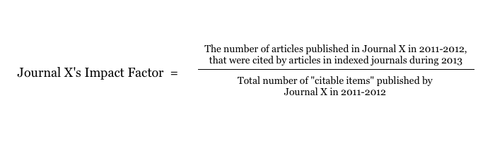

#### 2.1 History of Bibliometrics

##### 2.1.1 Introduction to Bibliometrics

The field of bibliometrics, sometimes scientometrics, has existed for many years and has created a set of methods to quantitatively analyse scientific and technological literature (De Bellis, 2009). These metrics are most commonly used to measure the impact, or value, of the research in question. Fenner (2013) defines impact as follows: "The scientific impact of a particular piece of research is reflected in how this work is taken up by the scientific community", although others look outside the academic community for impact. This impact ranking has a diverse set of applications, including assessment of an author's work. Godin & Dore (2004) find that there is "there is huge demand for quantitative studies and indicators on the impact of science", with most aimed at the economic impact of research. They state that research has, and continues to be, funded on the basis that it has outcomes in society. One of the most widely used methods is the Impact Factor, sometimes known as the Journal Impact Factor. It was first proposed by Eugene Garfield in 1972, in his paper, Citation Analysis As A Tool in Journal Evaluation. The impact factor is calculated using the following algorithm:

The Journal Citation Reports is published annually by Thomson Reuters, listing all known journals and giving their impact factor, and other metrics for the current year. Neylon and Wu (2009) state that "most scientists ... will point to the Thomson ISI Journal Impact Factor as an external and 'objective' measure for ranking the impact of specific journals and the individual articles within them".

Usage of the impact factor in ranking research other than journals has become more widespread. Increasingly, impact factor has become a proxy for measuring many diverse research outputs. These range from comparisons of international impact to individual article value (Fuyuno & Cyranoski, 2006) (Arnold & Fowler, 2010) (Garfield, 2006). Article value is calculated by proxy, by simply taking the impact factor from the journal it was published in. This has lead to ranking author impact, by totalling the impact factor of each paper published.

Because of it's wide-ranging use, the impact factor has a strong influence on the scientific community. This has affected decisions on where to publish, whom to promote or hire, the success of grant applications, library decisions to purchase and renew journal subscriptions, researchers deciding where to publish, researchers choice on what to read and even salary bonuses (Van Epps & Hill, 2007) (Arnold & Fowler, 2010). The Public Library of Science (PLOS) Medicine editors (2006) report that "in some countries, government funding of entire institutions is dependent on the number of publications in journals with high impact factors".

In the UK, governmental assessment of Higher Education institutions have been conducted by the Research Assessment Exercise (RAE) since 1986. The exercise relied on the "subjective assessment of scientific publications by a panel of experts". Because of this, the RAE was time-consuming and expensive, costing the UK Government £12 million and universities an additional £47 million (Eyre-Walker & Stoletzki, 2013). In 2014, the RAE will be replaced by the Research Excellence Framework (REF). The REF will controversially provide more focus on research impact, with 25% of the final grading going towards measurement of value (Shepherd, 2009). Allen, Jones and Dolby (2009) believe that it is the impact factor's place as the key indicator of research progression that provides much of the rationale for the move to a more metrics-based successor.

##### 2.1.2 Failings of Traditional Metrics

The impact factor has been the subject of much criticism, with many papers reporting on its faults. Increasingly, scientists have been calling for an end to the wide-ranging use of the impact factor. In December 2012, researchers at the annual meeting of the American Society for Cell Biology signed the Declaration on Research Assessment, calling for the end of the use of journal metrics to assess individual articles or authors.

__Impact Cannot Be Represented By a Single Value__

Arnold & Fowler (2010) report that "the allure of the impact factor as a single, readily available number - not requiring complex judgments or expert input, but purporting to represent journal quality - has proven irresistible to many". It is this inherent simplicity that lead to the rise of the impact factor. As is shown in this chapter, this simplicity fails to interpret the scope and complexity of scientific impact.

__Network Effects Are Disregarded__

Authors have criticised the impact factor's simplicity, in that it is merely a straight count of citations, and does not take the effect of a network of researchers into account. Bollen, Rodriquez & Van de Sompel (2006) write that it "only represents the popularity factor of status, not its prestige factor", where popularity is defined as the total number of endorsements, and prestige is the relative prestige of endorsing actors. In their proposed system, a citation from a paper with higher prestige would be weighted more than a citation from a paper with lower prestige. This system is similar to Google's very successful PageRank algorithm, which allowed large scale ranking of web pages to produce accurate and relevant search engine. Bollen, Rodriquez & Van de Sompel (2006) find that their PageRank-like algorithm "strongly-overlapped" with the impact factor, but it "revealed significant and meaningful discrepancies". The simplicity of the impact factor does not allow for the concept of network effects, reducing it's usefulness as a tool for filtering.

__Usage As a Proxy for Other Forms of Impact__

As discussed above, the impact factor has been used as a proxy for other forms of impact - primarily article or author impact. This is problematic, as the impact factor was simply not designed to measure anything other than journal impact (Neylon & Wu, 2009). King & Tenopir (2004) find that only about 15 - 20% of scientists in the United States have authored a refereed article, further supporting the view that journal impact is not representative of author impact. Even Garfield, who proposed the original impact factor, has criticised this usage. In his paper, How to Use Citation Analysis for Faculty Evaluations, and When Is It Relevant? (1983), he states that citation analysis can augment author assessment, but finds that it is easily misinterpreted or inadvertently manipulated. Additionally, the current publishers of the impact factor, Thomson Reuters have admitted that it is being used in "many inappropriate ways" (The PLOS Medicine editors, 2006).

__Overwhelmed By Scale of Scholarly Publishing__

Scientific publishing has grown to an incredible rate, with over 800 000 papers published in 2008 in the popular academic article search engine, PubMed, alone (Neylon & Wu, 2009). This has grown to nearly 950 000 papers in 2013 ("2013 PubMed Search Results", n.d.). Neylon and Wu (2009) claim this growth has overwhelming for researchers - "It [is] impossible for any scientist to read every paper relevant to their research, and a difficult choice has to be made about which papers to read". Renear and Palmer (2009) find that scientists read 50% more papers than they did in the 1970s, spending less time on average with each one. Mendeley, a social referencing manager, found that researchers spent an average of 1:12 hours per day studying literature ("Global Research Report", 2009). Choices about where researcher's time reading papers now must be made, leading to a greater need for filtering the mass of papers. Traditional forms of filtering, namely, peer review and the impact factor, are overwhelmed by the scale of modern research (Priem, Taraborelli, Groth & Neylon; 2010).

__Citations Take Time to Accumulate__

The impact factor relies on citations as it's base measurement, which take time to accumulate. The average paper is not cited for months, at the earliest, but more often 1 - 2 years after publication (Neylon & Wu, 2009) (Priem, Piwowar, Hemminger, 2012). Potential impact, therefore, takes a long time to accumulate, especially relative to the rapid pace of development. This means that decisions using citation analysis data made soon after publication may be incomplete, affecting career decisions, decisions on where to publish, funding decisions, and many other decisions. Additionally, real-time ranking of output becomes very difficult, preventing possible filtering applications.

__Underlying Issues with Impact Factor Calculation__

Researchers have also pointed out the underlying mathematical issues with the impact factors. In a Journal of Cell Biology editorial, Rossner, Van Epps and Hill (2007) report that 89% of Nature's citations are attributable to only 25% of papers. Fundamentally, the impact factor is a mean, so it can be "badly skewed by a 'blockbuster' paper".

__Bias Towards Existing High Impact Journals__

Allen, Jones & Dolby (2009) compared expert reviews of research articles to the impact factor, and other citation-based metrics. They found that the expert's score was more strongly correlated to the impact factor than to the number of citations the paper had received. They believe this was a consequence of experts rating papers in high profile (and high impact) journals more highly, rather than an ability of experts to judge the intrinsic merit or likely impact of a paper. This presents the current metric system with a "rich get richer" problem - papers published in journals with existing high impact factors are perceived to be "better", leading to further high impact factors. This means it is difficult for papers in new journals to break into the system. A metric that considers more diverse communication methods might address this issue.

__The Impact Factor's Journal-Based Approach Produces a Bias Towards STEM disciplines__

Roemer & Borchardt (2013) note that "it has frequently been noted by both librarians and information scientists that researchers in STEM disciplines tend to emphasize the production and consumption of journal articles more heavily than scholars in the humanities or social sciences". This has a huge effect on the less article-heavy disciplines, like the humanities, as the impact factor only measures article citations. By de-emphasising this aspect of scholarly communication, the impact factor will be subsequently lower, which is potentially damaging especially in the current climate of measuring all academics using the impact factor. For example, in the UK, the upcoming REF (see above) will take impact measurement into account and these disciplines may lose out.

__Citation Counts Ignore Academic Outreach__

The impact factor only measures impact within the scientific community, through it's sole use of citations. Citation is evolving, and the published scientific article is not always the primary method of communicating scientific thinking (Anderson, 2009). Any attempt by researchers to provide outreach to the public is ignored by the impact factor (The PLOS Medicine editors, 2006). In the current research climate, where the impact factor has power over career paths, outreach is discouraged. The PLOS Medicine editors (2006) write that "[For a journal] which strives to make ... open-access content reach the widest possible audience ... impact factor is a poor measure of overall impact". They believe that by reaching a wider audience, they can help to set agendas - by publishing policy papers or highlighting neglected issues.

Additionally, some forms of scholarly communication that were rarely recorded before are now becoming commonplace in digital formats (Groth & Gurney, 2010) (Priem & Light Costello, 2010) (Zhao and Rosson, 2009) (Letierce, Passant, Decker et al., 2009) (Shema, Bar-Ilan & Thelwall; 2012). Researchers who collaborate well, or can explain concepts well have unpublished, but still valuable impact. Priem, Piwowar & Hemminger (2012) call this "scientific street cred", the informal and sometimes unintentional credit that scholars receive from peers that is moving online, where it can be tracked and quantified. Again, the impact factor does not take this hidden impact into consideration, by it's citation-based nature.

__Citation Counts Ignore Alternative Forms of Academic Publishing__

Other areas of scholarly work are also overlooked by the impact factor. The published paper is not necessarily the total output of a researcher, although it is often used to summarise. The Altmetrics manifesto authors (2010) report that there are "new forms [of communication that] reflect and transmit scholarly impact". Additional work might include data sets, or code, that may go on to be reused by further research, increasing it's impact (Piwowar & Vision, 2013). Priem & Light Costello (2011) believe that sharing information (in all forms) is a "central component of [researchers] work". However this potential impact will be not be captured by the impact factor.

__Thomson-Reuter's Unscientific Approach__

The Institute of Scientific Information, founded by Garfield in 1960, was acquired by Thomson Reuters in 1992 ("Thomson Corporation acquired ISI", 1992), handing over control of the impact factor. At no point have the key details of the impact factor calculation been made public, as they remain proprietary to Thomson Reuters. Some have accused the corporation of misidentifying article types, something that significantly affect the impact factor. The calculation is dependent on which article types are deemed as "citable" - the fewer citable types, the higher the impact factor. Thomson Reuters has not published it's process of choosing "citable" article types, and the PLOS Medicine editors (2006) report that "it became clear that the process of determining a journal's impact factor is unscientific and arbitrary". Rossner, Van Epps & Hill (2007) in a separate report found "numerous incorrect article-type designations" in Thomson-Reuters' data. They also found that the number of citations used in the impact factor was "substantially fewer" than the number published on the Journal Citation Reports website. They attempted to buy data that is used to calculate the impact factor and were refused by Thomson Reuters. They concluded that just as scientists would reject an article without primary data, so the impact factor should be rejected (Galligan & Dyas-Correia, 2013). The impact factor is not reproducible, a damning report of a metric that is supposed to measure scientific information, and that may affect potential career decisions.

__The Impact Factor is Vulnerable To Gaming by Journal Editors__

The impact factor suffers from problems with gaming - where publishers or authors attempt to artificially raise their impact factor. The main approach to this is to garner as many citations as possible, even if this does not accurately reflect on the true number of citations a journal may have received. Certain types of article are used to achieve this, in particular, review articles. These articles that review a journal's output, by their very nature tend to cite the journal many times (Rossner, Van Epps & Hill, 2007). When indexed by the Journal Citation Reports, journal editors way negotiate with Thomson Reuters to have whole article types removed, thereby potentially increasing their impact factor. One strategy for achieving this is reducing the publication of articles of a certain type, an approach that cannot be be viewed as good for a healthy science community (The PLOS Medicine Editors, 2006). Arnold & Fowler (2010) also report on another worrying trend from authors of manuscripts under review, who were asked or required by editors to cite other papers from the journal. They describe this practice as "bordering on extortion".

__Retracted Papers Are Included in Impact Factor Calculations__

Research papers are sometimes retracted because of errors, however these are still counted towards the impact factor. Liu (2007) points to the infamous Hwang stem cell papers that were retracted after it was discovered that they were fabricated. The retracted papers were cited 377 times, and accounted for 39% of the journal Science's impact factor in 2004 and 2005. Liu also reports that high impact factor journals are based on "useless or misleading citations". Impact gained from retracted papers does not reflect accurately on the true value, and should not be included in the impact factor.

__Citation Counts Offer No Incentive For Certain Good Scientific Practices__

A core aim of bibliometrics is to find the best scientific articles, however, the impact factor can encourage poor scientific practices. The impact factor provides no incentive to publish negative results, considered a good practice for advancing science. Buschman & Michalek (2013) comment that the impact factor "discourages publishing research with negative results", as negative result papers receive fewer citations, and therefore lower impact factor. They also find that blogs are increasingly being used to document negative results, however this valuable work is not captured by the impact factor.

__Journal's Restrictive Terms of Use Limit Innovation__

Some newer approaches to assessing impact, such as the webometric movement are fundamentally limited by terms of use restrictions. Text mining or scraping web sites to count citations to scholarly work is a potentially useful method for measuring impact, however these approaches are prevented by academic publisher's terms of use. These terms prevent automated text mining, so instead indexes must be build manually, which is not a scalable approach (Priem, Piwowar & Hemminger, 2012).

