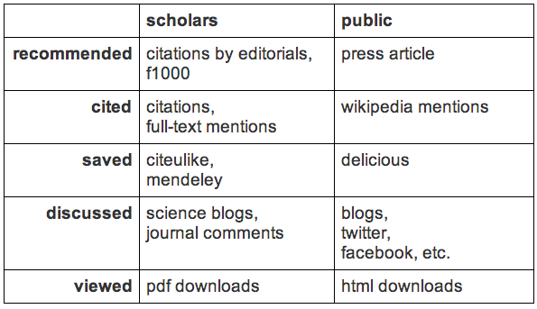

#### 2.3 What is Altmetrics?

As alternative to traditional bibliometrics, the concept of altmetrics was developed in the late 2000s. Although there are many different definitions, altmetrics as a term has evolved over the years to an umbrella term for metrics that measure impact of web-based scholarly communications both qualitatively and quantitatively (Priem, Taraborelli, Groth & Neylon, 2010) (Liu, 2003) (Howard, 2012). Altmetrics, in contrast to the impact factor, are primarily measured at the article level, although it has been suggested by some that altmetrics should also measure impact outside of the traditional article (Neylon & Wu, 2009) (Adie, 2013). Article level metrics was a term favoured initially by those looking for an alternative to the impact factor. However article level metrics have started to be incorporated under the banner of altmetrics (Priem, 2010). These metrics attempt to find the "real world impact" of research, measuring sources outside of traditional science, giving a more encompassing view of impact.

Kaitlin Thaney, Director of the Mozilla Science Lab, likened altmetrics to tracking "a researcher's footprints in the community" (Liu, 2003). This is a good metaphor for describing how altmetrics attempts to capture impact from a wide range of sources. It is this wide range of sources, and their relative ease of access that allows not only the measurement of scholarly communications, but also communications of the wider general public (Priem & Hemminger, 2010). Although the webometric movement has mined the web for impact data before, this approach has not been updated for the rise of the social web, or Web 2.0. This new form of interaction on the web, enables a much larger audience to access publishing tools on the web. Users are using these tools to chat, discuss and share interesting links, activities that could potentially generate impact for researchers by measuring how far their research is spread (Galligan, 2012). Priem & Hemminger (2010) state that "[the] emergence of 'Web 2.0' presents a new window through which to view the impact of scholarship".

Metrics that have been included in altmetrics in the past include article views and downloads, scholarly tweets and Facebook messages (Zhao and Rosson, 2009), bookmarks on bookmarking services like Delicious (Priem, Piwowar & Hemminger, 2012), saves on social referencing services like Mendeley (Yan & Gerstein, 2011), blogs (Groth & Gurney, 2010) and even traditional citations (Priem, Piwowar & Hemminger, 2012). There is a consensus that altmetrics centre around mining web-based resources (Howard, 2012). There exists no definitive list of data sources, and some disagree on the validity of specifics, but there is some movement towards standardising metrics and how they are measured (Thelwall, Haustein, Lariviere et al, 2013) (Lin & Fenner, 2013).

The web's usage by scholars to communicate has been growing, and looks to continue into the future (Priem, Taraborelli, Groth & Neylon, 2010). Fenner (2013) found that 93% of PLOS Biology research articles published since June 2012 have been discussed on Twitter, and 63% mentioned on Facebook. Procter, Williams, Stewart et al. (2010) find that usage of "Web 2.0" tools such as blogs, comments and wikis are used for scholarly purposes "frequently" by 13% of their sample and "occasionally" by 45% (Procter, Williams, Stewart et al, 2010).

A key feature of altmetrics is the diversity of data sources; as discussed, the impact factor's simplistic model does not adequately measure the complex system that is scientific impact (Fenner, 2013). There is no definitive list of data sources that altmetrics practitioners have standardised around, and studies have used different data sources and implementations of retrieving the sources (Mulvany, 2013). The following sections list altmetric data sources that have been used in previous studes.

##### 2.3.1 Twitter

Twitter as a service has grown rapidly in recent years (Priem & Hemminger, 2010). Several studies have looked at the scholarly usage of Twitter, finding that it has been used for a variety of academic purposes (Zhao & Rosson, 2009) (Letierce, 2009) (Shuai, Pepe & Bollen, 2012) (Eysenbach, 2011). Zhao & Rosson (2009) found that 6% of sampled tweets contained a link to a paper, of which, 52% directly linked to a paper and 48% linked to a third-party which then linked to a paper. This is considered a form of impact within altmetrics.

Shuai, Pepe & Bollen (2012) studied the usage of Twitter by scholars over time after a new paper has been released. They found that most Twitter mentions of a paper occur one day after publication, and that is the only day the article is mentioned on Twitter. Articles are quickly passed around with little in-depth discussion. They conclude that either early Twitter mentions drive greater download numbers, or alternatively, inherently higher quality articles generate high early Twitter mentions. Eysenbach (2011) found similar usage - a majority of tweets related to a paper were sent on the day of article publication, and after 30 days, tweets would move into "sporadic tweetation phase".

Zhao and Rosson (2009) interviewed scholarly Twitter users and found that they "typically follow people both in and out of their particular subfields", which gives conversations a "more interdisciplinary perspective". This broad scope of conversations is interesting to altmetric practitioners, as it affords an opportunity to measure impact that is more wide ranging. They additionally found that participants "emphasized that they saw citing on Twitter as part of a dynamic, ongoing conversation".

Access to Twitter data primarily comes from the Twitter API, which enables programmatic access to tweets. However, historically Twitter has struggled to provide complete access to all tweets, or tweets older than a few days. Twitter now says that it filters search results for "quality Tweets and accounts" ("Twitter search rules and restrictions", n.d.). In addition, Twitter has begun rate limiting API requests to 450 per app per hour ("GET search/tweets", n.d.).

Several applications have developed approaches to solve this. The third-party altmetrics service, Altmetric.com, creates its own database of tweets by polling the Search API regularly ("Sources of Attention - Twitter", n.d.), and saving tweets with links to scholarly papers. Another altmetrics service, ImpactStory, uses a third-party Twitter search analysis API called Topsy to retrieve tweets. Topsy enables not just a search for the number of times a link has been tweeted but a search for the number of times "influential" users have tweeted a link ("Twitter Search, Monitoring, & Analytics", n.d.). In addition, ImpactStory uses the regular Twitter API to retrieve statistics on the number of followers of a particular account ("ImpactStory: FAQ", n.d.).

##### 2.3.2 Other Social Networks

Twitter is by far the most studied social network as a data source for altmetrics. However, other social networks have been included in altmetric studies, with Facebook, Reddit, Digg, StumbleUpon and Slashdot being examples (Priem & Hemminger, 2010). Interaction with science in these online arenas is similar to that of Twitter - discussion around a link to a primary or secondary source. These take many forms; Facebook data consists of counts of clicks, likes, shares and comments of a link (Priem, Piwowar & Hemminger, 2012). Reddit shows some criteria that make it potentially valuable as a data source, with Sanderson & Rigby (2013) reporting that Reddit's code of behaviour, or "reddiquette", enforces linking to primary sources.

Impact from social networks is likely to be similar to that of Twitter's, with lower relative usage from scholars. This reflects the wider usage of social networks, and represents the diverse impact potential of an article (Sanderson & Rigby, 2013) (Zhao & Rosson, 2009).

Less emphasis has been placed on study of these networks, with only a few articles including them. No articles focus entirely on studying the impact of a particular social network other than Twitter. This may be for a few reasons; as discussed, Twitter's usage among scholars is growing, so focus on that particular social network has been strong. Some of the social networks have seen declining usage recently, Digg, reportedly dropping in visitors since 2010 (Metz, 2010). Additionally, gaining access to other social network's data is somewhat difficult, as sites like Slashdot do not offer programmatic access to data. RSS feeds or web pages would have to be scraped by a crawler.

##### 2.3.3 Blogs

Blogging as a medium started in the late 1990s, but grew more popular in the mid-2000s, unlike most of the tools discussed here it is not closely associated with a "name-brand" service, perhaps reflecting on the maturity of the medium. This maturity combined with the ease of publication that is possibly the reason for blogging's popularity among scholars, with Priem & Hemminger (2010) commenting that the literature is much too large to review in its entirety. Scholars use blogs for a variety of reasons, including sharing content, expressing opinions and interacting with others both inside and outside of the author's discipline (Shema, Bar-Ilan & Thelwall, 2012). Groth and Gurney (2010) argue that scholarly communication is not separated between articles and blogs, but intertwined, with blogs increasingly referring to traditional publications. Most blog posts describe the implications of science (Groth & Gurney, 2010) (Priem & Hemminger, 2010). This variety makes blogs useful to altmetrics practitioners, as they allow measurement of different forms of impact, both scholarly and non-scholarly, through citation by adding a link to an article.

The demographics of scholarly bloggers are skewed towards males affiliated with academic institutions, according to Shema, Bar-Ilan and Thelwall's (2012) sample. They also found 59% were either students or researchers in an academic institute, and less than a third were not affiliated with an institute. They concluding that there is a core of quite well connected scholarly bloggers who are "information disseminators". Therefore, impact gathered from this group is likely to be highly valuable and trusted.

Unlike Twitter, Facebook and other social media tools, blogging's culture of linking to primary sources is strong, and is similar to academics culture of citations. This makes links on blogs a strong indicator of impact (Priem & Hemminger, 2010). Blogs tend to reference "high quality science", with 70.5% of the publications references were in journals with high impact factors (Groth & Gurney, 2010).

Priem & Hemminger (2010) report that mining blogs to spot trends has been an area of active research, with some blog trend detection services created (Glance et al; 2004) (Bansal & Koudas, 2007). These systems scrape the blogosphere to spot emerging trends, which can then be mapped to scholarly impact (Priem & Hemminger, 2010). In addition to text mining, subscriber numbers are used to gain insights on impact. The altmetrics tool, ImpactStory uses an API provided by the popular blogging service, Wordpress, to extract the number of subscribers to a given blog. Using this method, impact of a scholar's blog can be determined ("ImpactStory: FAQ", n.d.).

##### 2.3.4 Social Reference Managers

Social reference managers are a fairly new category, dominated by Mendeley, started in 2008. These services allow researchers to collect papers they find interesting and take notes on them, in an easily accessible place. This is similar to older services, such as Endnote, however they add the ability for a researcher to view a feed of the papers other researchers have saved (Gunn, 2013) (Procter, Williams Stewart et al, 2010). "By broadcasting what papers they think are important, researchers are directly influencing the research community's choice of reading and discussion material". It is this behaviour of indicating what they believe to be important that generates impact.

Mendeley is the most popular of these services, with Gunn (2013) reporting broad adoption in the life sciences, chemistry, maths and computer science. The service has little usage outside of academia. Despite its dominance, Mendeley is not the only service in this market, with some competitors such as Zotero (Priem & Hemminger, 2010).

Mendeley offers a public API, or application programming interface, that allows altmetrics practitioners to directly access usage data (Gunn, 2013) ("Mendeley API Documentation", n.d.).

As data from social reference managers is generated by scholars its value to altmetrics is high. Practitioners have a high degree of confidence that impact generated from social reference managers originates from trained scholars. In addition, tagging and rating metadata is valuable, providing more insight into scholarly impact. Neylon and Wu (2009) even speculate that reference managers might add future functionality to able to "track the amount of time users spend viewing papers within their interface".

##### 2.3.5 Social Bookmarking

Bookmarking services are very similar to reference managers, in that they allow users to save links and view other's saved links, perhaps in a feed of links. Again, it is this behaviour that generates impact. Both scholars and non-scholars use social bookmarking services. Bookmarking services also allow users to tag and comment on links, giving valuable metadata (Taraborelli, 2008) (Neylon & Wu, 2009) (Priem & Hemminger, 2010). The major difference between reference managers and bookmarking services is the likelihood that impact is from scholarly sources. Bookmarking services tend to be aimed at the general public, whereas reference managers are focussed on scholars. This difference has advantages for altmetrics practitioners, as it allows measurement of wider impact, distinct from the impact factor (Howard, 2012) (Galligan, 2012).

There are several social bookmarking services, including the widely used Delicious, and the more scholarly focussed CiteULike. Priem and Hemminger (2010) describe bookmarking as "[maybe] the best–developed scholarly Web 2.0 application", although business focus in this area has dropped off recently.

##### 2.3.6 Faculty of 1000

The Faculty of 1000 (F1000), is a post-publication peer review and recommendation service, designed for biology and medicine researchers. Articles are recommended by "hand-selected" reviewers, the Faculty, and given a score, the F1000 Factor ("What is F1000?: The recommendations", n.d.) ("What is F1000?: F1000Prime factors and rankings", n.d.). Unfortunately, for altmetrics practitioners, F1000 does not plan to provide an API, meaning that F1000 scores have to be manually collected (Priem & Hemminger, 2010).

Wets, Weedon & Velterop (2003) argue that it provides a "much needed 'qualitative' addition to the tool-box" of impact-assessors (Priem & Hemminger, 2010). Impact extracted from the F1000 is likely to be similar to that of social reference managers, like Mendeley, as the population of recommenders is scholarly. Therefore, articles recommended through the service are likely to have high influence among other scholars.

##### 2.3.7 Article Views and Downloads

Out of the data sources discussed here views and downloads are the most traditional. Lin & Fenner (2013) define this data source as the "activity of users accessing the article online" (Lin & Fenner, 2013). Several article publishers have begun to offer statistics on the number of times an article has been viewed or downloaded including all of the Public Library of Science (PLOS) journals and Nature journals (Patterson, 2009) (Baynes, 2012).

The link to impact is somewhat direct, the higher the download numbers, the higher number of people reading the paper, the higher the impact (Taraborelli, 2008). Yan & Gerstein (2011) report that "the spread of a paper will ... be reflected at the level of web usage statistics".

Several studies found that views/downloads had the highest numbers of all of the altmetric data sources, reflecting the ease of viewing a paper. Fenner (2013) says that "when readers first see an interesting article, their response is often to view or download it". Despite this, studies pointed to the increased engagement of other data sources - it takes a more engaged reader to go to the effort of tweeting, bookmarking, saving or citing the paper. This implies a hierarchy of engagement with articles, something to consider when evaluating altmetric data.

##### 2.3.8 Mainstream Media

Like some social networks, mentions in mainstream media are not always included as a data source in altmetrics studies. The mainstream media is usually defined as online newspaper articles. There are two approaches to capturing impact on these sites: through the use of web scrapers or manual searches through a site. The third-party altmetrics service, Altmetric.com, maintains a manually curated list of RSS feeds which it then parses for instances with links to, or mentions of scholarly papers in the body of the news article ("Sources of Attention - Mainstream News Outlets", n.d.). It is these links that are evidence of impact.

The difficulty of obtaining data from mainstream media sites is a likely reason that most studies do not include this data source. In addition, correctly parsing for a citation is very difficult, as formats vary widely, a long standing problem for altmetrics. To get around this, Altmetric.com searches for important information such as journal or article title, which is then used as a basis for a literature search on PubMed. This technique is not 100% reliable, nor is it particularly timely. Impact can take some time for the article parser to find ("Sources of Attention - Mainstream News Outlets", n.d.).

##### 2.3.9 Categorisation of metrics

Lin and Fenner (2013) describe the emerging altmetrics landscape as "increasingly difficult to manage, understand, and navigate", due to the growth of altmetrics services. To combat this, there have been some discussions among altmetric scholars recently around classifying data sources into categories and the development of industry best standards.

The goal of this classification is to create an ontology of altmetrics, to understand the intent behind the data source. Lin & Fenner (2013) attempted this for PLOS' Article Level Metrics (ALM) data, describing how they "moved from an emphasis on the data source itself to the underlying activity captured by the data source". Based on Priem, Piwowar and Hemminger's (2012) work, ImpactStory breaks impact measurement down into 10 categories. This allows somewhat of a qualitative assessment of impact, along with the pure quantitative measurements ("A new framework for altmetrics", 2012).

There is no universal agreement around categories, but in general the following are used by many altmetric studies ("A new framework for altmetrics", 2012) (Lin & Fenner, 2013) (Priem & Hemminger, 2010).

* Views/downloads
	* Activity of users accessing an article online
	* Example data sources:
		* Article views and downloads
* Saved/bookmarked
	* Activity of a user saving an article link in an online bibliography manager
	* Example data sources:
		* Social bookmarking services, such as Delicious
		* Social reference managers, such as Mendeley and CiteULike
* Shared/Recommended
	* Activity of a user endorsing the article
	* Example data sources:
		* F1000
		* (Mainstream media)
* Discussed
	* Activity of a user discussing the article with peers
	* Example data sources:
		* Blogs
		* Twitter
		* Facebook
* Citation
	* Activity of a user citing the article in a formal setting
	* Example data sources:
		* Formal citation
			* CrossRef
			* PMC
			* Web of Science
			* Scopus
		* Wikipedia

Areas of disagreement exist, for example, Priem & Hemminger (2010) include social news sites such as Reddit and Digg in the shared/recommended category, whereas most other studies do not. This may be because the popularity of this market has waned recently.

A concept that is revealed through classification of altmetric data sources is a hierarchy of engagement. It is intuitive that formally citing an article shows more engagement with the work than sharing the article on Twitter, and in turn, more engagement than simply reading the article (Lin & Fenner, 2013). Fenner (2013) finds that the average ratio of citations to article views is 1 to 300.

It could be argued that this higher engagement shows higher impact. However, some find that simply classifying impact generates value by putting it into context ("ImpactStory: FAQ", n.d.). The "story" behind that impact can be told. Additionally, by definition, the access to the tools that show higher levels of engagement - not everyone can write a research paper in which to cite. To combat this, ImpactStory splits its categories into data sources that affect scholars and the public. They suggest "categorizing metrics along two axis: engagement type and audience" ("A new framework for altmetrics", 2012).

Similarly, Lin & Fenner (2013) distinguish between primary metrics, "the raw counts of activity captured by each source", and secondary metrics "comprised of descriptive statistics that give context to the primary metrics", giving an example of average usage of similar papers.

##### 2.3.10 Timeline of Usage

Yan & Gerstein (2011) find that usage of a scholarly article over time generally follows a "long tail" distribution, where "on average, the older a paper is, the less attention it receives". The decline in usage drops rapidly in the first few months, after which the pace of decline slows. They further find that once a user has accessed an article, they may spread the information to others, again supporting the hierarchy of data sources model.

Wu & Huberman (2007) find voting statistics on the social news website, Digg.com, follow a "simple stochastic model", where the general dissemination of information is spread randomly amongst a user's contacts over time.

There are very few studies into the usage of altmetrics over time, other than to validate short term altmetric experiments against traditional citation rates. These generally attempt to compare the results for an altmetric data source, usually over a fairly short period of time, i.e. predictions using these data sources, against citation rates. This approach, however, gives little insight into how an altmetric data source changes over time, and how this affects the article's impact.

