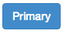

<div class="page-break-avoid">

#### 3.4 Proposed Solution

The following section describes the proposed solution to the requirements laid out in section 3.3. This solution is to create a web application that will assist altmetrics researchers in studying how altmetrics change over time. The application will consist of four parts that are described in detail in the sections 3.4.5 - 3.4.8, which will be combined into a single web application, described in section 3.4.1.

</div>

A web application will be created on the Node.js platform, written in the JavaScript language. This application will consist of a website that allows users to search for articles that they wish to view altmetrics data for, visualise this data, and allow them to save it in a database.

The application will provide a search form, with various fields for article metadata. When the search is requested, the server will access the PLOS article search API, to find matching articles. A wrapper around this API will be created as a standalone module that will abstract the implementation details of the API. The module will return a JSON response containing a list of DOIs.

Using this list of DOIs, a request is made to the PLOS ALM API, to access the altmetrics data for the selected articles. Another wrapper around this API will be created, again as a standalone module. This module encapsulates the API details, and so can be reused in other projects. The module will return a JSON object containing the altmetrics data.

This data is then returned to the client, where it will be used to create the visualisation. The D3.js library will be used to create a bubble chart where each article is represented by a bubble, the bubble's size corresponds to the total number of citations received, and the x- and y- axis will correspond to altmetrics data sources. A fourth axis will be represented by the current year and will allow users to control moving back and forward in time. The current values of the altmetric data sources will be calculated using the current year.

Before data is returned to the client, it will also be saved in the application's database. A Node.js module will be used to interact with the MongoDB database. Application data will be stored in a JSON-like format and associated with a unique identifier. Users can access the visualisation and data later using this unique identifier, through the use of a permalink.

<div class="page-break-avoid">

##### 3.4.1 Web Application

The project will create a web application to meet the requirements described in 3.3. A web application was chosen as it provides a method for everyone to access the application, quickly, easily and without downloading any large programs.

</div>

As discussed in section 2.6, altmetrics are diverse and measure impact from outside science - areas that may not have access to expensive computer equipment. Therefore, a medium that can be accessed by all is suited to this project. No additional programs - other than a web browser, which often come pre-installed on many devices - are required to view a website. In addition, no restrictions are placed on the usage of the web, unlike much of the existing scholarly publishing field where paywalls regularly prevent access.

A website also provides a useful wrapper around the separate parts of the application, as described in sections 3.4.5 - 3.4.8. Without this wrapper, users would have to manually move data between the separate parts, leading to a much more complex and frustrating user experience.

<div class="page-break-avoid">

##### 3.4.2 Node.js

Node.js is designed for server-side applications, providing methods for receiving and responding to HTTP requests. Applications for this platform are written in JavaScript, taking advantage of the extremely powerful Google V8 JavaScript engine that Node.js is based on ("JavaScript Performance Rundown", 2008).

</div>

The fact that applications are written in JavaScript is one of Node.js' main advantages, as it is the same language that is used on the client-side for web development. Developers do not lose context when switching between languages, such as with a more traditional set-up with PHP programs on the backend, and JavaScript on the frontend.

As a web application is to be constructed for the application, an HTTP server is required. This can be easily achieved using Node.js, creating an application that will listen for HTTP requests and sends responses. The following code snippet is taken from the Node.js website:

```js
var http = require('http');

http.createServer(function (req, res) {
	res.writeHead(200, {'Content-Type': 'text/plain'});
	res.end('Hello World\n');
}).listen(1337, '127.0.0.1');

console.log('Server running at http://127.0.0.1:1337/');
```

This would, when run using the Node.js command line interface, create a server that listens on port 1337 and on the 127.0.0.1 host that responds to requests with a plain text "Hello World".

Modules are core to the Node.js platform, allowing for quick and easy addition and use of code written by yourself or others. This even applies to core parts of Node.js - in the example above, the `http` module is used and so it has to be `require`d first. The very popular npm (Node Package Manager) application comes bundled with Node.js, which enables developers to publish modules for others to use.

The modular philosophy behind Node.js is very beneficial for this project. As described above, there are several sections of the application that can be split from the main project and published as standalone modules. As discussed in section 2.6, the altmetrics community encourages transparency and reuse, principles that are reflected in the Node.js developer community. These packages can be reused by any Node.js developer easily, or perhaps by a researcher looking to study altmetrics.

The basic server described above provides a low-level and overly-verbose approach that is ill-suited for this project. For a more powerful server, a third-party module will be used. The Express module is one of the most popular modules available on npm, currently listed as the fifth most depended upon package on npm's package registry. Express offers greater control over common web server tasks, such as routing requests, templating views and generally improving upon the built-in `http` module. Express will be used as the framework for the application, receiving requests, routing them to the correct controllers and generating responses. The following snippet is taken from the Express website: 

```js
var express = require('express');
var app = express();

app.get('/', function(req, res){
	res.send('hello world');
});

app.listen(3000);
```

This shows the Express equivalent to the previous snippet, however in a much cleaner manner. Requests to port 3000, on the index of the current host, will return a plain text "hello world". More routes can be added by registering further callbacks on the `app.get()` function.

In the final application, Express will provide the backbone for the server, routing requests to the correct controllers, with any attached request parameters. These controllers will then call methods within the API wrapper modules, before generating responses from templates based on data returned from the modules.

<div class="page-break-avoid">

##### 3.4.3 Grunt and Bower

Grunt is a JavaScript task runner that provides automation for many useful functions. There are several uses for this within the project including running the Node.js server, starting the MongoDB database, and processing Sass files. Grunt can be configured to run these tasks from the command line, and therefore a useful collection of administration scripts can be created. Many of these tasks are packages published on Node.js' package manager npm (see section 3.4.2), in the form of Grunt plugins.

</div>

As described in section 3.4.2, Node.js has a web server that must be started from the command line. If changes are made to the application, the server must be restarted for changes to be reflected at runtime. This can become tedious in periods of heavy development. The third-party application, nodemon, is designed to help with this problem. nodemon will watch application files for changes and automatically restart the server. There is a Grunt plugin (called grunt-nodemon) that will perform this function that will be used to reduce development time.

Similarly, the database must be started at boot. This is also achieved through Grunt, through the plugin, grunt-shell. This allows Grunt to call command line shell scripts, such as the one used to start the MongoDB database used for this project (see section 3.4.8).

The project will use the pre-processor Sass for creating stylesheets (see section 3.4.4). These must be converted to CSS before they are served to a user. A Grunt plugin is used that will process the Sass files and convert them to CSS, called grunt-contrib-sass. However, this plugin will need to be run every time a change is made to the source Sass files. The grunt-watch plugin will be used to watch for changes in the Sass files and automatically run the conversion scripts.

Finally, styles from the Twitter Bootstrap project will be used in this application (see section 3.4.4). These files do not need to be included in the application source repository, as they are treated as libraries. Instead, another command line tool is used to download them. Bower is "front-end" package manager, for downloading open source JavaScript and CSS projects. This will be configured to download the Bootstrap files when the Grunt "build" task is run.

<div class="page-break-avoid">

##### 3.4.4 Styling

Requirement 6 states that the system must be easy-to-use and have good visual design. To achieve this, the Twitter Bootstrap project will be used to provide a framework for the visual design. The project allows developers to create stylesheets quickly, by providing a library of pre-constructed CSS components. These components can be created by adding class attributes to HTML documents. In effect, Bootstrap creates a much more appealing default stylesheet for the web. For example, the following code snippet will create a button that is shown in Figure 3.1.

</div>

```html
<button class="btn btn-primary">Primary</button>
```



The styles provided by Bootstrap are useful, however, they do require adjustment. This can be a little difficult when using CSS, especially considering the challenges faced in a modern web environment. For example, many browsers use CSS pre-fixes for newer or experimental features. Adding these manually is time-consuming, and so CSS pre-processors have started to fill the gaps left by CSS.

Sass is one such pre-processor, which follows a very similar syntax to CSS but has to be passed through a conversion script to be turned into CSS. Sass offers several advantages over CSS, including variables, a nested syntax, and a function-like syntax called mixins. For example, changing colours in a CSS file can take time to find all instances of the colour, however, with Sass a single variable can be used for each of these instances.

Another benefit that Sass provides is automatic concatenation, through imports. CSS also uses an `import` syntax, however this is not considered best practice as it adds unnecessary HTTP requests. One Sass file can import another on the server-side, creating a single concatenated CSS file. This will be used in the project to split the stylesheet into smaller, more meaningful modules that are combined into a single CSS file when the "build" script is run (see section 3.4.3).

<div class="page-break-avoid">

##### 3.4.5 Altmetrics Data Collection

Requirement 4 describes the need for altmetrics data collection from an external API. As discussed in this requirement, gathering new data for the system is out of scope, as it is time- and resource-heavy, and several different altmetrics providers offer APIs. There are several options available, although not all satisfy the requirements. The following table compares the different altmetrics data APIs:

</div>

| Characteristic | PLOS Article Level Metrics (ALM) API | Altmetric.com API |
| - | - | - |
| Historical metadata | Yes. Each article lists every data source, some of which include daily, monthly & yearly breakdowns of when citations occurred. Citation values are for each individual time period, not aggregated | Yes. Each article gives a breakdown of the calculated Altmetric.com score at regular intervals since publication. The intervals are as follows: 1 day, 2 days, 3 days, 4 days, 5 days, 6 days, 1 week, 1 month, 3 months, 6 months and 1 year. The score is calculated using a proprietary method, that attempts to normalise the various altmetric data sources recorded by their software |
| Data sources | Article views, CiteULike saves, CrossRef citations, Datacite citations, F1000 citations, Facebook likes, Figshare links, Mendeley saves, Nature citations, PubMed Central citations, Reddit links, ResearchBlogging links, ScienceSeeker links, Scopus citations, Twitter mentions, Wikipedia citations and Wordpress links | CiteULike saves, Connotea saves, blog links (curated list of blogs), Facebook mentions, F1000 citations, Google+ mentions, LinkedIn links, mainstream media links (using a manually curated list of RSS feeds), Mendeley saves, Pinterest links, Reddit links, StackExchange links, Twitter mentions, Wikipedia citations, YouTube description links and "other manual additions" |
| Data collection methods | The general approach is to regularly poll data source APIs to check if newer data can be found. If so, the data is added to the PLOS internal database. This database then used to generate API responses | Very similar approach; regularly check APIs of the data sources, and update an internal database. This is then used by the application to create the API responses |
| Rate limits | 1000 requests per day, allowing 5 seconds for a query to return results | 1200 requests per day, maximum of 720 per hour. However, using an API key will raise rate limits "significantly" |
| HTTP compliance | Good, but not fully compliant. Requests for non-existent articles return a 404 Not Found response. Requests without an API key return a 401 Unauthorized response. However, invalid or poorly constructed requests also return a 404 response, instead of a 400 Bad Request | Good, but not fully compliant. Requests for non-existent articles return a 404 Not Found response. Requests that exceed the rate limit return a 420 response, that is not part of the HTTP protocol but is generally related to rate limiting responses. Additionally, poorly formed requests return a 404 response instead of a 400 Bad Request response |
| Transparency | Full source of the application used to generate the API is available under an Apache 2.0 License | Exact methods of data collection and calculation are proprietary |
| Other comments | Not all data sources, such as Scopus citations, include historical metadata. This is a known issue that is registered on the API application issue tracker, where it is discussed this will be fixed for version 3 of the API | No data source captures article views or downloads |

<figcaption>Table 1: A comparison of potential altmetrics data providers</figcaption>

The ImpactStory API was initially considered, however it was discovered that this API has been deprecated and discontinued. However, an ImpactStory blog post discusses the possibility that it may be offered again "in the near future" ("New widget and API | Impactstory blog", 2012).

From the table it is clear that, for this project, the most appropriate solution is the PLOS ALM API. Crucially, it provides historical metadata. This is obviously important as the system must be able to show altmetrics changing over time, and that cannot be achieved without this data. The PLOS ALM API also gives a more detailed breakdown of when citation occurred. Citation numbers are given every year for each data source, whereas Altmetric.com's API only gives aggregate numbers for all data sources at set points after publication. The rate limits when compared with the Altmetric.com API are much higher, beyond the greatest expected usage and so they do not need to be considered.

However the PLOS ALM API has a major drawback - only articles that are published with PLOS journals are tracked by the API. Altmetric data for articles published in other journals cannot be calculated since this data is not gathered. Despite this restriction, the system will still offer a very large sample of articles to users as the PLOS library is so large. In 2013, the PLOS One journal published 31500 articles ("Thanking Our Peer Reviewers", 2014).

Requests to the PLOS ALM API will be made with a list of DOIs that represent the articles that the user has selected (see section 3.4.6). For this application, the option for historical metadata will be added to the request. Responses are returned in JSON format, the preferred format for this project, as XML format can be difficult to parse. An example request and response are shown below:

```
http://alm.plos.org/api/v3/articles?api_key={YOUR_API_KEY}&ids=10.1371/journal.pone.0035869&info=history

[
	{
		"doi": "10.1371/journal.pone.0035869",
		"title": "Research Blogs and the Discussion of Scholarly Information",
		"url": "http://www.plosone.org/article/info%3Adoi%2F10.1371%2Fjournal.pone.0035869",
		...
		"publication_date": "2012-05-11T07:00:00Z",
		...
		"views": 21454,
		"shares": 135,
		"bookmarks": 135,
		"citations": 9,
		"sources": [
			{
				"name": "citeulike",
				"display_name": "CiteULike",
				"events_url": "http://www.citeulike.org/doi/10.1371/journal.pone.0035869",
				"metrics": {
					"pdf": null,
					"html": null,
					"shares": 25,
					...
					"total": 25
				},
				"update_date": "2014-03-05T07:55:58Z",
				...
				"by_year": [
					{
						"year": 2012,
						...
						"total": 22
					},
					...
				]
			},
		]
	}
]
```

This shows the generated response for the article with DOI: 10.1371/journal.pone.0035869. Firstly, the aggregate altmetrics, organised by category are given - 21454 views since publication for example. Then an array of altmetric data sources is given, each giving the total metrics for the given source. Finally, each data source reports the number of citations each day, month and year that it changes. So in this example, the article gained 22 CiteULike citations in 2012, given in the `by_year` array of the CiteULike object. Further documentation of the API is available from the API website ("Public Library of Science (PLOS)", n.d.).

A wrapper will be created for around this API, encapsulating its functionality into a single library that has a uniform interface. This abstracts implementation details of the API out of other parts of the codebase that do not need to know these details. Another advantage of this modular approach is that if changes are made to the API, then only the wrapper will be affected.

The wrapper will accept a single DOI (as a string) or a list of DOIs (as an array). Optionally, configuration can be set on the wrapper. The request string is built using the input DOI list. The request is sent to the API, and the response is parsed to ensure no errors have occurred. The wrapper will then return this parsed response.

In above sections, the ability for standalone Node.js packages to be published was described. The PLOS ALM API wrapper will be published in this manner. The package will be available on the module registry, npm, allowing third-party developers to download and use the package in their own systems, encouraging further altmetrics study. The module will be released under a MIT license, giving permission for others to not only use the package but to make changes and contribute back to the source, improving the project. This shows the great benefit of Node.js' modularity and altmetrics' culture of openness.

<div class="page-break-avoid">

##### 3.4.6 Scholarly Article Search

Requirement 3 describes the need for a scholarly article search. The proposed solution to this problem is in two parts: the search form, and the PLOS Search API wrapper. The search form will provide the user with a mechanism for interacting with the system to give their search parameters. The search wrapper will execute the search, using these parameters, to the PLOS Search API which will find matching articles in its archive and return a list of matching articles.

</div>

The application will serve the search form as a static web page, containing a form. The form is a relatively simple way for users to interact with the system to find "articles of interest", or articles which they wish to receive altmetrics data for. The form will provide input fields for the following, expanded from requirement 3:

| Field            | Description                                                  |
| ---------------- | ------------------------------------------------------------ |
| Keyword          | Matches all text in an article                               |
| Author           | Matches article's author name                                |
| Journal          | Matches article's journal name                               |
| Subject area     | Matches an article's subject area (taken from PLOS taxonomy) |
| Publication date | Matches article's publication date                           |
| DOI              | Matches an article's Digital Object Identifier               |

<figcaption>Table 2: Input fields used for the scholarly article search form</figcaption>

Once the form is submitted, a request will be made to the application server with the attached search parameters. The parameters are received by the server and passed to the search API wrapper.

The search API wrapper will perform a search for articles that match these search parameters. Unfortunately, there are very few reliable sources for searchable published scholarly material. Initially, the CrossRef API was considered as it provides search for a large number of publishers. However, and as discussed in section 3.4.5, only articles published by PLOS can be processed by the PLOS ALM API wrapper, and therefore the search part of the system cannot return articles published by other journals. This restriction means that the sensible choice is the PLOS Search API, as this will only search for PLOS articles.

The PLOS Search API allows access to PLOS' internal search engine, based on the Apache Lucene project, Solr. Accepted search parameters meet those required by requirement 3. Responses are returned in JSON format and an example request and response are shown below:

```
GET http://api.plos.org/search?q="altmetrics"&wt=json&api_key={YOUR_API_KEY}

response: {
	numFound: 13,
	...
	docs: [
		{
			id: "10.1371/journal.pone.0064841",
			author_display: [
				"Mike Thelwall",
				"Stefanie Haustein",
				"Vincent Larivière",
				"Cassidy R. Sugimoto"
			],
			title_display: "Do Altmetrics Work? Twitter and Ten Other Social Web Services",
			...
		},
		...
	]
}
```

This response shows that a simple search for the keyword "altmetrics" will return 13 articles, including each article's DOI. These DOIs can then be used to find their altmetrics data.

As described in the introduction for this section, a wrapper around the API will be created. The wrapper will be very similar to the data collection wrapper. The reasoning behind this choice is explained in section 3.4.5.

Search parameters are validated by the wrapper, to ensure that errors made by the user will not produce invalid responses from the API. For example, any search parameter that is not used by the PLOS Search API will raise an error, as this may return an error response from the API.

The wrapper will also be published as a standalone package to the npm repository, under a MIT license. The benefits of this are explained in section 3.4.5.

<div class="page-break-avoid">

##### 3.4.7 Visualisation

Requirements 1 and 2 state the need for a visualisation of altmetrics data and how it changes over time. The solution for these requirements will be a D3.js "bubble" chart. This chart will show multiple articles, represented as bubbles, with axes for two altmetrics data sources, an axis for the number of citations and an axis for time.

</div>

The x- and y-axes of the chart represent the article's altmetric values for two different data sources. The user can select which data source is to be represented on these axes. Articles are represented by a "bubble" on the chart that is centred according to the values of the selected data sources. The size of the bubble represents the total number of traditional scholarly citations the article has received. An example is shown below:


This will meet some of the requirements described in requirement 1, as it allows the user to compare multiple articles against each other. Users can see if a large number of views (as in this example) leads to a large number of citations, and thus greater impact. The visualisation also meets the requirement to be able to switch between multiple altmetric data sources.

Finally, to meet all of requirement 1, there must be some interface for associating each bubble to the article it represents. As the chart will be built using JavaScript and HTML's SVG specification, it is relatively easy to add a "tooltip" that will appear when the user hovers over the bubble with the mouse. This will show the article's title, and current values for the selected data sources.

To meet requirement 2, the chart must be able to respond to a fourth axis that represents the current time. Data represented on the graph is transformed to show values from the current time. Initially, creating a simple line graph that showed each data source against time was considered. However, some tools already exist for this purpose, and comparison between data sources is difficult - a key component in requirement 1.

A graph that allows comparison of data sources, while also showing changes over time is required. This area of the design was heavily influenced by Hans Rosling's "Wealth & Health of Nations" presentation ("Hans Rosling's 200 Countries, 200 Years, 4 Minutes", 2010). In this presentation, Rosling shows the life expectancy and income of 200 countries over 200 years. By animating through each year and changing the position of the bubble based on data for that year, changes at certain periods of time become evident that would have gone unseen except under close scrutiny.

It is this comparison over changes over time that is missing from other visualisation styles. The concept will be adopted for the project, by animating the bubbles to move as the time changes. In addition to this animation, the user will also be able to control the passage of time manually using the mouse.


Much like the wrappers described in sections 3.4.5 and 3.4.6, the visualisation code will be encapsulated into a module. Prototypical inheritance will be used to structure the library, giving an object-orientated style "class". The library will accept basic options in its constructor, which will then build the chart and append it into the DOM.

The library will be self-contained, following the best practice of not polluting the global namespace in the browser. Further, the library will follow the asynchronous module definition (AMD) convention, allowing clients to asynchronously download the library within a module container. This is often done using the popular Require.js library.

D3.js is a well-known JavaScript library used primarily for creating charts and graphs. It was chosen over other similar libraries for this application for several reasons.

Other potential libraries that were considered include Google Charts, and Chart.js. However, both of these libraries are focussed on instantiating a pre-made chart - line graphs, bar charts, pie charts - with a dataset. This approach is more suited to projects with a more traditional visualisation style, where a simple chart is required. D3.js takes a more flexible approach, stating on its website "D3 is not a monolithic framework that seeks to provide every conceivable feature" ("D3.js - Data-Driven Documents", n.d.). This is much more appropriate for this project, where a custom style of chart is created specifically for this purpose.

D3.js is based on manipulating Scalable Vector Graphs (SVG) elements. This relatively modern technique is declarative, and thus does not rely on raster images. The World Wide Web Consortium (W3C) standardised a specification for SVG in 2011, and is now supported in a majority of browsers. The D3.js library provides a cleaner, less verbose interface to the SVG specification. This makes manipulation of SVG elements in the browser relatively simple.

As the library is based on transformation of DOM elements, not on an internal representation of the shapes that make the chart, it can be considered more "future friendly". As the web evolves, and more standards are added, tools that focus on existing standards will require less change. D3.js is able to adapt to potential additions to the web specification, for example, more advanced CSS properties or new HTML elements.

<div class="page-break-avoid">

##### 3.4.8 Storage

Requirement 5 describes the need for storing altmetrics data for faster and more efficient retrieval, and for creating a permalink.

</div>

Data from the altmetrics data collection process will be in JSON format, and so it is sensible to also store this data in JSON format. The storage process does not require a large degree of complexity, as the data only needs to be stored against a unique key so that it can be retrieved later. A key/value pair database therefore is mostly appropriate for this use case. However, future revisions of the project may require a deeper understanding of the data stored in the database. For this reason, it may be useful to have more structure to data stored in the database.

Data will be stored in the database after it is returned from the data collection API wrapper described in section 3.4.5. The application flow starts with the user submitting their search, which will call the search wrapper, returning a list of DOIs. This list of DOIs is passed to the altmetrics API wrapper, the results of which will then be stored in the database. The database will generate a unique key for this data, which is used to create a permalink. The user is then redirected to this link, and the visualisation is generated.

MongoDB was chosen for the application as it satisfies these requirements. Documents in MongoDB are stored in a JSON-like format that is associated with a unique key. This is much less complex than a relational database, where a schema would have to be constructed. There are many tools for Node.js available for use with MongoDB. The most prominent is the `mongodb` library on npm. This provides a simple driver for connecting to MonogoDB, querying and updating the store. However, this library does not offer functionality for creating structure in the database. Another potentially useful library is the popular Mongoose library that is modelled as an Object Relation Map (ORM) for MongoDB. This would give more structure to the database, while still storing data in the JSON-like format, and will likely give the best results.

<div class="page-break-avoid">

##### 3.4.9 Source Control

The source code of the application will be stored in a git repository, a source control system designed to assist developers write code. Code for the project will be hosted on GitHub, a service that offers code hosting for git repositories. By combining these, the project will have powerful tools for controlling, debugging and distributing code.

</div>

Git allows developers to track and control changes to a codebase, by "committing" updates regularly. This is achieved by a system of cryptographic hashes generated using the source code itself. These hashes can be used as identifiers for stages in the code which can be easily moved between. "Branches" are concept within git that enable changes to be made in a semi-temporary area where developers can experiment with the codebase without fear of permanently breaking anything. Experiments can be merged into the main branch if found to be successful.

GitHub is a service that can accept updates, allowing code to hosted on their servers. This also gives the benefit of creating a backup. GitHub provides an easy-to-use Graphical User Interface (GUI) to git that is helpful under certain circumstances. The service also provides an issue tracker, for saving bugs and new ideas.

Updates can be shared using git's protocol with others who can make further changes. This means that code published under a permissive open source license can be easily edited by others before changes are submitted back to the original author. This structure enables much faster and easier open source development, as described in requirement 7.

<div class="page-break-avoid">

##### 3.4.10 Testing

For the application to be considered to be successful, it must contain as few bugs as possible. Section 3.2 describes the project's design methodology of Test Driven Development (TDD). For this to take place, a testing framework must be included in the project. This will provide an environment for tests to be run and tested against. For this project, two libraries will be used; Mocha for running tests; and Chai for providing assertions.

</div>

Mocha is a test runner for Node.js, that enables developers to create tests that will be run in its environment. If an error is thrown by the test, then Mocha will report this to the user. The example below shows a basic Mocha test (that will pass):

```js
var expect = require('chai').expect;
describe('Array', function() {
	describe('#indexOf()', function({
		it('should return -1 when the value is not present', function() {
			expect([1,2,3].indexOf(5)).to.equal(-1);
			expect([1,2,3].indexOf(0)).to.equal(-1);
		});
	});
});
```

Chai is an assertion library, again for Node.js, that provides assertions that expressions can be tested against. If the assertion fails an error will be thrown. The examples below show some of the Chai assertions:

```js
expect(foo).to.not.equal('bar');
expect({ foo: 'baz' }).to.have.property('foo').and.not.equal('bar');
expect('test').to.be.a('string');
expect(foo).to.exist;
```

These libraries were chosen because of their popularity, flexibility and ease of use. Mocha is widely used among the Node.js developer community. It is popular due to its rich feature list and flexibility. Mocha allows developers to choose which assertion library they wish to test with. This is unlike the also popular Jasmine library, which provides a complete all-in-one framework for tests. The Chai library was chosen for its readable tests. As is shown in the above example, Chai tests can be very similar to sentences, an improvement over the "assert" style of other libraries.

