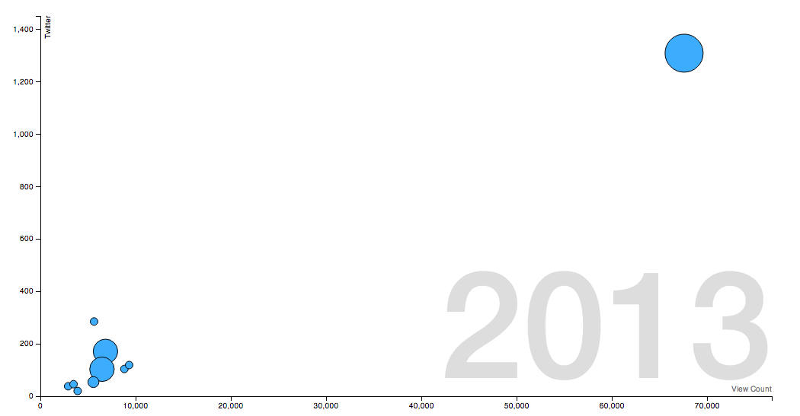

#### 4.4 Visualisation Implementation

This section will discuss the implementation of the visualisation of altmetrics data. Section 3.4.7 describes the proposed solution for this requirement, a D3.js bubble chart comparing two altmetrics data sources against the total number of scholarly citations for a set of articles. Each bubble will be animated to show the passage of time, and how the data changed over this time period. To achieve these goals, a JavaScript library was created that will perform the chart creation and management process.

##### 4.4.1 Asynchronous Module Definition

This library, called AlmChart, will be published under an open source license. Because of this, the library will follow best practices for browser-focussed JavaScript libraries. These are similar to the best practices followed for the search and data collection modules, however there are some key differences.

Unlike Node.js, a library author cannot know what environment the library will be run under. The environment that Node.js maintains (see section 4.2.1) means that modules are separated from each other. To access another module, it must first be imported. This is not the case for browser libraries, where namespace collisions can produce errors if not carefully managed. This has lead to the rise of module definitions, which attempt to provide a standardised structure for JavaScript libraries, separating them from each other, while still allowing import-like behaviour. One of the most popular of these is Asynchronous Module Definition (AMD), and this format is used for the AlmChart library. The AMD Wiki ("AMD · amdjs/amdjs-api Wiki", n.d.) defines a single function, called `define`, that has the following signature.

```
define(id?, dependencies?, factory);
```

This shows how a module using AMD would be defined. The unique (per project) identifier, and the module dependencies are optional. The factory is the function that should be executed to instantiate the module. The AlmChart library uses this function to declare itself to AMD module loaders. However, not all developers use AMD, or module loaders and so some fallback must be provided. The following code snippet shows the full declaration of the AlmChart library.

```js
(function(root, factory) {
	if (typeof define === 'function' && define.amd) {
		// AMD. Register as an anonymous module.
		define(function() {
			// Also create a global in case some scripts
			// that are loaded still are looking for
			// a global even when an AMD loader is in use.
			return (root.AlmChart = factory());
		});
	}
	else {
		// Browser globals
		root.AlmChart = factory();
	}
}(this, function() {
	var AlmChart = function() {
		...
	};

	...

	return AlmChart;
}));
```

This shows how if an AMD module loader is used, then the library is declared using the `define` function. Otherwise, the library is declared as a single class in the global namespace. This encapsulates chart functions and prevents the global namespace from getting polluted.

The AlmChart class is instantiated using the normal JavaScript method - `new AlmChart()`. The library requires two options to be passed to the constructor. Firstly, the DOM element that the chart is to be appended to is required. Then the URL for the data source is also needed. Once instantiated, the chart will be drawn when the `draw()` function is called. The default data sources used will be the number of Twitter mentions and the number of views. These can be changed by executing the `setConfig()` function and passing in the new configuration options. This will change the data accessor functions within the library, and therefore will change the data shown on the chart.

##### 4.4.2 AlmChart Library

The library performs several steps to set up, create and animate the chart. The chart depends on D3.js, which is used to perform most of the drawing and calculation tasks. However, to begin with including the D3.js library did not work. When including the development version of the library, the browser would throw errors, originating from a pi (π) character that was included in the source. It is suspected that some character encoding problems caused the errors. Fortunately, the compressed and minified version of the library did not include this character, and thus did not throw any errors. This is a practice that should be adopted for production-ready web sites anyway, and so was used in the final application.

When the AlmChart class is instantiated the configuration is set. This includes setting up the data accessors - functions that will retrieve values from the currently selected data sources. There three key data accessors; one for the x-axis, one for the y-axis and one for the radius of the bubble. They are called, with a given article's data passed into them, when the class requires a value for the article. The following code snippet shows the two of the data accessors.

```js
AlmChart.prototype.x = function(data) { return data.sources[this.config.dataSourceKeys.x]; };
AlmChart.prototype.y = function(data) { return data.sources[this.config.dataSourceKeys.y]; };
```

By making these functions, the data sources can be changed on the fly. Changing the value of `this.config.dataSourceKeys.x` will change the calculated values for the x-axis.

As discussed above, the chart will not be drawn until the `draw()` function is called. This will kick off the internal drawing functions. The first step will create the scales and axes for the chart. Scales are a concept within D3.js for transforming values relative to the chart's size. This allows the data to be accurately plotted on graphs of any size. A key part of this function will be to find the earliest and latest year in the dataset. This is so that the starting and ending points of the animation can be calculated. The axes will hold all data about a single dimension of the graph, and so one is set up for the x- and y-axes.

Finally in this step, the tooltip will be set up. Tooltip support is provided by the d3-tooltip library, and will show a hovering box over a bubble when a user holds the mouse over the bubble. For the tooltip to be set up, a template for the element needs to be created. This is achieved by cloning a hidden template DOM node.

The next step involves downloading the data asynchronously from the server, before parsing into a JavaScript object in memory. D3.js provides a mechanism for achieving this, the `.json()` function. If the data was in a different file format, for example XML files would be retrieved using the `.xml()` function. The data must then be filtered (see section 4.4.2), and it is passed to the `filterJson` function.

The next step will begin to draw to the screen. A container `g` element (a "group" element, part of the SVG specification) is created, within which all other chart elements will be appended. The axes are then drawn on screen, and transformed into the correct position. They are labelled with the relevant label, according to the currently selected data sources. A problem arose when attempting to draw the time axis on the graph. This axis cannot be shown as part of the x- or y-axes - it represents another dimension of the data and so must be shown in another axis. Inspiration was taken from Hans Rosling's presentation (see section 3.4.7), and a date was added to the background of the graph. However no compelling method could be found for showing the date axis if daily or monthly breakdowns of the historical metadata were used. Therefore the application uses the yearly breakdowns of the data.

Once this is completed, the bubbles are created. The `drawCircles` function controls this, creating `circle` elements (again, part of the SVG specification), which are appended to the container element. The circles are positioned and sized by the `position` function. This function will take a circle element as an argument and set it's x and y positions and it's radius according to the current year. These are calculated by taking the current year's value and scaling it using the relevant scale that were set up earlier.

Finally, the circles will be animated to move according the changes in altmetrics data as time passes. This is performed by D3.js' `transition` function, which will calculate a number of "frames" between the beginning and end of the transition, calculating the amount of time passed between each one, and thus a new year for each frame. This new year may be fractional, as there are multiple frames between the different years. This year value is then passed to the circle's `enter` function, which will re-calculate data values for the x- and y-axes, and reposition the circles using these new data values.

As discussed above, the amount of time passed between years may be fractional. Clearly there is no data values for such fractional years. There are two approaches to this problem; either round up or round down the current year to make it an integer again; or calculate a interpolated value using the fractional year. The former approach would create a very "jerky" animation where bubbles only move at the end of a year, whereas the latter approach would smooth the movement so movement occurs throughout the year. Therefore, the interpolation approach was taken. Figure 4.1 shows a screenshot of the final visualisation.



##### 4.4.3 Problems with the Dataset

Unfortunately, it was found that the dataset provided by the altmetric API wrapper, and thus the PLOS ALM API, has some significant issues. The main problem is that data for most data sources is sparse - much of the data is not useful. Several of the data sources do not include historical metadata, and so simply return a `null` value. For example, the number of scholarly citations an article receives is not broken down historically. This is one reason why the radius of the bubble does not change with time. This causes bugs in the calculation of article bubble positions, as performing mathematics on a `null` value will create a `NaN` ("not a number"). This problem is addressed in a issue, registered on the PLOS ALM API issue tracker, acknowledging the problem and stating that work towards fixing the problem will be included in version 3.0 of the API ("provide daily/monthly/yearly stats for all sources · Issue #9 · articlemetrics/alm", n.d.).

Of the data that is useful, the historical data is also in a format that is not conducive for the chart calculations. For each year that is given, the associated value is the number of altmetric citations received within that year. A more useful value would be the cumulative number of citations received up to that point.

Another problem, of lesser significance, is that the data is structured so that each article's data source list is an array. In JavaScript, arrays cannot be associative - values are indexed by order within the array, not by a named key. This is problematic for this application as specific data source values must be correctly selected from the array. This could be achieved using the array's index number, however this is brittle. The API may expectantly change, reordering the array. In addition, using index numbers is difficult to debug, especially when compared to using named keys.

To counter these problems, filtering of the data is required. The library maps over each article in the data and converts the array to an associative object, using the data source's name as a key. This solves the second problem, allowing data sources to be selected by name, not index number. The first problem is countered by iterating through each data source and filtering out data sources with `null` historical data values. If a historical data value is found, a running total is created that converts the values to a cumulative number.

* Interpolation
	* Show the algorithm
	* Why was it chosen
		* No better model exists

